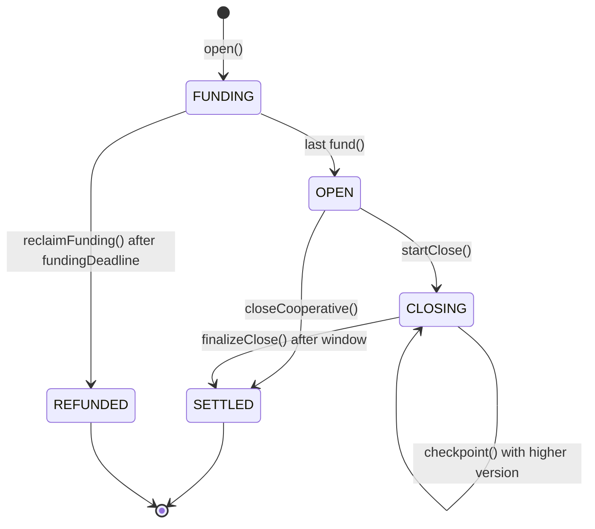

## Abstract

A Lightsphere is an off-ledger execution context shared by a fixed set of
participants, whose assets are held in escrow by a contract on a Hiero network
(the anchor ledger). Participants exchange state updates off-ledger at whatever
rate their hardware and links allow, and settle the final state to the anchor
ledger in a single transaction.

This HIP standardizes two modes:

- **Signed mode.** Two to sixteen participants co-sign every state update.
  This is a generalized state channel. The anchor contract enforces the
  highest-version state that all participants signed. No party has to trust any
  other party or any third party.
- **Network mode.** The sphere is itself a Hiero network, for example a private
  permissioned deployment, with its own consensus. Assets move between the
  anchor ledger and the sphere network as CLPR messages, and the sphere posts
  periodic balance checkpoints. If the sphere halts, users can exit from the
  last checkpoint.

The HIP defines the anchor contract interface, the EIP-712 state encoding, the
network-mode CLPR message formats, and a throughput accounting rule so that
benchmark claims from different implementations can be compared. It requires
no changes to Hiero consensus nodes, mirror nodes, or SDKs.

## Motivation

Off-ledger channels that settle to a base ledger are the standard way to give
applications throughput and latency that no consensus protocol can offer
directly. Interactive games, agent-to-agent micropayments, streaming payments,
and order matching all produce many state changes between a small set of
parties, and almost none of those changes need global ordering.

Other ecosystems have shipped this. On 4 July 2026, Sui's "programmable
tunnels" (off-ledger payment and state channels that settle to Sui mainnet when
closed) reported a peak of 6,086,766 effective transactions per second in a
public experiment with AI agents and human participants. Hiero has no
equivalent standard today. Teams that want channels on Hiero each write their
own escrow contract, signature format, and dispute rules, and none of these
work with each other.

Hiero networks are a good anchor for channels:

- Fees are low and predictable, so opening and closing a sphere is cheap
  compared with the value it carries.
- Finality is deterministic and fast (seconds, with no reorgs), so a
  challenge submitted on time cannot be reorged away.
- The Hedera Account Service system contract
  ([HIP-632](hip-632.md)) can verify both ECDSA(secp256k1) and ED25519
  signatures, so accounts with either key type can participate.
- CLPR, the Cross-Ledger Protocol from LF Decentralized Trust, already moves
  state-proven messages between Hiero networks. A private Hiero network (for
  example, a HashSphere deployment) can
  therefore act as a multi-party sphere with its own BFT consensus, settling to
  a public Hiero network without a new bridge.

Standardizing this as an Application HIP lets wallets, SDKs, watchtower
services, and indexers support every Lightsphere deployment the same way.

## Rationale

**Application category, no node changes.** Everything in this HIP is a
contract and an off-ledger message format. It can ship on any Hiero network
that has the smart contract service, without waiting for a consensus-node
release. A native service (`LightsphereOpen`, `LightsphereClose` HAPI
transactions) could cut fees later. That is listed under Open Issues, and the
state encoding below is designed so that it would not change.

**Unanimous signing in signed mode.** Every state must be signed by every
participant. This is the property that makes signed mode trust-free: no state
can take value from a participant who did not sign it. The cost is liveness.
One offline participant stops progress, and the others must close on-ledger.
That is why signed mode is capped at sixteen participants, and why larger
groups should use network mode.

**Highest version wins, with a fixed challenge window.** This is the dispute
rule used by most deployed channel systems, including Lightning-style and
Perun-style designs. A stale state can always be replaced by a newer one
during the window. The window is not extended by later submissions, so a
griefer cannot hold funds indefinitely.

**Fixed funding at open.** Signed-mode spheres are funded once, at open.
Supporting top-ups and partial withdrawals while a sphere is open ("splicing")
needs on-ledger and off-ledger state to agree on deposit counters, which adds
a race that v1 avoids. Participants can close and reopen instead. Splicing is
an open issue.

**Pull payments.** Settlement credits a claimable balance, and each recipient
withdraws in a separate call. HTS transfers to an account can fail for reasons
outside the sphere's control: the recipient is not associated with the token,
the token is frozen for the account, KYC was not granted, or the token is
paused. Pull payments keep one failing recipient from blocking settlement for
everyone else.

**Network mode reuses CLPR instead of a new bridge.** A Hiero network used as
a sphere already has BFT consensus, an EVM, and HTS. Its only missing piece is
a safe way to move assets to and from the anchor ledger, which is exactly what
CLPR provides with state proofs. Network mode adds only what CLPR does not:
a standard gateway pair, balance checkpoints, and a halt exit.

**Related work.**

- **Lightning Network.** Two-party payment channels on Bitcoin, with a
  penalty-based dispute rule. Lightsphere uses version numbers instead, which
  is simpler on an account-based ledger.
- **Perun, Counterfactual and ForceMove.** Generalized state channels with
  on-chain adjudication of application rules. Lightsphere v1 carries
  application state only as an opaque hash. On-chain adjudicators are an open
  issue.
- **Sui programmable tunnels.** The same off-ledger-then-settle model,
  currently two-party, settling only to Sui. Lightsphere adds a standard
  multi-party mode (network mode) and, through CLPR, a path to settle across
  ledgers.
- **Rollups.** Rollups give open membership and global state, at the cost of
  a sequencer, data availability, and proof systems. Spheres are much lighter
  but have fixed membership. They are complementary.

## User stories

- As a game developer, I want two players to make thousands of moves per second
  against each other with no fee per move, and settle the outcome on Hedera
  when the match ends.
- As an AI agent operator, I want my agent to pay another agent per request,
  in HBAR or a stablecoin, without submitting a transaction per request.
- As a financial institution running a private Hiero network, I want my
  participants to transact privately among themselves and settle net positions
  to a public Hiero network, with a guaranteed exit if my network stops.
- As a wallet developer, I want one signature format and one contract interface
  so I can support every Lightsphere application without custom code.
- As a watchtower operator, I want a standard event and state format so I can
  monitor spheres for stale-state closes on behalf of offline users.
- As a reviewer of a throughput claim, I want a precise definition of an
  "effective transaction" and the evidence I should expect to see.

## Specification

The key words MUST, MUST NOT, SHOULD, and MAY are to be interpreted as
described in RFC 2119.

### Terminology

- **Anchor ledger.** The Hiero network whose smart contract holds the sphere's
  escrowed assets.
- **Anchor contract.** A contract on the anchor ledger implementing
  `ILightsphereAnchor`.
- **Sphere.** One instance of off-ledger execution, identified by a `sphereId`.
- **Participant.** In signed mode, one of the accounts listed at open, named by
  its 20-byte EVM address alias.
- **Asset.** HBAR (denoted `address(0)`) or an HTS fungible token (denoted by
  its EVM address).
- **Sphere network.** In network mode, the Hiero network that runs the sphere.
- **Gateway contract.** In network mode, the contract on the sphere network
  that pairs with the anchor contract over a CLPR Channel.

### Constants

| Name                       | Value         | Notes                                      |
|----------------------------|---------------|--------------------------------------------|
| `MAX_PARTICIPANTS`         | 16            | Signed mode only                           |
| `MAX_ASSETS`               | 8             | Per sphere                                 |
| `MIN_CHALLENGE_PERIOD`     | set at deploy | SHOULD be at least 3,600 seconds on public networks |
| `HAS_ADDRESS`              | `0x16a`       | Hedera Account Service system contract ([HIP-632](hip-632.md)) |

### Sphere identity

```solidity
struct SphereParams {
    uint8     mode;             // 0 = SIGNED, 1 = NETWORK
    address[] participants;     // SIGNED: 2..MAX_PARTICIPANTS, no duplicates. NETWORK: empty.
    address[] assets;           // 1..MAX_ASSETS, no duplicates. address(0) = HBAR.
    uint256[] initialDeposits;  // SIGNED: participants.length * assets.length entries. NETWORK: empty.
    uint64    challengePeriod;  // SIGNED: seconds, >= MIN_CHALLENGE_PERIOD. NETWORK: 0.
    uint64    fundingDeadline;  // SIGNED: unix seconds. NETWORK: 0.
    bytes     networkConfig;    // NETWORK: abi.encode(NetworkConfig). SIGNED: empty.
    bytes32   salt;
}

sphereId = keccak256(abi.encode(block.chainid, address(anchorContract), params));
```

`initialDeposits`, and `balances` in `SphereState`, are flattened
participant-major: the entry for participant `p` and asset `a` is at index
`p * assets.length + a`.

### Signed mode

#### Lifecycle



#### State encoding

States are signed as EIP-712 typed data so that existing wallets and hardware
signers can display and sign them.

```
EIP712Domain(string name,string version,uint256 chainId,address verifyingContract)
  name              = "Lightsphere"
  version           = "1"
  chainId           = the anchor ledger's EVM chain ID (Hedera mainnet 295, testnet 296, previewnet 297)
  verifyingContract = the anchor contract address

SphereState(bytes32 sphereId,uint64 version,uint256[] balances,bytes32 appDataHash,bool isFinal)
```

- `version` MUST increase by at least one for each new state. Participants MUST
  NOT sign two different states with the same `version`.
- `balances` MUST conserve funds: for each asset `a`, the sum over all
  participants of `balances[p * assets.length + a]` MUST equal the sum of
  `initialDeposits` for that asset. The anchor contract MUST reject any state
  that violates this.
- `appDataHash` commits to application state (for example a game board). The
  anchor contract stores it but does not interpret it.
- `isFinal = true` marks a state that every participant agrees ends the sphere.

The digest that is signed is the standard EIP-712 digest
`keccak256(0x1901 || domainSeparator || hashStruct(state))`.

#### Signature verification

A state is **fully signed** when it carries exactly one signature from each
participant, in participant order. The anchor contract MUST verify each
signature by calling
`IHederaAccountService(HAS_ADDRESS).isAuthorizedRaw(participant, digest, sig)`
and MUST reject the state unless every call returns `true`. Per HIP-632, a
65-byte signature is checked as ECDSA(secp256k1), and a 64-byte signature as
ED25519 against the account's single ED25519 key. The anchor contract MUST
reject ECDSA signatures with an `s` value in the upper half of the curve order.

Participants whose accounts have threshold or key-list keys cannot use
`isAuthorizedRaw`. They SHOULD open spheres from a single-key account. Support
for complex keys is an open issue.

#### Anchor contract interface (signed mode)

```solidity
interface ILightsphereAnchor {
    enum Status { NONE, FUNDING, OPEN, CLOSING, SETTLED, REFUNDED, HALTED } // HALTED: network mode only

    struct SphereState {
        bytes32   sphereId;
        uint64    version;
        uint256[] balances;
        bytes32   appDataHash;
        bool      isFinal;
    }

    event SphereOpened(bytes32 indexed sphereId, SphereParams params);
    event SphereFunded(bytes32 indexed sphereId, address indexed participant);
    event SphereActive(bytes32 indexed sphereId);
    event StateCheckpointed(bytes32 indexed sphereId, uint64 version, bytes32 appDataHash);
    event CloseStarted(bytes32 indexed sphereId, uint64 version, uint64 challengeEndsAt);
    event SphereSettled(bytes32 indexed sphereId, uint64 version, bytes32 appDataHash);
    event SphereRefunded(bytes32 indexed sphereId);
    event Withdrawn(address indexed account, address indexed asset, uint256 amount);

    /// Registers a sphere in FUNDING. Anyone MAY call. MUST reject invalid params,
    /// assets with HTS custom fees, and an existing sphereId.
    function open(SphereParams calldata params) external returns (bytes32 sphereId);

    /// Caller deposits its full initialDeposits row. HBAR via msg.value; HTS tokens
    /// via transferFrom against a prior allowance. Participants whose row is all zero count as
    /// funded at open. Moves to OPEN when every participant has funded.
    function fund(bytes32 sphereId) external payable;

    /// After fundingDeadline, while still FUNDING: credits every deposit back to its depositor.
    function reclaimFunding(bytes32 sphereId) external;

    /// Immediate settlement from a fully signed state with isFinal = true.
    function closeCooperative(SphereState calldata state, bytes[] calldata sigs) external;

    /// Records a fully signed state if its version is higher than the stored one.
    /// Allowed in OPEN and CLOSING. Does not extend the challenge window.
    function checkpoint(SphereState calldata state, bytes[] calldata sigs) external;

    /// Participant-only. Moves OPEN -> CLOSING and sets challengeEndsAt = now + challengePeriod.
    /// MAY include a fully signed state, which is recorded as in checkpoint().
    function startClose(bytes32 sphereId, SphereState calldata state, bytes[] calldata sigs) external;

    /// After challengeEndsAt: settles on the highest recorded state, or on initialDeposits if none.
    function finalizeClose(bytes32 sphereId) external;

    /// Pull payment of everything credited to msg.sender for the given asset.
    function withdraw(address asset) external;

    function status(bytes32 sphereId) external view returns (Status);
    function latestState(bytes32 sphereId) external view returns (uint64 version, bytes32 appDataHash);
    function claimable(address account, address asset) external view returns (uint256);
}
```

Behavior rules:

1. `checkpoint` and `startClose` are callable by anyone holding a fully signed
   state, except that `startClose` itself MUST be called by a participant. This
   lets a watchtower submit a newer state for an offline participant without
   being able to start a close.
2. Settlement credits `claimable[participant][asset]` from the settled state's
   balances and MUST NOT transfer assets directly.
3. A state whose `sphereId` does not match, or that fails fund conservation,
   MUST be rejected. Rejection MUST NOT change stored state.
4. The anchor contract MUST be associated with every HTS asset before accepting
   it. It SHOULD associate itself during `open` using the HTS system contract,
   or be deployed with enough automatic association slots.
5. The anchor contract MUST NOT accept HTS tokens that have custom fees,
   because a fee charged on the payout transfer would break fund conservation.

### Network mode

In network mode, the sphere is a Hiero network (the sphere network) connected
to the anchor ledger by a CLPR Channel. A Gateway contract on the sphere network
and the anchor contract are the two CLPR applications on that Channel.

```solidity
struct NetworkConfig {
    string  sphereLedgerId;     // CAIP-2 identifier of the sphere network, as configured in CLPR
    bytes   channelId;          // CLPR Channel between the anchor ledger and the sphere network
    address gateway;            // Gateway contract address on the sphere network
    uint64  checkpointInterval; // seconds between checkpoints the gateway MUST emit
    uint64  haltTimeout;        // seconds without any message before the sphere may be declared halted
}
```

`haltTimeout` MUST be at least three times `checkpointInterval`, and SHOULD be
long enough to cover planned maintenance on the sphere network and CLPR
endpoints (days rather than hours on public anchors).

#### Messages

All network-mode payloads are ABI-encoded as
`abi.encode(uint8 msgType, bytes32 sphereId, bytes body)` and sent with CLPR
`sendMessage` on the configured Channel.

| `msgType` | Name        | Direction        | `body`                                                                         |
|-----------|-------------|------------------|--------------------------------------------------------------------------------|
| 1         | DEPOSIT     | anchor -> sphere | `abi.encode(uint64 depositId, address asset, uint256 amount, address recipient)` |
| 2         | WITHDRAW    | sphere -> anchor | `abi.encode(uint64 withdrawalId, uint64 sphereEpoch, address asset, uint256 amount, address recipient)` |
| 3         | CHECKPOINT  | sphere -> anchor | `abi.encode(uint64 sphereEpoch, bytes32 balancesRoot)`                          |

- **Deposit.** A user calls `depositToSphere(sphereId, asset, amount, recipient)`
  on the anchor contract. The anchor escrows the asset, increments
  `netDeposited[sphereId][recipient][asset]`, and sends a DEPOSIT. The gateway credits
  `recipient` on the sphere network with a sphere-local representation of the
  asset. If the CLPR Response reports failure, the anchor contract MUST
  credit the depositor's `claimable` balance and decrement `netDeposited` by the
  same amount.
- **Withdraw.** A user burns their sphere-local balance through the gateway,
  which sends a WITHDRAW. The anchor contract credits
  `claimable[recipient][asset]` and increments `withdrawn[sphereId][recipient][asset]`.
- **Checkpoint.** At least every `checkpointInterval`, the gateway sends a
  CHECKPOINT. `sphereEpoch` MUST increase strictly from one checkpoint to the
  next. `balancesRoot` is the root of a Merkle tree, with sorted-pair hashing,
  whose leaves are:

  ```
  leaf = keccak256(bytes.concat(keccak256(abi.encode(
      address account,
      address asset,
      uint256 balance,                 // sphere-local balance at the end of sphereEpoch
      uint256 cumulativeDepositsApplied,     // total DEPOSIT amount credited to account on the sphere
      uint256 cumulativeWithdrawalsInitiated // total WITHDRAW amount burned by account on the sphere
  ))));
  ```

The anchor contract MUST accept network-mode messages only when the local
CLPR Service delivers them on the configured Channel and they originate from
the configured gateway. Every received message refreshes `lastHeardAt`.

#### Halt and exit

If `block.timestamp > lastHeardAt + haltTimeout`, anyone MAY call
`declareHalt(sphereId)`. Once a sphere is HALTED:

1. The anchor contract MUST reject every later WITHDRAW and CHECKPOINT for that
   sphere, including messages that were proven before the halt but arrive
   afterwards. It MUST reject new `depositToSphere` calls, and MUST ignore CLPR
   Responses to DEPOSIT messages sent before the halt (those deposits are
   settled by the exit formula instead).
2. Each account MAY call
   `exit(sphereId, asset, balance, cumDepositsApplied, cumWithdrawalsInitiated, proof)`
   once per asset, with a Merkle proof against the last accepted `balancesRoot`.
   `msg.sender` MUST equal the leaf's `account`. The anchor credits:

   ```
   exitAmount = balance
              + (netDeposited[sphereId][account][asset] - cumDepositsApplied)
              - (withdrawn[sphereId][account][asset]    - cumWithdrawalsInitiated)
   ```

   with signed arithmetic, and floored at zero.

The two adjustments reconcile the checkpoint with what happened on the anchor
afterwards. Deposits the sphere had not yet applied at the checkpoint are added
back. Withdrawals credited on the anchor after the checkpoint are subtracted.
Withdrawals that the sphere had burned but that never reached the anchor (and
are now rejected by rule 1) give a negative second term, which correctly adds
them back.

#### Anchor contract interface (network mode additions)

```solidity
interface ILightsphereNetworkAnchor is ILightsphereAnchor {
    event DepositSent(bytes32 indexed sphereId, uint64 depositId, address indexed recipient, address asset, uint256 amount);
    event DepositRefunded(bytes32 indexed sphereId, uint64 depositId);
    event WithdrawalCredited(bytes32 indexed sphereId, uint64 withdrawalId, address indexed recipient, address asset, uint256 amount);
    event CheckpointAccepted(bytes32 indexed sphereId, uint64 sphereEpoch, bytes32 balancesRoot);
    event SphereHalted(bytes32 indexed sphereId, uint64 lastSphereEpoch);
    event Exited(bytes32 indexed sphereId, address indexed account, address indexed asset, uint256 amount);

    function depositToSphere(bytes32 sphereId, address asset, uint256 amount, address recipient) external payable;
    function declareHalt(bytes32 sphereId) external;
    function exit(
        bytes32 sphereId,
        address asset,
        uint256 balance,
        uint256 cumDepositsApplied,
        uint256 cumWithdrawalsInitiated,
        bytes32[] calldata proof
    ) external;
}
```

A network-mode sphere enters OPEN directly at `open` and leaves it only for
HALTED. The signed-mode functions `fund`, `reclaimFunding`, `closeCooperative`,
`checkpoint`, `startClose`, and `finalizeClose` MUST revert for network-mode
spheres.

### Throughput accounting

This section is normative only for documents that claim conformance to this
HIP when reporting throughput. It exists so that claims from different
implementations, and from other ecosystems, can be compared.

- An **effective transaction** in signed mode is a `SphereState` with a new
  `version` that every participant has signed and every other participant has
  verified. Unsigned proposals, partially signed states, and states that are
  later overwritten before every participant has verified them do not count.
- An effective transaction in network mode is a transaction that has reached
  consensus on the sphere network.
- A report MUST give both the peak rate and the sustained rate averaged over at
  least 60 seconds, the number of spheres and participants, the hardware used,
  and the anchor-ledger transaction IDs of every `open` and settlement.
- A report SHOULD publish a random sample of fully signed states so that third
  parties can check signatures against the anchor contract's EIP-712 domain.

### Impact on Mirror Node

None required. Anchor contract events are available through the existing
contract results and logs APIs. Indexers can rebuild every sphere's status from
the events above.

### Impact on SDK

None required. A client library for building, signing, and verifying
`SphereState` values, and a reference watchtower, are expected as part of the
reference implementation. Neither needs a change to existing Hiero SDKs.

## Backwards Compatibility

This HIP adds new contracts and message formats only. It does not change any
existing transaction, system contract, or state, so there are no backwards
compatibility concerns.

## Network Optionality

Lightsphere is entirely optional, and no network has to do anything to allow
it. Any Hiero network with the smart contract service and the Hedera Account
Service system contract ([HIP-632](hip-632.md)) can host signed-mode anchor
contracts. Network mode also needs CLPR to be deployed on both the anchor
ledger and the sphere network, with a Channel between them. A network without
CLPR can still host signed mode. There are no node configuration properties,
and nothing changes for clients or mirror nodes on networks where nobody
deploys an anchor contract.

## Security Implications

**Signed mode is trust-free for each participant, provided they are online or
delegate to a watchtower.** A participant who is offline for a whole challenge
window can lose to a stale state. Participants SHOULD choose a
`challengePeriod` that covers their worst expected downtime, and SHOULD use a
watchtower for long-lived spheres. `checkpoint` is open to anyone so that
watchtowers need no special permission.

**Replay.** The EIP-712 domain binds every signature to one anchor ledger and
one anchor contract, and `sphereId` binds it to one sphere. A state signed for
a testnet sphere cannot be replayed on mainnet, and a state from one sphere
cannot be replayed on another.

**Signature malleability.** High-`s` ECDSA signatures are rejected so that a
signature cannot be mutated into a second valid encoding.

**Equivocation.** Signing two states with the same `version` is a participant
error, and the anchor accepts whichever is submitted first. Implementations
MUST refuse to sign a second state with a `version` they have already signed.

**HTS token controls.** Freeze, KYC, pause, and wipe keys stay in force on
tokens held by the anchor contract. A token admin can pause a token and delay
withdrawals, or wipe the anchor's balance. Participants accept the controls of
the tokens they deposit. Tokens with custom fees are rejected at open.

**Network mode adds a trust assumption.** In network mode, safety depends on
the sphere network's consensus. A colluding supermajority of the sphere
network's validators, or a compromised CLPR verifier for the Channel, can
create false WITHDRAW or CHECKPOINT messages and drain the anchor's escrow.
The halt exit protects against the sphere stopping. It does not protect
against the sphere lying. Users of network mode MUST be told whose validators
they are trusting, and anchor deployments SHOULD cap the value escrowed per
sphere. Anyone can call `open`, including with a malicious gateway, so wallets
MUST show users the `networkConfig` that a `sphereId` commits to before they
deposit, and SHOULD keep an allow-list of known sphere networks.

**Confidentiality.** CLPR payloads, and therefore DEPOSIT, WITHDRAW, and
CHECKPOINT messages, are stored in plaintext on both ledgers. A private sphere
network that settles to a public anchor reveals the deposit and withdrawal
amounts and recipients for each account, and each account's balance as of every
checkpoint. Deployments that need confidentiality SHOULD settle net positions
through a small set of omnibus accounts, or wait for a future version that
commits to encrypted or aggregated balances.

**Reentrancy.** HBAR payouts in `withdraw` hand control to the recipient. The
anchor contract MUST follow checks-effects-interactions and use a reentrancy
guard on every state-changing function.

## How to Teach This

- **Signed mode is a bar tab.** Everyone puts money behind the bar at the
  start, keeps a running tab that everyone initials after each round, and
  settles the last initialed tab at the end. If someone walks out, the bar
  settles the newest tab anyone can show.
- **Network mode is a private trading floor.** Members trade on their own
  floor at their own speed. The floor reports to the public ledger regularly,
  and if the floor closes for good, everyone leaves with what the last report
  said they had.
- Documentation SHOULD include a two-party walkthrough on testnet: open, fund,
  exchange a thousand states, close cooperatively. It SHOULD also show a
  disputed close, where one party submits a stale state and a watchtower
  replaces it.

## Reference Implementation

To be provided before this HIP moves past Draft:

- Solidity `LightsphereAnchor` implementing `ILightsphereAnchor` and
  `ILightsphereNetworkAnchor`, with unit and property tests for fund
  conservation, dispute ordering, and the exit formula.
- Solidity `LightsphereGateway` for sphere networks, implemented as a CLPR
  application.
- A TypeScript client library for EIP-712 state signing, and a reference
  watchtower.
- A load harness that produces throughput reports in the format above.

## Rejected Ideas

- **Native HAPI service in v1.** Rejected for v1 because it needs a
  consensus-node release and TSC approval, while the contract version can ship
  on every Hiero network now. The state encoding is designed so that a later
  native service can verify the same signed states.
- **Hiero Consensus Service topics as the off-ledger log.** HCS gives ordering
  and timestamps, but it charges a fee per message and holds no assets. Every
  update would be an on-ledger transaction, which defeats the purpose.
  Participants MAY still post periodic state hashes to a topic for auditing.
- **Majority (non-unanimous) signing in signed mode.** Rejected because it would
  let a majority take a minority's funds. Groups that need majority rule should
  use network mode, where the trust assumption is explicit.
- **Pushing payouts at settlement.** Rejected because one recipient whose token
  association, freeze, or KYC status blocks the transfer would block every other
  recipient.

## Open Issues

1. **Splicing.** Top-ups and partial withdrawals while a signed-mode sphere is
   open.
2. **On-ledger adjudicators.** Optional application contracts that can advance a
   disputed state by application rules, as in ForceMove, instead of only
   accepting the highest version.
3. **Complex keys.** Participants with threshold or key-list accounts, using the
   HIP-632 `isAuthorized` function instead of `isAuthorizedRaw`.
4. **Non-fungible assets.** HTS NFTs as sphere assets.
5. **Cross-ledger anchors.** Spheres whose funds are escrowed on a non-Hiero
   ledger and settled through CLPR, and payment routing across spheres using
   the CLPRouter multi-hop design.
6. **Exit recipient for ED25519 accounts in network mode.** The exit requires
   `msg.sender` to equal the sphere account's EVM address, which works for ECDSA
   accounts that share an address across networks but not for ED25519 accounts
   whose long-zero addresses differ. A registered exit recipient in the leaf is
   one option.
7. **Confidential checkpoints.** Committing to encrypted or aggregated balances
   in network mode, so that a private sphere network does not reveal
   per-account balances to the anchor ledger.

## References

- [HIP-1: Hiero Improvement Proposal Process](hip-1.md)
- [HIP-632: Hedera Account Service system contract](hip-632.md)
- [CLPR specification (LF Decentralized Trust)](https://github.com/LFDT-CLPR/clpr-spec)
- [EIP-712: Typed structured data hashing and signing](https://eips.ethereum.org/EIPS/eip-712)
- [Sui: Over 6 Million Transactions Per Second in AI Agent Livestream Experiment](https://www.sui.io/blog/sui-processes-over-6-million-transactions-per-second-in-ai-agent-livestream-experiment)
- [Hashgraph: HashSphere private networks](https://hashgraph.com/hashsphere)
- [Lightning Network paper](https://lightning.network/lightning-network-paper.pdf)
- [Perun: Virtual Payment Hubs over Cryptocurrencies](https://eprint.iacr.org/2017/635)

## Copyright/license

This document is licensed under the Apache License, Version 2.0 —
see [LICENSE](../LICENSE) or <https://www.apache.org/licenses/LICENSE-2.0>.
