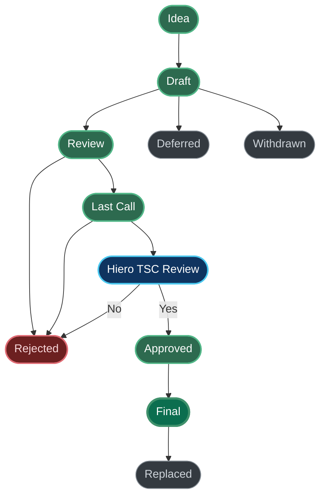
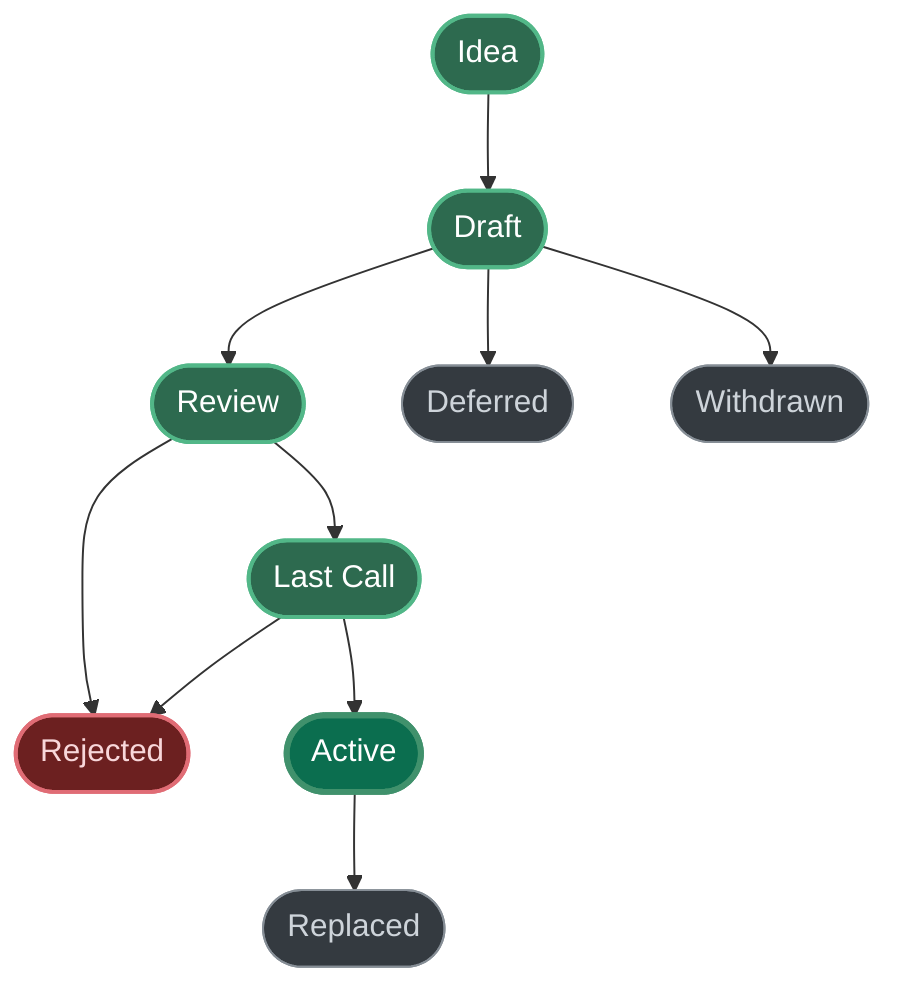

## What is a HIP?

HIP stands for **Hiero Improvement Proposal**. A HIP is intended to provide information or initiate engineering efforts to update functionality under Hiero governance. The HIP should be technically clear and concise, and as granular as possible. Small, targeted HIPs are more likely to reach consensus and result in a reference implementation.

HIPs are intended to be the primary mechanism for proposing new features, for collecting community input, and for documenting the design decisions that go into the Hiero codebase. The HIP author is responsible for building consensus within the community and documenting dissenting opinions.

For HIPs that propose changes to the Hiero codebase (typically Standards Track HIPs for Core, Service, Mirror Node or Block Node categories), the Hiero Technical Steering Committee (TSC) provides the technical approval. This decision is made solely within the Hiero project. Separately, each network that runs the Hiero codebase—Hedera, for example—determines whether and how to adopt a feature. Neither decision binds the other.

Because the HIPs are maintained as text files in a versioned repository, their revision history is the historical record of the proposal. HIPs are **not** meant to address *bugs* in implemented code. Bugs should be addressed using issues on the implementation's repository.

> **Note on Networks**  
> Hiero is network-agnostic software. It is used by multiple distributed ledger networks—public networks such as [Hedera](https://hedera.com) as well as other public and private (permissioned) network deployments. The decision whether a HIP is approved for the Hiero codebase is made by the Hiero TSC. Whether a specific network adopts, activates, customizes, or deploys the resulting functionality is a separate decision made by that network's own governance. See [Networks and HIP Adoption](#networks-and-hip-adoption).

## HIP Types

There are three kinds of HIP:

1. **Standards Track**
   Describes a new feature or implementation for the Hiero codebase or an interoperability standard recognized by Hiero. The Standards Track HIP abstract should include which part of the Hiero ecosystem it addresses. Standards Track HIPs require both a specification and a reference implementation.

   - **Core:** Proposals addressing the low-level protocol, algorithm, or networking layers.  
   - **Service:** Proposals that add or improve functionality at the service layer of the Hiero software stack.  
   - **Mirror, Block Node:** Proposals for software designed to retrieve records (transactions, logs, etc.) from the core network and make them available to users in a meaningful way.
   - **Application:** Proposals to standardize ecosystem 
   software that isn’t directly a Hiero node or mirror (e.g., application network software, external contract consensus services, oracles).

2. **Informational**  
   Describes a Hiero design issue or provides general guidelines to the community but does not propose a new feature or standard. Such HIPs do not necessarily represent a community consensus or recommendation.

3. **Process**  
   Describes a process surrounding the Hiero codebase, or proposes a change to one. Process HIPs are similar to Standards Track HIPs but apply outside the code itself. Meta-HIPs are considered Process HIPs.

## HIP Workflow

### Hiero Technical Steering Committee

The Hiero Technical Steering Committee (Hiero TSC) is the body that makes final decisions on whether or not to Approve Standards Track HIPs pertaining to Hiero’s core or service layers. The Committee is also responsible for decisions regarding the technical governance of the open-source codebase.

The Hiero TSC is the only body that can decide whether a HIP is Approved for the Hiero codebase. No network, company, or council can require that a HIP is implemented in Hiero, and none can veto an Approved HIP. Likewise, any organization is free to prepare their own HIPs to submit to the TSC. To make sure that the perspective of network operators is represented in that decision, the TSC composition explicitly provides seats for organizations that operate networks based on Hiero—for example Hedera (Hedera mainnet) or Hashgraph (Hashsphere), and all people are free and encouraged to join the public TSC meetings to advocate for HIPs they are interested in. Network operators are therefore expected to bring their concerns into the TSC discussion and the public HIP discussion.

### Core Developers

Hiero’s “core developers” include those contributing to the open-source project under the Hiero Organization—employees, contractors, or community members recognized by Hiero.

### HIP Editors

HIP editors are individuals responsible for the administrative and editorial aspects of the HIP workflow, such as assigning HIP numbers and merging pull requests once a HIP is properly formatted.

### Start With an Idea

The HIP process begins with a new idea. It is highly recommended that a single HIP contains a single key proposal or new idea. HIP editors reserve the right to reject a HIP if it appears too unfocused or broad. If in doubt, split your HIP into several well-focused ones.

Each HIP must have a champion (the “author”) who writes the HIP in the specified style, shepherds discussions, and attempts to build consensus. The champion can make a PR of their HIP against the official repository and the PR will serve as the HIP's discussion and the link to the PR will be the value of the `discussions-to` header.

### ⚠️ Setting up DCO

This repository inherits security practices requiring the Developer Certificate of Origin (DCO). Please set up your DCO sign-off before creating or updating a HIP. 

### Submitting a HIP

1. **Fork the HIP repository**, and create a markdown file named `hip-0000-my-feature.md`.  
2. Include the standard HIP front-matter (preamble) at the top, using “Draft” for `status` and “0000” as a placeholder HIP number.  
3. **Open a draft pull request** for your newly created file.  
4. Iterate with the community, updating the PR as needed.  
5. When ready, convert the PR from "Draft" to "Review" to request an editorial review.  
6. The editors will check for correct structure, formatting, and clarity. If the HIP is sound, they will:  
   - Assign a HIP number (usually the PR number)  
   - Merge the PR into the repository with `Draft` status  
7. From there, the community continues discussion—possibly leading to further commits or PRs that update the HIP.

### HIP Review & Resolution

When the HIP author believes the proposal is complete, they may request content review from the core developers and editors. A HIP must be clear and complete, presenting a net positive improvement.

A HIP may be marked **Last Call** to gather final user feedback. 

Following a successful **Last Call** period (or when **Last Call** is deemed unnecessary for minor changes), the Hiero TSC will review HIPs requiring Hiero's technical endorsement (most Standards Track and Process HIPs). If the TSC agrees, the HIP status changes to **Approved**. The Hiero TSC is the sole authority for this decision: no network's agreement is required, and no network can veto it. This concludes the official HIP workflow with respect to approval; the remaining status change to **Final** depends only on the reference implementation being merged.

Reviews performed by individual networks are **not** part of this workflow and are never a precondition for **Approved** or **Final**. A network may review and accept a feature at any time—including before a corresponding HIP is created or published—and its decision, either way, neither holds up nor overrides any Hiero TSC decision. This independence runs in both directions: Hiero approval does not require Hedera to adopt or deploy a change, and Hiero rejection or lack of approval does not prevent Hedera from implementing or deploying it independently, subject to the applicable open-source licenses. A network's adoption decision may be recorded with optional, informational headers (see [Networks and HIP Adoption](#networks-and-hip-adoption)).

### HIP Status Titles

- **Idea** – Pre-draft, not in the repository. 
- **Draft** – The formal starting point of a HIP. The HIP is currently being drafted and is not yet ready for review.
- **Review** – The HIP is ready for review by the community and HIP editors.
- **Last Call** – The HIP is in a final review window, typically 14 days, before being moved to a Hiero TSC approval vote (Service, Core, Mirror or Block Node HIPs) or `Approved` (Application HIPs).
- **Approved** – A Standards Track HIP has been approved by Hiero TSC or by the community in the case of `Application` category HIPs.
- **Final** – A Standards Track HIP has been reviewed and approved by Hiero TSC and its reference implementation has been merged.
- **Active** – A Process or Informational HIP that is currently in effect.
- **Deferred** – A HIP that is not currently being pursued but may be revisited in the future.
- **Withdrawn** – Author has withdrawn the HIP.  
- **Stagnant** – A HIP that has been inactive for a significant period (e.g., 6+ months) may be marked as Stagnant by the HIP editors.
- **Rejected** – The HIP has been rejected by the HIP editors, the community, or a Hiero TSC vote.
- **Replaced** – The HIP has been replaced by a newer HIP.

## HIP Workflow Overview

### Standards Track HIPs

Standards Track HIPs (categories: Core, Service, Mirror or Block Node) follow this general lifecycle:

1.  **Idea**: Propose your idea to the community. Create an [issue](https://github.com/hiero-ledger/hiero-improvement-proposals/issues) to discuss the idea.
2.  **Draft**: Create a copy of the [HIP template](../hip-0000-template.md), fill in the details, and submit it as a pull request (PR) to the HIPs repository. The HIP status should be **Draft**. `needs-hiero-approval` should be `Yes`.
3.  **Review**: Once the PR is submitted, the HIP editors and community will review the proposal. The status changes to **Review**. If they have not done so already, networks that intend to run the proposed functionality are encouraged to start their own internal review in parallel at this point and to bring the results back into the public discussion.
4.  **Last Call**: If the HIP is generally agreed upon, a HIP editor will assign a `last-call-date-time` and change the status to **Last Call**. This is a final opportunity for community feedback, typically lasting 14 days.
5.  **Approved**: After the Last Call period, if there are no major objections that cannot be resolved, Hiero TSC will vote on the HIP and if it is approved, a HIP editor or maintainer will create a PR changing the status to **Approved**. At this point, the HIP is considered approved by the Hiero community and approved for the Hiero codebase.
6.  **Final**: When a HIP is implemented in code, the HIP maintainer updates the status of the HIP to **Final** and specifies a `release` number.
7.  **Stagnant / Deferred / Withdrawn / Rejected / Replaced**: A HIP may also end up in one of these states as described in "HIP Statuses".

The possible paths of the status of Standards Track HIPs are as follows. Network adoption decisions are deliberately not shown: each network follows its own process, under its own governance and on its own schedule—possibly even before a HIP is published—so no network workflow is prescribed here (see [Networks and HIP Adoption](#networks-and-hip-adoption)).



### Informational, Process and Application HIPs

Informational and Process HIPs follow a simpler lifecycle:

1.  **Idea**: Propose your idea. Create an [issue](https://github.com/hiero-ledger/hiero-improvement-proposals/issues) to discuss.
2.  **Draft**: Create a copy of the [HIP template](../hip-0000-template.md), fill in the details, and submit it as a PR. The HIP status should be `Draft`.
    *   For Process HIPs: `needs-hiero-approval` should be `No`.
    *   For Informational and Application HIPs: `needs-hiero-approval` should be `No`.
3.  **Review**: The HIP editors and community review the proposal. Status changes to **Review**.
4.  **Last Call**: If generally agreed upon, a HIP editor assigns a `last-call-date-time` and changes status to **Last Call** (typically 14 days).
5.  **Active**: After Last Call, if no major objections, a HIP editor merges the PR into this state.
6.  **Stagnant / Deferred / Withdrawn / Rejected / Replaced**: As described in "HIP Statuses".

The possible paths of the status of Informational, Process and Application HIPs HIPs are as follows:

⚠️ **NOTE**: The diagram below illustrates all valid status transitions:



## Networks and HIP Adoption

Hiero is the software; a network is a deployment of that software operated under its own governance. The Hiero codebase is used by several networks, including public networks—[Hedera](https://hedera.com) being the most prominent example—as well as other public networks, consortium networks, and private (permissioned) deployments. Nothing in the HIP process is specific to any one of them.

The separation of concerns is:

- **Hiero TSC**: decides whether a HIP is **Approved** for the Hiero codebase, and thereby whether the functionality becomes part of the software. Network operators hold seats on the TSC (see [Hiero Technical Steering Committee](#hiero-technical-steering-committee)) and exercise their influence there.
- **A network**: decides whether it adopts, enables, configures, customizes, or deploys functionality that Hiero provides, and on which schedule.

The following rules apply:

1. **A network's internal review is not part of the official HIP workflow.** Networks may run any internal review, approval, or council process they like, at any time—including before a corresponding HIP is created or published—but the outcome does not gate a HIP's status. A HIP reaches **Approved** and **Final** based on the Hiero TSC decision and the reference implementation alone.
2. **A network cannot compel implementation.** No network can require that a HIP be implemented in Hiero, nor block an Approved HIP from being implemented. That decision belongs to the Hiero TSC.
3. **A network is free not to adopt.** A network may decide not to run functionality introduced by a HIP—because it is irrelevant to that network, conflicts with its policies or regulatory environment, or simply is not wanted in operation.
4. **A network is free to implement independently.** As with any downstream deployment or distribution of open-source software, Hiero rejection or lack of approval does not prevent a network from implementing or deploying a change on its own, subject to the applicable open-source licenses.
5. **A network may add its own components.** Networks may extend their deployment with additional, network-specific components or code that are not part of Hiero and not described by any HIP.

### Recommendation for network operators

The Hiero community explicitly wants the feedback of network operators to flow into HIPs. Operators run the software in production and see requirements—operational, legal, economic, or security-related—that nobody else in the community can contribute. Their input makes HIPs better, and it is welcome at every stage.

Networks that intend to run a proposed feature are therefore strongly encouraged to review HIPs **in parallel** with the Hiero process, starting at the **Review** stage at the latest. Reviewing in parallel keeps concerns visible while the design can still change, instead of surfacing them after a HIP is **Approved**.

**Feedback belongs in the open process.** The HIP process is public and the review happens on GitHub: in the HIP's pull request, in the linked discussion, and in the repository's issues. Whatever internal review a network runs, the resulting comments, objections, and requirements should be brought back into these public threads so that all feedback converges in one place. This keeps the discussion transparent, lets every reviewer see the same arguments, preserves the rationale in the HIP's revision history, and moves the HIP forward openly. Feedback that stays inside a network's internal channels cannot be considered by the HIP author, the community, or the TSC.

**Bring your perspective into the TSC.** Beyond commenting on individual HIPs, network operators are encouraged to take part in the technical governance of Hiero itself—for example by nominating a candidate for a seat in the next Hiero TSC election, or by joining the public TSC meetings to advocate for HIPs they are interested in. That is the way to have a lasting voice in HIP approval decisions, in contrast to a network-internal approval step, which has no standing in this process.

Networks may of course document their own adoption decisions in their own governance records; if they choose to record them in the HIP front-matter, they may use optional network-specific headers, which are informational only (see [HIP Header Preamble](#hip-header-preamble)).

### Design implication: HIPs should be optional by construction, if possible

Because Hiero must serve networks with different requirements, it is built in a modular way, and it helps when HIPs respect that modularity. This is a design recommendation, not a rule a HIP has to satisfy: in practice, optionality often cannot be achieved—consensus-relevant changes, protocol or state changes that every node must apply identically, or security fixes are simply not something an individual network can switch off. That is a normal outcome, not a defect of the HIP.

So where it is reasonably possible, it is worth designing a HIP such that a network instance can ignore it—by not deploying the component, by leaving a feature disabled, or by configuration—when the functionality has no effect on that network or is not wanted in its operation. Where that is the case, it helps if the HIP:

- states whether the functionality is mandatory for correct operation of a Hiero network or optional;
- describes how it can be disabled, restricted, or configured per network, including sensible defaults;
- describes the observable consequences for clients, mirror nodes, and other components when a network does not enable it;
- avoids making unrelated functionality depend on it, so that non-adoption stays a local decision rather than a fork.

## What belongs in a successful HIP?

A successful HIP document typically includes:

1. **Preamble**  
   With metadata: HIP number, title, author(s), type, status, discussions link, etc.
2. **Abstract**  
   A short summary (~200 words).  
3. **Motivation**  
   Explains why existing specifications are inadequate.  
4. **Rationale**  
   Explains why particular design decisions were made; includes discussion of alternatives.  
5. **User Stories**  
   "As a (user role), I want (action) so that (benefit)."  
6. **Specification**  
   Technical details and syntax.  
7. **Backwards Compatibility**  
   If incompatible changes are introduced, discuss severity and solutions.  
8. **Network Optionality**  
   Whether the functionality is mandatory or optional for a network, how a network can disable or configure it, and what the effects are for a network that does not adopt it (see [Networks and HIP Adoption](#networks-and-hip-adoption)).  
9. **Security Implications**  
   Address any security concerns explicitly.  
10. **How to Teach This**  
   Guidance on explaining this HIP to others.  
11. **Reference Implementation**  
   Required for Standards Track HIPs to become Final.  
12. **Rejected Ideas**  
   Summaries of alternative ideas and why they were not pursued.  
13. **Open Issues**  
   Items still under discussion.  
14. **References**  
   URLs and other resources used throughout the HIP.  
15. **Copyright/License**  
   HIPs must be placed under the Apache License, Version 2.0.

## HIP Formats and Templates

Use [GitHub-flavored Markdown] with the "HIP Template" as a base. 

### HIP Header Preamble

Each HIP must begin with a YAML front-matter block:
```yaml
---
hip: <HIP number>
title: <HIP Title>
author: <list of authors>
working-group: <optional list of stakeholders>
requested-by: <name(s) or project requesting it>
type: <Standards Track | Informational | Process>
category: <Core | Service | Mirror | Block Node | Application | Process>
status: <Draft | Review | Last Call | Approved | Final | Active | Deferred | Withdrawn | Stagnant | Rejected | Replaced | Accepted [Not to be used, replaced by Approved status]>
last-call-date-time: <optional, set by editor for last call end>
discussions-to: <URL for official discussion thread (usually the link to the original PR of the HIP)>
needs-hiero-approval: <Yes | No>
created: <date in yyyy-mm-dd format>
updated: <dates in yyyy-mm-dd format>
requires: <optional HIP number(s)>
replaces: <optional HIP number(s)>
superseded-by: <optional HIP number(s)>
release: <optional implementation release version>
---
```
Note: Previous status **Accepted** is a legacy status. All **Accepted** HIPs prior to Jan 1, 2025 should be assumend impicitly to have the status **Approved**.

#### Optional network-specific headers

A network may record its own adoption decision in the HIP front-matter. Such headers are **optional and purely informational**: they document a decision taken outside the HIP process and have no influence on a HIP's status or on the Hiero TSC decision. They are maintained by the HIP maintainer together with the respective network.

The Hedera network uses the following headers for this purpose, and existing HIPs still carry them:

```yaml
needs-hedera-review: <Yes | No>
hedera-acceptance-decision: <Accepted | Not Accepted>
hedera-reviewed-on: <dates in yyyy-mm-dd format>
```

`needs-hedera-review` indicates that the Hedera network intends to review the HIP for adoption on its mainnet; a missing or `No` value says nothing about the HIP's standing in Hiero. A network's decision may predate the HIP; the HIP maintainer updates the headers once a corresponding HIP exists. If Hedera chooses not to adopt, `hedera-acceptance-decision` can be set to `Not Accepted`. Other networks may introduce analogous headers following the same `<network>-…` naming pattern. Because these headers are outside the official workflow, new HIPs are not required to set them.

### Reporting HIP Bugs or Updates

Report issues as GitHub issues or pull requests. Major changes to a **Final** HIP typically require either a new HIP or a very careful editorial process.

### Transferring HIP Ownership

If a HIP author no longer wishes to maintain it, they can arrange new ownership. If they cannot be reached, a HIP editor can assign a new champion.

### HIP Editor Responsibilities

Editors handle:

- Approving initial formatting and structural correctness.
- Assigning HIP numbers.
- Merging final changes once the HIP meets requirements.

They do *not* judge the proposals themselves, but ensure the process is followed.

## Style Guide

When referring to a HIP by number, write it as "HIP-X" (e.g. HIP-1). Where possible, link it using relative Markdown links, such as `[HIP-1](./hip-1.md)`.

## History

This document was derived from Bitcoin's BIP-0001, Ethereum's EIP-1, and Python's PEP-0001. Much text was simply copied and adapted.

## Copyright

This document is licensed under the Apache License, Version 2.0. See [LICENSE](../LICENSE) or <https://www.apache.org/licenses/LICENSE-2.0>.
