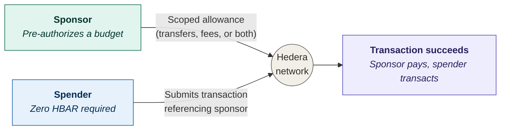

## Abstract

This HIP introduces a new **spender-originated, network-resolved, scoped-allowance consumption** model that extends the existing approval and allowance network logic (`CryptoApproveAllowance`, `NftAllowance`, `TokenAllowance`).

Under this model, a sponsor grants one or more *scoped allowances* to a spender via `CryptoApproveAllowance`. The spender then authors and submits transactions entirely from their own account, declaring `sponsor_claims` that reference those allowances. The network validates and resolves all claims atomically — drawing value movement and/or HAPI fees from the sponsor's balance as declared — without requiring the sponsor to co-sign or appear as the transaction submitter.

Two scopes are defined:

- **`CRYPTO_TRANSFER`** — the sponsor's balance funds HBAR value movement within the spender's transaction. This is a distinct mechanism from the legacy `is_approval` path; the spender is the transaction submitter, and the network resolves the asset movement from the sponsor's balance via the scoped allowance.
- **`TRANSACTION_FEES`** — the sponsor's balance covers HAPI transaction fees (node, network, and service fees).

A single transaction may include `sponsor_claims` spanning both scopes simultaneously, enabling a zero-balance spender to move assets and pay HAPI fees — all funded through allowances granted by one or more sponsors, with no co-signature required. This feature removes the requirement for users to hold HBAR to participate in the network and unlocks new patterns for delegated-cost application design.

## Sponsored Fees Flow

The following diagram illustrates the end-to-end flow of a sponsored transaction, from the sponsor's allowance grant through to atomic settlement on the network.



### Key properties of the flow

- **One sponsor, multiple scopes** is shown as a single claim above for clarity. In practice `sponsor_claims` is a list, and multiple sponsors can cover different scopes in the same transaction (e.g., Alice covers `CRYPTO_TRANSFER`, Carol covers `TRANSACTION_FEES`).
- **USD conversion happens in Phase 1.** The network reads the stored `unit`, and if it is `USD`, converts the HAPI fee or transfer cost using the council-controlled exchange rate from file `0.0.112` before comparing it to the stored allowance amount.
- **Atomicity is the central guarantee.** If any single sponsor claim cannot be satisfied — whether due to a missing allowance, insufficient remaining allowance amount, or insufficient sponsor HBAR balance — *nothing* is charged. No partial sponsor debits ever occur.
- **Allowance and balance are checked independently.** A sponsor must have both sufficient remaining allowance under the scoped record *and* sufficient actual HBAR in the account to cover the tinybar cost. Either being insufficient fails the transaction with `INSUFFICIENT_SPONSOR_ACCOUNT_BALANCE`.

## Terminology

This HIP uses the following actor terms consistently. Two of them — **owner** and **sponsor** — describe the same account viewed from different layers of the protocol, and are deliberately preserved as distinct terms.

- **Owner** — the account that holds an allowance record, as defined by HIP-336. Used as a protobuf field name on `CryptoAllowance.owner` and in the allowance uniqueness key `(owner, spender, scope)`. *Owner* describes a storage-layer relationship.
- **Sponsor** — the account whose balance is debited when a `sponsor_claim` is resolved at transaction execution. Used as a protobuf field name on `TransactionSponsorClaim.sponsor_account_id` and `QueryHeader.sponsor_account_id`. *Sponsor* describes an execution-layer relationship.
- **Spender** — the account granted the right to consume an owner's allowance. Used as a protobuf field name on `CryptoAllowance.spender`. Under HIP-1068, the spender is also the transaction submitter when the `sponsor_claims` path is used.
- **Submitter** — the account that signs and submits the transaction. Under HIP-1068's `sponsor_claims` path, the submitter is always the spender; the transaction id reflects the submitter.

In any scenario where this HIP's `sponsor_claims` path consumes a scoped `CryptoAllowance`, **the sponsor is the same account as the allowance's owner.** The two terms describe the same account in different layers: `owner` in the allowance record, `sponsor` in the transaction body. This HIP uses each term in its respective layer — allowance-record contexts (storage, uniqueness key, upsert rules, mirror node) use `owner` and `spender`; transaction- and execution-layer contexts (validation, charging, user journeys, system contracts) use `sponsor` and `spender`. The protobuf field names are correctly named for their respective layers and are not renamed by this HIP.

The protobuf naming preserves headroom for future HIPs that may decouple these roles (e.g., delegated sponsorship where one account holds the allowance and another authorizes its consumption).

## Motivation

The web3 onboarding process is hindered by the requirement that an account maintain sufficient cryptocurrency at all times to engage with the network. On Hedera, this means an account must have sufficient HBAR balance to submit a HAPI transaction to the network.

While this serves as a security feature to ensure node and network resources utilized are paid, it requires that new users must first obtain cryptocurrency value to engage with the network. It also prevents the abstraction of payments from the submission of transactions. Many more users could be onboarded to the network as well with incentive to engage with the network if their transactions could be "HBAR-less".

Additionally, ecosystem development grant providers find it challenging to distribute funds to partners in a way that is accurate and encourages transaction on the network. Grant providers want to make sure their projects can only spend HBAR awarded on transaction fees to the network and not for unrelated value transfer cases. This makes it easier for grant providers to track funds and assure appropriate usage.

The appropriate solution is one that enables low barrier to entry for users but also maintains network security regarding fee payment. To this end a flow that allows other users to sponsor the fees required of an account during a transaction submission would satisfy both desires.

Ultimately the current Hedera ecosystem lacks a native capability for a sponsor account to cover transaction fees of a spender without co-signing for every transaction. This limitation hinders the development of user-friendly applications and services that could benefit from a more flexible transaction fee payment flow.

## Rationale

Today the network supports three types of allowances: `CryptoAllowance`, `TokenAllowance`, and `NftAllowance`. The existing allowance model (HIP-336) allows a spender to consume an owner's allowance by constructing a transfer that originates from the owner's account and marking the relevant debits with `is_approval = true`. This is an **owner-originated transaction**: the owner appears as the `from` party; the spender authors a transaction on the owner's behalf.

This HIP introduces a parallel but fundamentally different model: **spender-originated, network-resolved, scoped-allowance consumption**. The spender authors a transaction from their own account and declares `sponsor_claims` referencing one or more scoped allowances. The network validates and resolves those claims atomically, drawing from the sponsor's balance to fund the declared scopes. The sponsor's account is not the transaction submitter and does not co-sign.

The new `AllowanceScope` field formalizes which category of cost a given allowance authorizes:

- **`CRYPTO_TRANSFER`**: The allowance funds HBAR value movement within the spender's transaction. In the new path, the spender is the transaction submitter and the network draws the transferred value from the sponsor's balance. This is intentionally distinct from legacy `is_approval`, where the owner's account is the `from` party.
- **`TRANSACTION_FEES`**: The allowance funds HAPI transaction fees (node, network, and service fees).

Accounts use the same `CryptoApproveAllowance` transaction to grant scoped allowances. No new allowance message types are introduced. When a spender submits a transaction that includes `sponsor_claims`, the network identifies the referenced allowance records and, if all validations pass, debits the appropriate sponsor accounts for each declared scope.

Notably, a pseudo sponsored transaction flow exists today if the sponsor submits a transaction signed by the spender. However, this flow requires significant offline coordination and is time limited in some cases depending on transaction validation timing window. This HIP provides a solution that is not limited by either of these considerations. A sponsor need only know the accountId or EVM address of the spender they want to sponsor. A spender need only know the account id or EVM address of their sponsor to submit a transaction and specify to the network that the transaction will be funded by the sponsor.

Additionally, this flow allows for a user with an EVM address but no Hedera account to share their address and be sponsored in advance of their first transaction submission to the network. In this way their first transaction will both not be rejected by the network but will also automatically create their account for them offering a seamless onboarding process.

The proposed changes are made in alignment with the current implementation of allowances for similar capabilities (as seen in [HIP 336](https://github.com/hashgraph/hedera-improvement-proposal/blob/main/HIP/hip-336.md)).

## User stories

1. As a **dApp operator**, I want to sponsor the HAPI transaction fees for my users so that they can interact with my application without holding HBAR.
2. As an **enterprise administrator**, I want to assign a fee allowance to employee accounts so that they can submit consensus messages, token transfers, and other transactions with zero personal balance.
3. As a **sponsor**, I want to set a maximum HBAR or USD amount per spender per scope so that I retain budgetary control over sponsored fees.

### Generic User Stories
1. As an existing account on the network I want to be able to sponsor up to a certain HBAR limit the cost of future transaction fees due by another account by granting an explicit allowance.
2. As an existing account on the network I want to be able to sponsor an unlimited amount of HBARs to cover the cost of future transaction fees due by another account by granting an explicit allowance.
3. As an existing account on the network I want to be able to sponsor up to a certain HBAR limit the cost of different scopes of allowances such as transfers and fee payments by granting an explicit allowance in a single transaction.
4. As a sponsor of transaction fees I want to be able to update the allowance amount higher or lower.
5. As a sponsor of transaction fees I want to be able to revoke the allowance amount I previously granted.
6. As a spender on the network with balance I want to be able to submit transactions that utilize my sponsor's balance to pay for fees instead of mine.
7. As a spender (hollow or complete) with no balance I want to be able to submit transactions that utilize my sponsor's balance to pay for fees.
8. As a user of the network I want to be able to query the current transaction fee allowance balance granted to a spender from a sponsor.
9. As an enterprise dApp operator I want to provide a Web3 service / product but do not want to handle crypto assets as part of the operational costs.
10. As a software provider I want to cover the transaction fees of a customer's account to allow them to interact with my software even with 0 HBARs in their account.
11. As a spender on the network, Alice wants to utilize funds from an allowance to pay for transaction fees even when she has more than enough HBARs to pay for the transaction herself.
12. As a spender on the network, Alice wants to utilize funds from her balance to pay for transaction fees even when she has more than enough HBARs assigned to her in a transaction fee allowance to pay for the transaction.

## Specification

2 user journeys are illustrated below.

### Enterprise dApp Operator

User Story: As an enterprise dApp operator I want to provide a Web3 service / product but do not want to handle crypto assets as part of the operational costs.

User Journey:

1. The enterprise dApp operator signs a commercial off-chain agreement with a crypto intermediary to service their crypto purchases for the operation of their dApp. In this arrangement the crypto intermediary acts as the sponsor and the enterprise dApp operator acts as the spender.
    1. The crypto intermediary whitelists the enterprise dApp operator's primary Hedera account Id on their management platform (for ongoing management platform needs).
    2. The crypto intermediary signs and submits an `AccountAllowanceApproveTransaction` (using the new `AllowanceScope` field set to `TRANSACTION_FEES`) to provide an on-chain reference to the agreement, designating the enterprise dApp operator as the spender.
        1. The fee for this transaction is covered by the crypto intermediary.
        2. The allowance may be either fixed or unlimited.
2. The enterprise dApp operator configures the crypto intermediary as their sponsor for all HBAR transaction or query costs.
    1. E.g. `Client.setFeeSponsor()`.
3. The enterprise dApp operator submits a signed transaction to the network with a `sponsor_claims` entry that identifies the crypto intermediary as sponsor for `TRANSACTION_FEES`.
4. The sponsor's account is interrogated (by the network) for a matching allowance using the enterprise dApp operator's account Id as the spender.
    1. The transaction succeeds if the allowance is present and has either:
        1. unlimited remaining allowance; or
        2. a remaining balance greater than the current transaction fee.
    2. Otherwise the transaction fails.
5. Where the transaction succeeds, the HBAR fees for the transaction are deducted from the sponsor's account.
    1. The enterprise dApp operator's HBAR account balance (used to sign the transaction) is left untouched.
    2. The enterprise dApp operator's HBAR balance can be zero.
6. The transaction is successful.

### Enterprise Software Provider

User Story: As a software provider I want to cover the transaction fees of a customer's account to allow them to interact with my software even with 0 HBARs in their account.

User Journey:

1. The software provider signs an `AccountAllowanceApproveTransaction` (using the new `AllowanceScope` field set to `TRANSACTION_FEES`) which designates the customer as the spender. In this arrangement the software provider acts as the sponsor.
    1. The fee for this transaction is covered by the software provider.
    2. The allowance may be fixed or unlimited.
2. The software provider sets the customer's sponsor as the software provider's dedicated fee account (and synchronizes this with the customer's software for use during transaction submission).
3. The customer submits a signed transaction to the network with a `sponsor_claims` entry that identifies the software provider as sponsor for `TRANSACTION_FEES`.
4. The sponsor's account is interrogated (by the network) for a matching allowance using the customer's account Id as the spender.
    1. The transaction succeeds if the allowance is present and has either:
        1. unlimited remaining allowance; or
        2. a remaining balance greater than the current transaction fee.
    2. Otherwise the transaction fails.
5. Where the transaction succeeds, the HBAR fees for the transaction are deducted from the sponsor's account (i.e., the software provider).
    1. The customer's HBAR account balance (used to sign the transaction) is left untouched.
    2. The customer's HBAR balance can be zero.
6. The transaction is successful.

### Protobuf

A new allowance scope will be added to help define which type of fee an allowance can be used for.
```protobuf
    enum AllowanceScope {
        /**
         * Identifies the allowance value may be used to satisfy crypto transfer transactions.
         */
        CRYPTO_TRANSFER = 0;


        /**
        * The allowance applies to HAPI transaction fees (node, network,
        * and service fees) as defined in the network fee schedule.
        *
        * This scope covers the Hiero-specific cost of submitting a
        * transaction. It does NOT include EVM gas fees.
        */
        TRANSACTION_FEES = 1;

    }
```

A new `AllowanceUnit` enum defines the currency denomination of the allowance `amount` field.

```protobuf
    enum AllowanceUnit {
        /**
         * The allowance amount is denominated in HBAR (tinybars).
         * This is the default value when AllowanceUnit is not explicitly set,
         * preserving backwards compatibility for all existing allowances.
         */
        HBAR = 0;

        /**
         * The allowance amount is denominated in USD (expressed in USD tinycents).
         * The network converts to HBAR at the prevailing exchange rate when
         * settling the allowance. This allows sponsors to define budgets in
         * fiat terms independent of HBAR price fluctuation.
         */
        USD = 1;
    }
```

Crypto allowances will specify the scope allowance records.
```protobuf
    /**
    * An approved allowance of hbar transfers for a spender.
    */
    message CryptoAllowance {
        AccountID owner = 1;
        AccountID spender = 2;
        int64 amount = 3;

        /**
        * The denomination of the allowance amount field.
        *
        * When not explicitly set, the default unit is HBAR for all scopes.
        * USD is also valid for both CRYPTO_TRANSFER and TRANSACTION_FEES scopes.
        *
        * AllowanceUnit is only relevant to CryptoAllowance. TokenAllowance
        * and NftAllowance do not carry a unit field; their amounts are always
        * expressed in the token's own smallest denomination.
        */
        AllowanceUnit unit = 4;

        /**
        * The applicable scope for this CryptoAllowance. 
        */
        AllowanceScope scope = 5;
    }
```
By default existing crypto allowances will map to a `CryptoAllowance` with scope `CRYPTO_TRANSFER` and unit `HBAR`.

`TokenAllowance` and `NftAllowance` retain their existing protobuf definitions. They do not include `scope` or `unit` fields in this HIP, and token/NFT allowance amounts continue to be denominated in the relevant token or serial-number semantics defined by existing allowance behavior.

> Note: To achieve unlimited HBAR allowance functionality, the network MUST support `-1` as a value for `CryptoAllowance.amount`.

At the protobuf level, omitted `scope` and `unit` fields default to `CRYPTO_TRANSFER` and `HBAR`, respectively. This preserves compatibility for existing clients. SDKs SHOULD expose explicit sponsor-oriented builders that require callers to choose the intended scope, while older clients that submit a new allowance without `scope` continue to create a legacy-compatible `CRYPTO_TRANSFER` HBAR allowance.

The updated `TransactionBody` will contain the sponsor account identifier.
```protobuf
    /**
     * A scoped allowance consumption claim declared by the spender (transaction submitter).
     * If present, the specified sponsor account will be charged for the full
     * cost of each declared scope, provided matching scoped allowances exist
     * and are sufficient. A claim may cover value movement (CRYPTO_TRANSFER),
     * HAPI fees (TRANSACTION_FEES), or both.
     *
     * The sponsor referenced here is the same account as the owner of the
     * matching CryptoAllowance record (see Terminology section).
     */
    message TransactionSponsorClaim {
        /**
         * The account the spender asserts has granted a scoped allowance
         * covering the declared scope(s) for this transaction. Resolved
         * against the owner field of candidate CryptoAllowance records.
         */
        AccountID sponsor_account_id = 1;

        /**
         * The set of scopes the spender is requesting be sponsored by the sponsor account. 
         * Each scope MUST appear at most once in this claim, and each scope
         * MUST appear at most once across all sponsor_claims in the
         * transaction. The list MUST contain at least one value.
         */
        repeated AllowanceScope scope = 2;
    }

    
    message TransactionBody {
        // ... existing fields ...

        /**
        * An optional list of sponsor claims for this transaction.
        *
        * Each claim references a sponsor account and the scope of fees
        * the sponsor covers. If empty, the spender (transaction submitter)
        * pays all fees as usual; this preserves existing behavior.
        *
        * Rules:
        *   - Each scope may appear at most once across all sponsor_claims.
        *     Splitting one scope across multiple sponsors is not supported.
        *   - A claim referencing a scope not applicable to the transaction
        *     type SHALL cause the transaction to fail with
        *     INVALID_SPONSOR_CLAIM.
        *   - Duplicate scopes SHALL cause the transaction to fail with
        *     DUPLICATE_SPONSOR_SCOPE.
        */
        repeated TransactionSponsorClaim sponsor_claims = 75;
    }
```

The updated `QueryHeader` would also contain the sponsor account identifier for sponsored query fees.
```protobuf
    message QueryHeader {
        ...

        /**
         * The account that the spender asserts has granted an HBAR allowance
         * (scope = TRANSACTION_FEES) to sponsor the query fees. Resolved
         * against the owner field of candidate CryptoAllowance records.
         */
        AccountID sponsor_account_id = 3;
    }
```

`QueryHeader.sponsor_account_id` applies only to `TRANSACTION_FEES`. Queries cannot request `CRYPTO_TRANSFER` sponsorship, and there is no query-level `scope` field because query sponsorship has exactly one applicable scope. If `sponsor_account_id` is not specified, the network treats the query as a normal query and charges query fees through the existing query payment path.

For a sponsored query:

- The query `payment` field MUST be unset. A query that sets both `payment` and `sponsor_account_id` SHALL fail with `INVALID_QUERY_HEADER`.
- All paid query types are eligible for sponsorship unless a query type is explicitly documented as free or unsupported.
- The network validates the same `(owner=sponsor_account_id, spender, TRANSACTION_FEES)` allowance record used for sponsored transaction fees.
- Query sponsorship uses the same two-phase validate-then-charge model as transaction sponsorship: first validate the allowance and sponsor HBAR balance, then deduct the allowance amount and charge the sponsor only if validation succeeds.

### Allowance Uniqueness and Unit Lifecycle

#### Unique Key

An allowance record is uniquely identified by the tuple:

```
(owner, spender, scope)
```

The `unit` field is **not** part of the unique key. This means an owner cannot hold two simultaneous active allowances for the same spender and scope with different units. There is exactly one allowance record per `(owner, spender, scope)` triple.

#### Hollow Account and Alias Resolution

An owner MAY create a scoped `CryptoAllowance` for a spender identified by an `AccountID` alias, including an EVM address alias, before the spender has a numeric Hedera account ID. In this case, the allowance record is keyed by:

```
(owner, spender_alias, scope)
```

When the spender later submits a transaction from that alias and the transaction causes hollow account completion or auto-account creation, the network resolves the alias to the newly created numeric account ID before applying sponsor claim validation. After successful account creation, the network MUST canonicalize the allowance key to:

```
(owner, created_spender_account, scope)
```

and future lookups MUST use the created account ID. If the alias is malformed, cannot be resolved, or cannot complete account creation, the transaction fails according to the existing alias/account validation rules and no sponsor allowance is charged. If account creation succeeds but no matching alias-keyed or account-keyed allowance exists, the transaction fails with `INVALID_SPONSOR_ACCOUNT`.

#### Upsert Semantics

When a `CryptoApproveAllowance` transaction is submitted:

- If no record exists for the `(owner, spender, scope)` tuple, a new allowance record is created storing `amount` and `unit`.
- If a record already exists for the tuple, the transaction **updates** the existing record. Both `amount` and `unit` are overwritten with the new values. This is not a second allowance — it is an in-place replacement. The old spent state is reset.

Example:
1. Owner `0.0.100` grants spender `0.0.200` an allowance of `500_000_000` tinybars (`5 HBAR`) for scope `TRANSACTION_FEES`. The stored record is `(amount=500_000_000, unit=HBAR)`.
2. Owner `0.0.100` later submits a new allowance for spender `0.0.200`, scope `TRANSACTION_FEES`, with `amount=1000` and `unit=USD`. The existing record is overwritten: `(amount=1000, unit=USD)`, meaning 1000 USD tinycents. No second record is created.

#### Unit Change Rules

| Scenario | amount in new tx | unit in new tx | Result |
|---|---|---|---|
| Create new allowance | -1 or > 0 | any valid (or unset -> HBAR) | Creates record |
| Update existing allowance, stored unit = HBAR | -1 or > 0 | unset | Amount-only update; stored unit (HBAR) retained — legacy-compatible path |
| Update existing allowance, stored unit != HBAR  | -1 or > 0 | unset | **FAILS** — `ALLOWANCE_UNIT_REQUIRED_FOR_UPDATE` |
| Update amount and unit | -1 or > 0 | explicitly set | Updates both; unit changes |
| Change unit without new amount | unset | different from stored | **FAILS** — `ALLOWANCE_UNIT_CHANGE_WITHOUT_AMOUNT` |
| Delete allowance | 0 | any (including different from stored) | Deletes record; unit in request is ignored |
| Two entries in same tx for same tuple, different units | — | conflicting | **FAILS** — `ALLOWANCE_UNIT_CONFLICT` |

When a unit is not explicitly set in a `CryptoApproveAllowance` request for a **new** allowance, the default unit is `HBAR` for all scopes. `USD` is also valid for `CRYPTO_TRANSFER` and `TRANSACTION_FEES`.

When updating an **existing** scoped `CryptoAllowance` (amount > 0, record already exists), the `unit` field MUST be explicitly provided unless the submitter intentionally omits it to perform an **amount-only update** — in which case the network retains the stored unit unchanged. If unit is omitted and the stored unit differs from the default unit (`HBAR`), the transaction FAILS with `ALLOWANCE_UNIT_REQUIRED_FOR_UPDATE` to prevent unintentional denomination drift. SDKs should surface this as a deliberate "amount-only update" operation distinct from a full allowance update, so the omission is always intentional.

The asymmetry permitting unit omission when stored unit is HBAR but rejecting it otherwise is deliberate: it preserves the HIP-336 wire format for legacy clients (which never set unit and operate exclusively on HBAR allowances), while requiring HIP-1068-aware clients to be explicit when working with USD-denominated allowances that only they could have created.

#### Deleting and Re-creating with a Different Unit

A delete followed by a re-create with a different unit is explicitly permitted. The sequence:

1. Owner submits `CryptoApproveAllowance` with `amount=0` for `(owner, spender, scope)` → deletes the record.
2. Owner submits `CryptoApproveAllowance` with `amount=N, unit=NEW_UNIT` for the same tuple → creates a new record with the new unit.

This is two separate transactions and is not subject to the `ALLOWANCE_UNIT_CHANGE_WITHOUT_AMOUNT` rule, which only applies when attempting to change the unit in a single update where `amount=0`.

#### Network Resolution of Unit at Execution Time

When a spender submits a transaction referencing a sponsor via `TransactionSponsorClaim`, the spender specifies only the `sponsor_account_id` and the `scope`. The spender **does not** specify the unit. The network performs the following resolution steps at transaction execution time:

**Full-scope sponsorship rule**

When a transaction contains a `sponsor_claim` for a scope, sponsorship is all-or-nothing for that scope within that transaction. The sponsor is responsible for the total amount of every cost or asset movement in the transaction that is covered by the claimed scope. The spender cannot select individual transfer legs, ask the sponsor to cover only a deficit, or split a single claimed scope between sponsor and spender within the same transaction.

Unlike the legacy `is_approval` path, which marks individual transfer legs, `sponsor_claims` resolve sponsorship at the scope level. A `CRYPTO_TRANSFER` sponsor claim therefore applies to the full HBAR value movement covered by that scope in the transaction.

For `CRYPTO_TRANSFER`, the sponsor is responsible for all HBAR value movement in the transaction that is resolved through the `sponsor_claims` path. A transaction cannot use one `CRYPTO_TRANSFER` sponsor claim for Alice to fund a 5 HBAR transfer while Bob funds a separate 2 HBAR transfer from his own balance in the same transaction. That pattern requires separate transactions, or a different mechanism outside this sponsor-claim path.

Each scope MUST appear at most once across all `sponsor_claims` in a transaction. A duplicate scope within a single claim, or the same scope repeated across two sponsor claims, SHALL fail with `DUPLICATE_SPONSOR_SCOPE`. Splitting one scope across multiple sponsors is not supported.

**Phase 1 — Validate all sponsor claims (no charges committed)**

For each `sponsor_claim` in the transaction, in canonical scope order: `CRYPTO_TRANSFER` → `TRANSACTION_FEES`:

1. Locate the allowance record by matching `sponsor_account_id` against the `owner` field of candidate `CryptoAllowance` records, keyed by `(owner=sponsor_account_id, spender, scope)`. If the sponsor account does not exist or no matching allowance record exists, fail with `INVALID_SPONSOR_ACCOUNT`.
2. Read the stored `unit` from that record.
3. Determine the HBAR cost for the requested scope.
   - For `CRYPTO_TRANSFER`: compute the total tinybar value of all HBAR value movement in the transaction covered by the `CRYPTO_TRANSFER` scope. If a transaction has a `CRYPTO_TRANSFER` `sponsor_claim`, the sponsor is responsible for the full total for that scope; partial or per-leg sponsorship is not supported.
   - For `TRANSACTION_FEES`: compute the full HAPI fee (node fee + network fee + service fee) in tinybars.
4. Convert the fee amount to the allowance's denomination:
   - `HBAR`: no conversion needed; compare fee in tinybars directly against the stored amount.
   - `USD`: convert the fee in tinybars to USD cents using the prevailing network exchange rate, then compare against the stored amount in USD cents.
5. If the converted fee exceeds the remaining stored allowance amount **or** the sponsor account's HBAR balance is insufficient to cover the tinybar cost, record a failure for the transaction with `INSUFFICIENT_SPONSOR_ACCOUNT_BALANCE`. **Do not yet debit anything.**

If **any** scope validation fails because a sponsor has insufficient remaining allowance or insufficient HBAR balance, the entire transaction fails with `INSUFFICIENT_SPONSOR_ACCOUNT_BALANCE` before any charges are applied. No partial charges occur — a transaction that cannot fully satisfy all sponsor claims is rejected atomically.

**Phase 2 — Apply all charges (only if Phase 1 succeeded for all scopes)**

For each `sponsor_claim`, in the same order:

6. Deduct the fee in the allowance's denomination from the stored allowance amount.
7. Charge the sponsor's HBAR balance for the actual tinybar cost.

This two-phase validate-then-charge model ensures that no sponsor is partially charged when another sponsor claim in the same transaction fails. Either all sponsorships succeed and all charges are applied, or none are.

#### USD-Denominated Allowances and Exchange Rate Risk

For `unit=USD`, the allowance `amount` is expressed in USD tinycents. The network settles fees at the HBAR/USD exchange rate that is active at the **moment of transaction execution**. The rate source is the network exchange rate file `0.0.112`, using the active `ExchangeRate` values from that file.

The conversion from tinybars to USD tinycents is:

```
usd_tinycents = ceil(tinybars * cent_equiv / hbar_equiv)
```

where `hbar_equiv` and `cent_equiv` are the active exchange-rate fields. The network MUST round up to the nearest USD cent when decrementing a USD-denominated allowance so the allowance is never undercharged. The sponsor's account balance is still debited in the actual tinybar amount charged by the network.

If the exchange rate has moved between when the allowance was established and when the spender uses it:

- If HBAR appreciates (USD buys more HBAR), the spender can execute more transactions before the USD budget is exhausted — a benefit to the spender.
- If HBAR depreciates (USD buys less HBAR), the sponsor's HBAR balance is debited more HBAR per USD cent of allowance consumed. The sponsor's effective HBAR exposure increases.

Sponsors using `unit=USD` accept exchange rate risk between allowance creation and consumption. Sponsors who want to cap their HBAR exposure precisely should use `unit=HBAR`.

#### `CryptoDeleteAllowance` Interaction with Unit

`CryptoDeleteAllowance` remains limited to NFT serial-number allowance deletion as defined by HIP-336 and does not involve `AllowanceUnit`. To remove a scoped HBAR allowance, submit a `CryptoApproveAllowance` with `amount=0` for the `(owner, spender, scope)` tuple. The unit specified in an HBAR allowance deletion request is ignored; only the allowance key is used for lookup and removal.

Legacy HBAR allowance deletion remains backward compatible. If an existing client omits `scope` when submitting `amount=0`, the request deletes the legacy-compatible `(owner, spender, CRYPTO_TRANSFER)` HBAR allowance. Fungible token allowances and NFT allowances continue to use their existing deletion semantics and are not affected by `AllowanceUnit`.


#### Mirror Node Exposure of the `unit` Field

The mirror node REST API exposes the `unit` field on each allowance record returned from the `/allowances/crypto` endpoint. Clients may filter by unit using the `?unit=(HBAR|USD)` query parameter described in the Mirror Node API section. The `unit` field is not present on token and NFT allowance endpoints, where the denomination is always the token's own unit.

#### State and Storage Implications

Adding the `unit` field to each `CryptoAllowance` record introduces one additional byte of storage per allowance (a protobuf enum encoded as a varint). Given the existing 100-allowance-per-account limit, the maximum additional state per account is 100 bytes, which is negligible. No migration of existing allowance records is required; absent the field, the protobuf default of `0` maps to `HBAR`, preserving existing semantics.

### Error Cases

As with normal transactions, sponsored transactions may fail. Existing network rules remain applicable.

Sponsor claim validation is **atomic**: all sponsor claims are fully validated before any charge is committed. If any single claim fails — whether due to a missing allowance record, an insufficient allowance balance, or an insufficient sponsor HBAR balance — the entire transaction is rejected and no sponsor account is charged. This applies both within a scope (e.g., a single `TRANSACTION_FEES` claim) and across scopes.

A node that encounters an invalid sponsor account value, a non-existent sponsor account, or no matching allowance record for the sponsor, spender, and requested scope will respond with a new response code.

```protobuf
    enum ResponseCodeEnum {
        ...

        /**
        * A sponsor claim referenced a sponsor account that is invalid or
        * does not exist, or no matching allowance record exists for the
        * sponsor, spender, and requested scope.
        */
        INVALID_SPONSOR_ACCOUNT = 400;
        
    }
```

Transaction sponsorship will be complete in nature; a sponsor must be able to cover the full fee. If the remaining sponsored allowance amount is insufficient, or the sponsor's HBAR balance is insufficient to cover the actual tinybar debit, the transaction will fail with a new response code.

```protobuf
    enum ResponseCodeEnum {
        ...

        /**
        * A sponsor claim was valid, but the remaining allowance amount or
        * sponsor account HBAR balance was insufficient to cover the full
        * sponsored cost.
        */
        INSUFFICIENT_SPONSOR_ACCOUNT_BALANCE = 401;
    }
```


```protobuf
    enum ResponseCodeEnum {
        /**
        * A sponsor claim referenced a scope that is not applicable
        * to the transaction type.
        */
        INVALID_SPONSOR_CLAIM = 402;

        /**
        * A sponsor claim referenced duplicate scopes in one transaction
        */
        DUPLICATE_SPONSOR_SCOPE = 403;

        /**
        * A CryptoApproveAllowance transaction attempted to change the unit
        * of an existing allowance without also providing a new non-zero amount.
        * When updating an allowance's unit, a new amount MUST be specified
        * (amount > 0). To delete the allowance, submit amount = 0; the unit
        * in a deletion request is ignored.
        */
        ALLOWANCE_UNIT_CHANGE_WITHOUT_AMOUNT = 404;

        /**
        * A CryptoApproveAllowance transaction updated an existing scoped
        * CryptoAllowance (amount > 0) where the stored unit is non-default
        * (USD), without explicitly setting the unit field. When the stored
        * unit is HBAR (the protobuf default), omitting unit is permitted
        * for HIP-336 backwards compatibility. When the stored unit is USD,
        * unit MUST be explicitly provided to prevent unintentional
        * denomination drift, since a stored-USD record can only have been
        * created by a HIP-1068-aware client.
        */
        ALLOWANCE_UNIT_REQUIRED_FOR_UPDATE = 405;

        /**
        * A CryptoApproveAllowance transaction included multiple entries for
        * the same (owner, spender, scope) tuple with conflicting units.
        */
        ALLOWANCE_UNIT_CONFLICT = 406;

    }
```

### Transaction Id

Currently the transaction id of any submitted transaction takes the form of `<accountId>@<validStartTime>`. Usually the `accountId` signifies the account that both submitted and funded the transaction. Under HIP-1068, the `accountId` in the transaction id of a sponsored transaction continues to refer to the **submitter** (which under the `sponsor_claims` path is the spender). The **sponsor account** that is debited for fees appears in the `sponsor_claims` field of the transaction body. This HIP does not introduce a separate "payer" concept.

### System Contract Functions

Similar to [HIP 906](https://hips.hedera.com/hip/hip-906), the system contract interface would need to be updated to support the management of allowances with scope by a smart contract.

The following functions are introduced in this HIP. In all functions below, `owner` is not an explicit parameter. The allowance owner is derived from `msg.sender` for system contract calls, or from the account/token facade address for EOA facade calls. This keeps the Solidity interface and selector tables consistent.

```solidity
    interface IHRC1068 {
        enum AllowanceScope {
            CRYPTO_TRANSFER,
            TRANSACTION_FEES
        }

        /// Denomination of the allowance amount.
        /// Defaults to HBAR (0) when not explicitly set.
        enum AllowanceUnit {
            HBAR,   // amount denominated in tinybars (default)
            USD     // amount denominated in USD cents; settled at prevailing rate
        }

        /// extensions of HIP 514
        function approve(address token, address spender, uint256 amount, AllowanceScope allowanceScope) external
            returns (int64 responseCode);
        function approveNFT(address token, address approved, uint256 serialNumber, AllowanceScope allowanceScope)
            external returns (int64 responseCode);
        function setApprovalForAll(address token, address operator, bool approved, AllowanceScope allowanceScope)
            external returns (int64 responseCode);

        /// extensions of HIP 906
        function hbarAllowance(address spender, AllowanceScope allowanceScope) external returns (int64 responseCode,
            int256 amount, AllowanceUnit allowanceUnit);
        function hbarApprove(address spender, int256 amount, AllowanceScope allowanceScope,
            AllowanceUnit allowanceUnit) external returns (int64 responseCode);
    }
```

The selector hash is computed from the ABI-canonical signature, where enum arguments are encoded as `uint8`.

`IHRC1068` token methods will be callable via the HTS system contract at `0x167`.
| Hash | Solidity selector | ABI-canonical selector | HAPI Service |
|---|---|---|---|
| 0x70662901 | approve(address token, address spender, uint256 amount, AllowanceScope allowanceScope) external returns (int64 responseCode) | approve(address,address,uint256,uint8) | HTS (0x167) |
| 0xca32d40b | approveNFT(address token, address approved, uint256 serialNumber, AllowanceScope allowanceScope) external returns (int64 responseCode) | approveNFT(address,address,uint256,uint8) | HTS (0x167) |
| 0xebaab589 | setApprovalForAll(address token, address operator, bool approved, AllowanceScope allowanceScope) external returns (int64 responseCode) | setApprovalForAll(address,address,bool,uint8) | HTS (0x167) |


`IHRC1068` account methods will be callable via the Hedera Account Service (HAS) system contract at `0x16a`.
| Hash | Solidity selector | ABI-canonical selector | HAPI Service |
|---|---|---|---|
| 0xba62976f | hbarAllowance(address spender, AllowanceScope allowanceScope) external returns (int64 responseCode, int256 amount, AllowanceUnit allowanceUnit) | hbarAllowance(address,uint8) | CryptoService (0x16a) |
| 0x63a1e09f | hbarApprove(address spender, int256 amount, AllowanceScope allowanceScope, AllowanceUnit allowanceUnit) external returns (int64 responseCode) | hbarApprove(address,int256,uint8,uint8) | CryptoService (0x16a) |


The following `IHRC1068` methods will be directly callable by EOAs from a dApp and do not require a deployed smart contract. The contract address in this case is the applicable account or token evmAddress.
| Hash | Solidity selector | ABI-canonical selector | HAPI Service | Contract facade address |
|---|---|---|---|---|
| 0x769d9bc6 | approve(address spender, uint256 amount, AllowanceScope allowanceScope) external returns (int64 responseCode) | approve(address,uint256,uint8) | HTS | Token address |
| 0x94d1d8ae | approveNFT(address approved, uint256 serialNumber, AllowanceScope allowanceScope) external returns (int64 responseCode) | approveNFT(address,uint256,uint8) | HTS | Token address |
| 0x0ad33e14 | setApprovalForAll(address operator, bool approved, AllowanceScope allowanceScope) external returns (int64 responseCode) | setApprovalForAll(address,bool,uint8) | HTS | Token address |
| 0xba62976f | hbarAllowance(address spender, AllowanceScope allowanceScope) external returns (int64 responseCode, int256 amount, AllowanceUnit allowanceUnit) | hbarAllowance(address,uint8) | CryptoService | Account address |
| 0x63a1e09f | hbarApprove(address spender, int256 amount, AllowanceScope allowanceScope, AllowanceUnit allowanceUnit) external returns (int64 responseCode) | hbarApprove(address,int256,uint8,uint8) | CryptoService | Account address |


### SDK API

With the introduction of new allowance scopes, the SDK will need to expose the functionality to developers. The following SDK behavior is expected:

- `AccountAllowanceApproveTransaction`
  - Add `approveHbarAllowance(owner, spender, amount, scope, unit)` or equivalent builder support for scoped HBAR allowances.
  - Add `approveHbarFeeAllowance(owner, spender, amount, unit)` as a convenience wrapper for `scope=TRANSACTION_FEES`.
  - Add `approveHbarTransferAllowance(owner, spender, amount, unit)` as a convenience wrapper for `scope=CRYPTO_TRANSFER`.
  - Treat `amount=-1` as unlimited for HBAR allowances.
  - Require SDK callers using sponsor-oriented methods to explicitly choose `scope`; retain protobuf defaults only for legacy compatibility.
- `Transaction`
  - Add `addSponsorClaim(sponsorAccountId, scopes)` and `setSponsorClaims(claims)` or equivalent APIs.
  - Add `Client.setFeeSponsor(AccountId sponsorAccountId)` as an optional client-level default that applies a `TRANSACTION_FEES` sponsor claim to transactions built by that client unless the transaction overrides sponsor claims. `setFeeSponsor` is the SDK ergonomic name for the underlying `sponsor_account_id` protocol field; the parameter is the same account that owns the matching scoped `CryptoAllowance`.
  - Adding a duplicate scope across sponsor claims MUST be rejected client-side when possible.
- `Query`
  - Add `setSponsorAccountId(AccountId sponsorAccountId)` or equivalent API that writes `QueryHeader.sponsor_account_id`.
  - Add `Client.setQueryFeeSponsor(AccountId sponsorAccountId)` or allow `Client.setFeeSponsor()` to apply to paid queries as `TRANSACTION_FEES` sponsorship.
- Deletion and update behavior
  - To delete a scoped HBAR allowance, SDKs submit `AccountAllowanceApproveTransaction` with `amount=0` and the target scope.
  - Amount-only updates SHOULD be represented by an explicit SDK method, such as `updateHbarAllowanceAmountOnly(...)`, so omitting `unit` is intentional.
  - Full updates SHOULD require both `amount` and `unit`.

`AccountAllowanceAdjustTransaction` is not part of the public Hedera SDK API and is not introduced by this HIP. Any earlier reference to that transaction type should be read as an allowance update performed through `AccountAllowanceApproveTransaction`.

### Mirror Node API

The Mirror Node allowance REST APIs would need to be updated to support the applicable scope concept values.

#### getCryptoAllowances
The `/api/v1/accounts/{idOrAliasOrEvmAddress}/allowances/crypto` would need to be updated to support all scopes.

```json
    {
        "allowances": [
            {
                ...,
                "scope": "CRYPTO_TRANSFER",
                "unit": "HBAR"
            },
            {
                ...,
                "scope": "TRANSACTION_FEES",
                "unit": "USD"
            }
        ],
        "links": {
            "next": null
        }
    }
```

A new query param `?scope=(CRYPTO_TRANSFER|TRANSACTION_FEES)` would be added to allow users to filter on the specific applicable scope type.

A new query param `?unit=(HBAR|USD)` would be added to allow users to filter by allowance denomination.


#### getTokenAllowances and getNftAllowances

The token and NFT allowance REST APIs are unchanged by this HIP. They do not expose `scope` or `unit`, because `TokenAllowance` and `NftAllowance` are not modified by HIP-1068.

## Backwards Compatibility

1. **Existing HBAR allowances are unaffected.** All HBAR allowances created prior to this HIP carry an implicit scope of `CRYPTO_TRANSFER`. The new `AllowanceScope` field on `CryptoAllowance` defaults to `CRYPTO_TRANSFER` (enum value `0`) when not set, this is the protobuf default for an unset enum. Similarly, the new `AllowanceUnit` field on `CryptoAllowance` defaults to `HBAR` (enum value `0`) when not set, which is also the protobuf default for an unset enum. Existing HBAR allowances function identically without any migration or update. Existing token and NFT allowances are not modified by this HIP.

2. **Existing transactions are unaffected.** The `sponsor_claims` field on `TransactionBody` is a new, optional, repeated field. Existing transactions that do not include this field behave exactly as they do today, the submitter pays all fees. An empty `sponsor_claims` list is semantically identical to no list at all.

3. **`is_approval` behavior is unchanged; `CRYPTO_TRANSFER` scope introduces a new, parallel path.** The existing `is_approval` flag on `AccountAmount` within `CryptoTransfer` continues to function exactly as before. Separately, this HIP introduces `CRYPTO_TRANSFER` as a first-class scope within the `sponsor_claims` mechanism — enabling spender-submitted transactions to draw value movement from a sponsor's balance without using `is_approval`. These are two distinct mechanisms for consuming a value-movement allowance: the legacy path is structured as if the owner originates the transaction; the new path is submitted by the spender, with the network resolving the allowance. Both are valid and may coexist within the same transaction.

4. **No changes to CryptoDeleteAllowance.** NFT allowance deletion continues to work as defined in HIP-336. To remove a scoped HBAR allowance, submit a `CryptoApproveAllowance` with `amount = 0` for the desired scope. Fungible token allowances continue to use existing allowance update and deletion semantics.

5. **Allowance limits.** The existing limit of 100 allowances per account remains in effect. Each unique scoped HBAR allowance `(owner, spender, scope)` counts as one allowance toward this limit, alongside existing token and NFT allowances.

6. **Protobuf wire compatibility.** Adding new fields to existing messages and a new enum value is wire-compatible with older clients. Older clients and SDKs will simply ignore the new fields. No breaking changes are introduced to any existing protobuf message.


This HIP does not replace the existing `is_approval` mechanism. Instead, it introduces a parallel allowance consumption path. The two paths differ in which account submits the transaction and how allowances are referenced:

| | Legacy `is_approval` path | New `sponsor_claims` path |
|---|---|---|
| Transaction structure | Originates from owner's account | Submitted from spender's account |
| Allowance reference | Explicit debit from owner's account in transfer | `sponsor_claims` field in `TransactionBody` |
| Scopes covered | Value movement only | `CRYPTO_TRANSFER`, `TRANSACTION_FEES`, or both |
| Owner co-signature required | Yes, or pre-authorized allowance | No |

A single transaction may use both paths simultaneously — for example, using `is_approval` to draw from one owner's balance and `sponsor_claims` to have a separate sponsor cover fees. The two mechanisms are applied independently where declared, subject to the conflict rule below.

There are no changes to token or NFT allowance concepts, and existing HBAR allowances retain their legacy-compatible `CRYPTO_TRANSFER`/`HBAR` defaults, so there should be no regression in functionality for currently deployed applications.


### Relationship to `is_approval` and Legacy HBAR Allowances

The existing `is_approval` flag on `AccountAmount` (introduced in HIP-336) remains fully valid and continues to operate as before for HBAR and fungible token value transfers. This HIP does not modify or deprecate that mechanism.

The `sponsor_claims` path introduced here is a **deliberately new, parallel allowance consumption mechanism**, not a restatement or extension of `is_approval`. The two paths are architecturally distinct:

**Legacy `is_approval` path (HIP-336)**

The spender constructs a `CryptoTransfer` that debits the *owner's* account, marking each owner-sourced debit with `is_approval = true`. The owner's account is the `from` party. The spender may pay fees themselves, or arrange a separate fee-payer. The owner need not co-sign if the allowance is already on-chain, but the transaction is structured *as if it originates from the owner's account*.

**New `sponsor_claims` path (this HIP)**

The spender submits a transaction from *their own* account. The `sponsor_claims` field in `TransactionBody` declares which sponsor accounts hold scoped allowances that should be consumed to fund the transaction. The network resolves those claims atomically — drawing value movement (`CRYPTO_TRANSFER`), HAPI fees (`TRANSACTION_FEES`), or both from the respective sponsor balances. The sponsor does not co-sign and does not appear as a `from` party in the transaction structure.

The `CRYPTO_TRANSFER` scope in `sponsor_claims` is intentionally a new capability, not legacy `is_approval` under a different name. A spender using `sponsor_claims` with `CRYPTO_TRANSFER` scope submits a transaction from their own account; the network moves value from the sponsor's balance to satisfy the transfer. This was not possible under HIP-336 without the sponsor co-signing or the transaction being structured as if originating from the sponsor's account.

**Concrete Example**

Alice grants Bob two scoped allowances via `CryptoApproveAllowance`:

1. `(owner=Alice, spender=Bob, scope=CRYPTO_TRANSFER, amount=1_000_000_000, unit=HBAR)` — funds asset movement
2. `(owner=Alice, spender=Bob, scope=TRANSACTION_FEES, amount=100_000_000, unit=HBAR)` — funds HAPI fees

Alice is the `owner` of each allowance record. She will also be the `sponsor` when Bob references those allowances at submission time — the same account viewed from the storage and execution layers, respectively.

Bob holds zero HBAR. Bob constructs a `CryptoTransfer` from Bob's account to Carol for 5 HBAR and includes the following `sponsor_claims`:

```
sponsor_claims: [
  { sponsor_account_id: Alice, scope: [CRYPTO_TRANSFER, TRANSACTION_FEES] }
]
```

Bob signs and submits the transaction. The network:
1. Validates Alice's `CRYPTO_TRANSFER` allowance covers the 5 HBAR transfer (it does: 10 HBAR remaining).
2. Validates Alice's `TRANSACTION_FEES` allowance covers the HAPI fees (it does: 1 HBAR remaining).
3. Executes atomically: debits Alice's balance for the 5 HBAR transfer and for the HAPI fees; credits Carol's account; decrements both allowance records.

Bob is the transaction submitter; Alice's scoped allowances are the funding source. Bob needed zero HBAR.

**Contrast with the legacy path**: under HIP-336, Bob would have constructed a transfer *from Alice's account* listing Alice as the debit party with `is_approval = true`, paid fees from his own balance (or arranged a separate fee-payer), and submitted it. Bob must still hold enough HBAR to pay fees, and the transfer is structured as originating from Alice's account.

**Coexistence**: a single transaction may use both paths simultaneously. For example, Bob could use `is_approval` to draw from a third account's balance for one transfer leg, while using `sponsor_claims` to have Alice cover fees. The network applies each mechanism where declared.

If the same account is both the legacy `is_approval` source for HBAR value movement and the `CRYPTO_TRANSFER` `sponsor_claim` sponsor in the same transaction, the transaction SHALL fail with `INVALID_SPONSOR_CLAIM`. This avoids ambiguous double consumption of the same owner's HBAR allowance through two different mechanisms. The mechanisms may coexist when they apply to different accounts or when `sponsor_claims` is used only for `TRANSACTION_FEES`.

**Sponsored Query Example**

Alice grants Bob a scoped allowance:

```
(owner=Alice, spender=Bob, scope=TRANSACTION_FEES, amount=100_000_000, unit=HBAR)
```

Bob submits a paid `ContractGetInfo` query with:

```
QueryHeader {
  sponsor_account_id: Alice
  responseType: ANSWER_ONLY
}
```

Bob does not include a query payment transaction. The node computes the query fee, validates Alice's `TRANSACTION_FEES` allowance and HBAR balance, returns the answer, deducts the fee from Alice's allowance, and charges Alice's HBAR balance. If Bob asks for `COST_ANSWER`, no paid answer is executed and the sponsor allowance is not charged.


## Security Implications

This HIP builds on the existing allowance feature functionality and security measures. No new approval authorization logic was added; rather this HIP allows owners to scope their allowance for specific spender intents. Consensus node logic will need to be added to ensure the expensed scope matches the intended scope.

### USD-Denominated Allowance and Exchange Rate Manipulation

Allowances denominated in `USD` are settled at the network's prevailing HBAR/USD exchange rate at execution time. The network's exchange rate is updated by the council-controlled exchange rate system (as described in existing Hedera documentation) and cannot be arbitrarily manipulated by individual users. However, sponsors should be aware of the following:

- **Rate volatility exposure**: If HBAR price drops significantly between allowance creation and use, the sponsor's HBAR balance may be debited more than the USD-equivalent amount suggests. Sponsors with strict HBAR cost ceilings should use `unit=HBAR` instead.
- **Rate update timing**: Exchange rates are updated periodically. A spender who times their transaction to execute immediately after a rate update favoring their side incurs no penalty — this is expected behavior. Sponsors who need precise cost control should use `unit=HBAR`.
- **No oracle manipulation vector**: Because the exchange rate is governed by a council-controlled mechanism rather than a DEX or external oracle that can be flash-loan manipulated, the attack surface for rate manipulation is limited to council-level governance actions, not individual transactions.

### Griefing via Rapid Unit Changes

An owner could in principle change the unit of an allowance repeatedly (e.g., alternating between `HBAR` and `USD`) to produce unpredictable behavior for a spender whose off-chain code reads the allowance before submitting a transaction. If the unit changes between the spender's query and their transaction submission, the spender's transaction may fail with `INSUFFICIENT_SPONSOR_ACCOUNT_BALANCE` if their internal logic computed a fee in the wrong denomination.

Mitigations:
- Spenders should treat allowance queries as advisory only and be prepared to retry on fee failures.
- Any unit change on an existing allowance requires a `CryptoApproveAllowance` transaction signed by the owner, incurring network fees. Repeated changes have a cost floor, making sustained griefing expensive.
- A unit change that reduces the effective budget (e.g., from a large HBAR amount to a small USD amount) is an intentional revocation of budget, which is within the owner's rights.
- The network resolves the unit at execution time from the on-chain record, so the settled denomination is always deterministic from the chain's perspective.

### Smart Contract Interaction Considerations

Smart contracts that interact with allowances programmatically via the system contract interface (`IHRC1068.hbarApprove`, `IHRC1068.hbarAllowance`) must account for the `unit` field:

- A contract that reads an allowance and assumes `HBAR` denomination will compute incorrect budgets if the stored unit is `USD`. Contracts should always read and validate the `AllowanceUnit` returned by `hbarAllowance` alongside `amount` before making spending decisions.
- A contract that grants an allowance to a spender contract should explicitly set the `unit` to match the spender's expectations. Relying on the HBAR default is safe only when the contract and spender are written to the same convention.
- Contracts cannot change the exchange rate or influence unit resolution at execution time. The network resolves the unit and rate at the consensus layer, outside the EVM execution context.
- Re-entrancy via allowance manipulation is not a concern because allowance state is updated atomically at the consensus layer, not during EVM execution. A contract call cannot observe an intermediate state in which the allowance has been partially debited.

## How to Teach This

SDK examples, blogs and tutorials on docs.hedera.com

## Reference Implementation

## Rejected Ideas

### Partial Payments

The idea of partial payments was initially considered in which an account could sponsor a sub amount of fees (finite or percentage) in a transaction and a spender would cover the rest. However, this flow becomes unnecessarily complex and the need is not clear initially. As such, sponsorship of fees will be complete and not partial; if an account sponsors a transaction fee it must have provided enough in the allowance to cover the whole transaction fee. If this is not the case the transaction will fail.

### Implicit Allowance Selection (Auto-Draw on Zero Balance)

It was proposed that the network should automatically draw from a sponsor's allowance when the spender's balance is zero. This was rejected because:

- It is inconsistent with the existing explicit-intent model (`is_approval` flag, ERC `transferFrom`).
- A spender may have multiple sponsors; the network cannot infer which one to use.
- Different spenders may have different off-chain policies; it is not appropriate for the network to assume intent.
- It would silently change the behavior of existing transactions in unexpected ways.

### No Daisy-chained allowances
Daisy chaining allowances is rejected. Example: Alice grants an allowance to Bob, Bob grants an allowance to Fred for the same scope. Fred MUST NOT be able to spend against Alice's allowance to Bob. The sponsor account that is charged MUST be the account referenced by `sponsor_claims.sponsor_account_id`.

### TOKEN_CUSTOM_FEES Scope

A `TOKEN_CUSTOM_FEES` scope was designed and partially specified to allow a sponsor to cover the HTS custom fees charged by a fee collector when a token is transferred. This would have enabled token issuers to absorb custom fees on behalf of recipients so they experience no unexpected deductions.

This scope was removed from the HIP for the following reasons:

- **Denomination ambiguity**: HTS custom fees can be denominated in HBAR, a fixed fungible token amount, a fractional token amount, or a royalty in HBAR. A single `AllowanceUnit` enum cannot cleanly represent all of these. A `TOKEN_CUSTOM_FEES` scoped allowance would require either a separate allowance record per fee denomination or a more complex message type — both of which expand the API surface significantly.
- **Multi-token complexity**: A single transfer may trigger custom fees from multiple different fee schedules and multiple different fee tokens. Mapping a single allowance record to the correct fee at execution time requires additional resolution logic not present in the current allowance model.
- **Scope creep**: The primary goal of this HIP is to enable zero-HBAR-balance accounts to submit transactions by having sponsors cover HAPI fees. Custom fee sponsorship is a distinct and more complex problem that is better addressed in a focused follow-on HIP.

Custom fee sponsorship may be revisited in a future HIP once the core sponsored fees infrastructure from this HIP is in production and the custom fee settlement model is better understood.

### GAS_FEES Scope

A `GAS_FEES` scope was designed and partially specified to allow a sponsor to cover EVM gas costs for `ContractCall`, `ContractCreate`, and `EthereumTransaction` operations. Under this design:

- A new `GAS` unit denomination would express allowances in gas units, settled in HBAR at the prevailing gas-to-tinybar conversion rate at execution time.
- Validation would use the transaction's gas *limit* as an upper bound; the actual gas *consumed* (known only after EVM execution) would be the basis for the final charge, potentially resulting in a refund of the difference.

This scope was removed from the HIP for the following reasons:

- **EVM tooling integration**: The standard `eth_sendRawTransaction` flow and `EthereumTransaction` have no standard mechanism to declare a sponsor claim. There is no EIP-compliant way for an EOA to specify per-transaction intent to use a gas allowance, and extending Hedera's JSON-RPC relay would require non-standard divergence from the broader EVM ecosystem.
- **Two-layer fee settlement**: A smart contract call incurs both a HAPI-level fee (from the fee schedule) and an EVM gas fee. Sponsoring both within a single transaction with different settlement mechanics — fee schedule rates vs. gas price — adds implementation complexity. Shipping HAPI fee sponsorship first allows the core infrastructure to mature before tackling the EVM layer.

The `GAS_FEES` scope and `GAS` unit denomination may be revisited in a future HIP once the core sponsored fees infrastructure is in production.

### Additional Allowance Types
Initially 2 new Allowance types were proposed (`TransactionFeeAllowance` and `CustomFeeAllowance`) to capture the ability to sponsor transaction and token custom fees. Though functional this would result in a larger API surface to specify the multiple scenarios. Instead the simple concept of a scope of applicability of each allowance was discussed and agreed upon. The simple scope concept is cleaner and can be added to the existing allowance types.

## Open Issues

- None. Hollow account sponsorship is specified in the "Hollow Account and Alias Resolution" section.


## References

- [HIP-336: Approval and Allowance API](https://github.com/hashgraph/hedera-improvement-proposal/blob/main/HIP/hip-336.md)
- [HIP-514: Smart Contract Service Token Transfer and Approval System Contract Functions](https://hips.hedera.com/hip/hip-514)
- [HIP-906: Hedera Account Service System Contract](https://hips.hedera.com/hip/hip-906)
- [Hedera protobufs: `services/transaction.proto`](https://github.com/hashgraph/hedera-protobufs/blob/main/services/transaction.proto)
- [Hedera protobufs: `services/query_header.proto`](https://github.com/hashgraph/hedera-protobufs/blob/main/services/query_header.proto)
- [Hedera protobufs: `services/response_code.proto`](https://github.com/hashgraph/hedera-protobufs/blob/main/services/response_code.proto)
- Hedera network exchange rate file: `0.0.112`

## Copyright/license

This document is licensed under the Apache License, Version 2.0 -- see [LICENSE](../LICENSE) or
(https://www.apache.org/licenses/LICENSE-2.0)