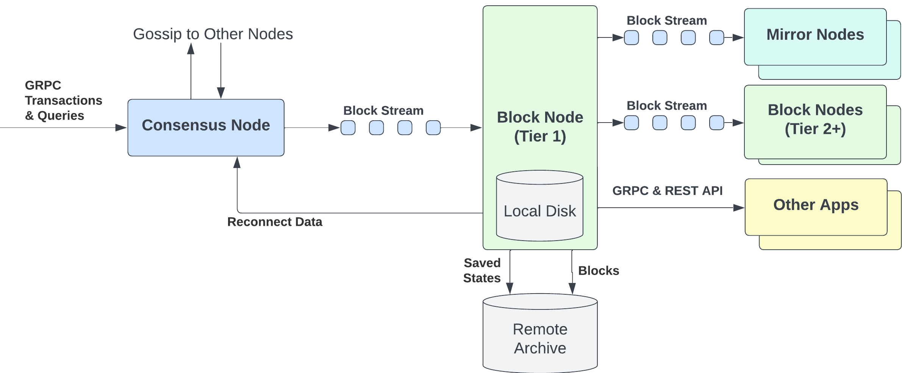
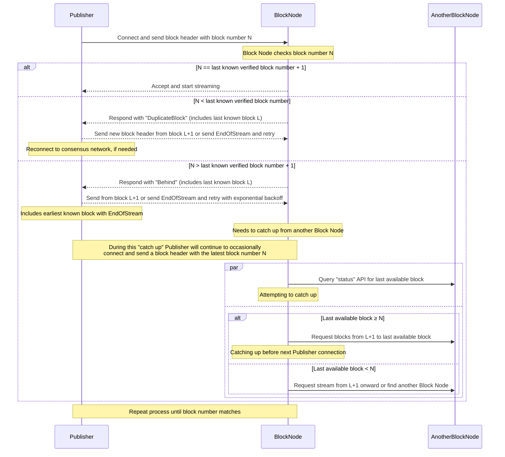
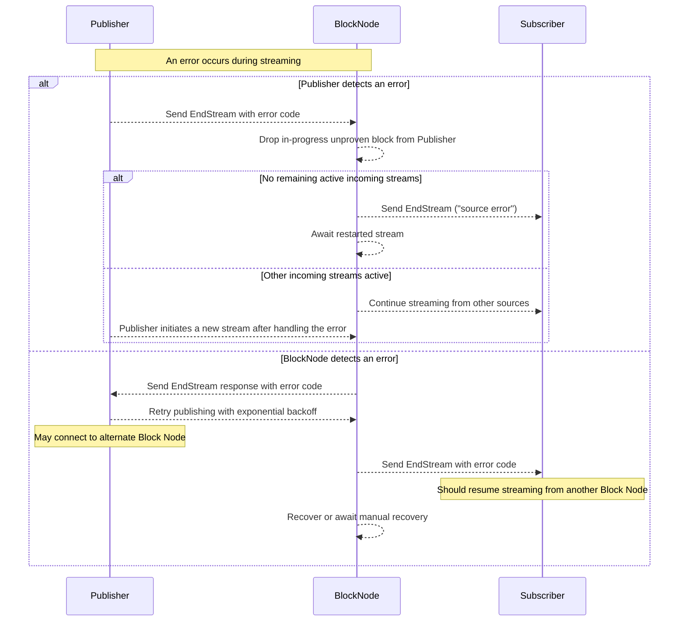

## Abstract

This HIP introduces and proposes the adoption of a new node type that is designed to parse the block streams, store
historical blocks, maintain latest state and serve up additional network APIs such as state proofs and block retrieval
that support decentralized querying and verification of state. 

A block node will primarily sit in between a consensus node and a mirror node to serve as a decentralized source of
verifiable network state and transaction information. As an emergent feature a block node will introduce a new node
economy through independent community operations. Anyone will be able to independently run a block node or block
stream parsing product that provides value added services to users e.g. aggregated data insights, data availability.

Block Nodes will have a rich API, allowing consumers to receive a subset of the stream, or the full stream. Block Nodes
can innovate on payment -- they can be commercial and have connectivity rules / rate limits / SLAs for customers. 
They can require payment for serving blocks, or they can serve blocks for free.

Block nodes will supersede the cloud storage buckets utilized today. Besides taking over storage duties, block nodes
will also offer reconnection services to consensus nodes and other block nodes. They will also provide cryptographic
proofs to both users and mirror nodes, enhancing the system's security and decentralization.
Mirror nodes will be updated to be able to retrieve block streams directly from block nodes.



The concepts of Block Node Discoverability and API pricing are noted in this HIP but will be expanded upon in future
HIPs and individual Hiero deployed network documentation.

## Motivation

In the current network architecture the consensus node outputs data representing snippets of consensus and transaction
inputs and outputs. The majority of this information sits in publicly available but costly cloud buckets from which the
community can download information and parse it - the mirror node and other indexers have utilized this flow since 2019
to support DApps.

One of the primary motivations is the decentralization of network data storage, thus reducing the centralization of
information in a few cloud providers and expanding it to anyone who wants to run a block node.

Additionally, some notable challenges of the existing architecture that the block nodes hopes to resolve are:

- Users must query the consensus node for latest state information
- Consensus nodes must rely on other consensus nodes to be taught latest Hashgraph information in order to catch up
- Consensus nodes don’t offer proof of state APIs
- Community members are unable to easily run independent nodes with complete state and transaction information that
support the verification of the consensus outputs


## Rationale

The block node has goals to increase data availability and push the bar on decentralization and promote client diversity.

To achieve this open, easy, performant and extensible communication is needed.
As such the block node will initially utilize the gRPC framework over the HTTP/2 protocol for communication. 
gRPC was chosen due to the HTTP/2 support, cross language and platform communication support (client diversity), high
performance streaming, use of protobufs (continued commitment to simple and clean API specification) and flexibility
with microservice pluggable options.

Consumers will utilize gRPC clients to communicate.
The use of gRPC matches the communication protocol used by the consensus node but differs from other web3 nodes which
often utilize JSON RPC APIs over HTTP. In the future it may be valuable to explore and add additional protocols such as
WS and HTTP (REST API, graphQL) based on community needs.


### Upgradeability

It is a goal of a block node to be easy to run by users across different, languages, platform and cloud hosting
resources. Today the network requires that consensus nodes all run the same software to ensure integrity and optimal
management of the network. Block nodes should not require this strict coupling and instead should offer the ability to
upgrade independently from the network consensus nodes.

Restrictions may exist when it comes to block stream protobuf versions. The block node will, however, make every
effort to be forward compatible, ensuring that new information added to the block stream can still be parsed, verified,
stored, and served even if the block node does not have a complete understanding of the detail contents.

The block node will support semantic version values and will make its current version available via API requests.

## User stories

### Terms
- **Block Node**: A software system intended to process a Block Stream and store blocks. The content of a Block Stream
    is defined in HIP 1056, among others.
- **Block Number**: A monotonically increasing number assigned by consensus to each block produced by the network.
- **Publisher**: An entity publishing blocks to a Block Node via the `publishBlockStream` API. This is typically a
    Consensus Node or another Block Node.
- **Subscriber**: An entity that subscribes to a verified Block Stream from a Block Node.
- **Verified Block**: A verified block is a block for which a Block Proof is received and for which the TSS signature
    of the network ledger ID is valid.
- **Full History Block Node**: A block node that maintains block history from genesis
- **Archive Block Node**: A block node that maintains block history but does not expose consumer block streaming
    services
- **Rolling History Block Node**: A block node that maintains blocks but prunes them after a configured period of time
- **Tier 1 Block Node**: A block node that receives block streams from a consensus node
- **Tier 2+ Block Node**: A block node that receives block streams from a block node or any non-consensus node block stream provider

### Personas

- Hiero consensus node operators
- Independent community node operators
- Mirror Node operators
- Block Node operators
- Custom dApps focused on high TPS flows
- Custom dApps focused on low trust flows
    - Low Trust, here, implies the dApp does not trust the block data without independently verifying authenticity and
    integrity.

### User Stories

1. As a block node operator I want to collect all of the information, in the form of block streams, produced by
consensus nodes.
2. As a block node operator I want to accept unfiltered and unverified block stream from one or more consensus nodes.
3. As a block node operator I want to offer a `publish` API that allows block streams producers to push block
items to a block node.
4. As a block node operator I want to provide a clear communication protocol that servers as a contract between a block
node and a consensus node to ensure reliable and predictable streaming of block items.
5. As a block node operator I want to offer a streaming API that provides access to real time verified block stream
details.
6. As a block node operator I want to offer an on demand block API that provide access to historical block details.
7. As a block node operator I want to verify the network signature in a block proof and assert block integrity.
8. As a block node operator I want to persist and maintain a complete and correct copy of the latest state.
9. As a block node operator I want to offer state APIs that provide access to historical state details.
10. As a block node operator I want to offer state APIs that provide access to latest state details.
11. As a block node operator I want to answer all queries available from the consensus node.
12. As a block node operator I want to offer a Reconnect API that allows a block node to “catch up” to latest network
activity by providing the latest block(s) and a historic state.
13. As a block node operator I want to offer a Reconnect API that allows a consensus node to “catch up” to latest
network activity by providing a recent historical state snapshot and/or recent blocks.
14. As a block node operator I want to offer `subscribe` API that allows block streams consumers to stream block
items starting at any valid block and continuing forward from that point indefinitely or to a specified end block.
15. As a block node operator I want to subscribe to an unfiltered and verified block stream from one or more block nodes.
16. As a block node operator I want to subscribe to a filtered and verified block stream from one or more block nodes.
17. As a custom dApp I want to subscribe to an unfiltered and verified block stream from a block node.
18. As a custom dApp I want to subscribe to a filtered and verified block stream from a block node.
19. As a custom dApp I want an API to request a copy of the periodic historical state snapshots maintained and made
available by a block node.
20. As a custom dApp I want an API to request a state proof for any item in state, as of an arbitrary historical block,
from a block node. 
21. As a custom dApp I want an API to request a state proof for any item in state, as of the most recent block, from a
block node.
22. As a consensus node operator I want to publish a block stream to one or more block nodes so that I am not required
to maintain historical state snapshots.
  
## Specification

The block node at its simplest will be another node server that offers APIs to consumers to obtain needed network
information and insights. Clean extendable schemas and easy to consume APIs are important to reach this goal

### Block Stream Schema

The Block node will support the streaming and parsing of Block Stream messages in protocol buffer format, as specified
in the [hiero-consensus-node repository](https://github.com/hiero-ledger/hiero-consensus-node/tree/main/hapi/hedera-protobuf-java-api/src/main/proto/block).

There are a few cases where a stream requires consideration from the Block Node
1. Protobuf version upgrades: The backward and forward compatibility built into protocol buffers makes versioning the
    protocol buffer specification largely unnecessary, and also ensures that future software versions will always be
    able to read, verify, and process older block stream data.
2. Pause in stream due to CN upgrades: The CN has historically carried out monthly coordinated upgrades of its software.
    This will remain a normal disruption in the data stream that a block node must support. In this case a block node
    will expect an end-of-stream response from a CN which it will gracefully manage.
3. No Block Proof: Each block stream in the block stream (with the exception of record file block items) is terminated
    with a block proof that provides the confidence of network verification of the block at hand. The lack of a block
    proof over a prolonged time is a signal to the block node that the CN has encountered an issue calculating the
    proof - either due to falling behind consensus or due to a potential ISS. A block node will maintain its connection
    and will manage an end-of-stream in the case the CN falls behind. Here, open subscriber connections that are
    streaming live block items out will likely be terminated after an established period of time.
    In such a case the block node may potentially observe the connection and persist the given current and previous
    block contents to aid in troubleshooting of the stream.
4. Delayed Block Proof: A delayed block proof may be followed by the receipt of a cascade proof. This is where an
    earlier block is proved using a later block signature with a chain of previous block hashes. In this case the block
    node will still eventually receive a block proof for every block. 

### Services
To achieve the above the block node will offer multiple pluggable services which can be enabled by node
operators.

> Note: protobuf summaries are noted in this HIP doc. The full protobuf specification can be found under
[block node protobuf](./../assets/hip-1081/protobuf)

> Block node implementers are encouraged to structure services as loosely coupled deployable service, not
configured, deployable. This will encourage light weight and scalable block nodes for community operators.


#### Block Access Service

As the block stream is ongoing and items are sent out in real time, it is valuable to be able to request a historical
block in its entirety.
The `getBlock` endpoint on teh `BlockAccessService` will allow a consumer to request a single verified block from the
block node.

```protobuf
/**
 * Remote procedure calls (RPCs) for the Block Node block services.
 */
service BlockAccessService {
    /**
     * Read a single verified block from the block node.
     */
    rpc getBlock(BlockRequest) returns (BlockResponse);
}
```

> Note: A stream of state changes highlighting the changes in a given block may be obtained by utilizing block item
filtering on the block service.

| Response code                     | Description   |
| --------------------------------- | ------------- |
| READ_BLOCK_UNKNOWN                | The server software failed to set a status,and SHALL be considered a software defect. |
| READ_BLOCK_INSUFFICIENT_BALANCE   | The requesting client account lacks sufficient HBAR to pay the service fee for this request. |
| READ_BLOCK_SUCCESS                | The request succeeded. |
| READ_BLOCK_NOT_FOUND              | The requested block was not found. |
| READ_BLOCK_NOT_AVAILABLE          | The requested block is not available on this block node server. |
| VERIFIED_BLOCK_UNAVAILABLE        | The request for a verified block cannot be fulfilled because the block node has yet to verify the block. |

#### Block Stream Publsih Service

One of the primary goals of the Block Node will be to expose a public streaming endpoint to which a block stream
producing client like a Consensus Node can publish block items to.

The `publishBlockStream` on teh `BlockStreamPublishService` will provide publishers with an endpoint to push their
block stream

```protobuf
/**
 * Remote procedure calls (RPCs) for the Block-Node block stream publishing services.
 */
service BlockStreamPublishService {
    /**
     * Publish a stream of blocks.
     */
    rpc publishBlockStream(stream PublishStreamRequest) returns (stream PublishStreamResponse);
}
```

For multiple reasons including security and ease of data rate controls the consensus node will push block stream data
to a block node. As such a block node must be ready and available to accept connections that push the block stream to
the node as blocks are agreed upon by the network. In this mode the Consensus Node or other block stream clients act as
the Producer feeding the block node data.

A summarized handshake of communication between a publisher and BN is as follows
- A publisher will send a Block Header item on connection
- A block node will accept the stream if it is the next block or the node has no cache of previous blocks. 
    - If the block is less than the last known block, the block node will respond with a `DuplicateBlock` response
    including details of the last known block. In this case the Block Node itself may explore a backfill path from
    another block node to resolve gaps in blocks where applicable.
    - If the block is greater than the last known block, the block node will respond with a `Behind` response including
    details of the last known block. A publisher must send either an earlier block or an `EndOfStream` in response. If
    an an `EndOfStream` is sent by the publisher it must include its earliest known block to signal to the Block Node
    how large of a catchup range it must resolve. In this case the Block Node itself may explore a backfill path from
    another block node to resolve gaps in blocks where applicable.
- During streaming errors may occur from either side.
    - If a Publisher detects an error it must send an `EndStream` response in the next BlockItem. A Block Node will
    drop unverified blocks from that Publisher.
    - If a Block Node detects an error it will send an `EndStream` response in the next BlockItem to all publishers.
    A publisher must respond with a a replay of the given block in sessions and will apply exponential
    backoff if the error repeats.





Publish block stream API response codes and their details are noted below

| Response code             | Description   |
| ------------------------- | ------------- |
| STREAM_END_UNKNOWN        | The server software failed to set a status, and SHALL be considered a software defect. |
| STREAM_END_RESET          | The Publisher reached a reset point. |
| STREAM_END_TIMEOUT        | The delay between items was too long. |
| STREAM_END_ERROR          | The publisher encountered an error. |
| STREAM_END_TOO_FAR_BEHIND | The block node is too far behind to catch up directly. |

> When the producer is a consensus node it is important to expose error cases that suggest a blocks node is falling
behind or failing to store blocks when expected.

> Notably, a block node may consume a block stream from multiple sources e.g. multiple CNs.
This approach can be used to increase the reliability and availability of network data.

> Note: If the producer is not a Consensus Node a Block Node may receive a filtered block stream via the
`publishBlockStream` endpoint. Filtering support is expanded upon in the Block Stream HIP 1056 and is characterized by
the replacement of block items with hash values while maintaining the ability to carry out block and state proofs on
the block information.

#### Block Stream Subscribe Service

One of the main value added service APIs a Block Node will provide will be to expose a public streaming endpoint of
verified block information.

The `subscribeBlockStream` on the `BlockStreamSubscribeService` will provide consumers with an endpoint to stream out
block items.

The block node will support 2 modes of data flow connections from external clients: publishBlockStream (push mode) &
subscribeBlockStream (pull mode)

```protobuf
/**
 * Remote procedure calls (RPCs) for the Block Node Stream subscribing services.
 */
service BlockStreamSubscribeService {
    /**
     * Subscribe to a stream of blocks.
     */
    rpc subscribeBlockStream(SubscribeStreamRequest) returns (stream SubscribeStreamResponse);
}
```

The `subscribeBlockStream` endpoints may offer filtering capabilities based on user requests and Block Node
functionality support.

Filtering will be at the Block Item level based on the content of specific block items (e.g. a dApp might only want
transactions for specific HCS topics). Future enhancements may offer filtering based on the matching of state
information or cross-transaction comparison.

An overview of communication between a Block Node and a subscriber is as follows
- A subscriber will send a desired block range and desired for verified or unverified streaming on connection
- A block node will accept the stream if the desired block range is supported. 
    - If the first block is less than the earliest available block, the block node will respond with a
    `READ_STREAM_INVALID_START_BLOCK_NUMBER` response.
    - If the end block is greater than the last available block, the block node will respond with a
    `READ_STREAM_INVALID_END_BLOCK_NUMBER` response.
    - Note: The end block _may_ be `0` to request "infinite" streaming that ends only when the client disconnects,
    the block node reaches a maximum streaming limit, there is a network interruption, or the block node restarts.
- During streaming, errors may occur.
    - If a Block Node detects an error it will send an `EndStream` response instead of the next BlockItem to all
    subscribers. A subscriber may choose to retry or connect to a different block node.

<aside>
🚨 **Open Task:** Complete communication overview
</aside>

Subscribe block stream API response codes and their details are noted below

| Response code                             | Description   |
| ----------------------------------------- | ------------- |
| READ_STREAM_UNKNOWN                       | The server software failed to set a status and SHALL be considered a software defect. |
| READ_STREAM_INSUFFICIENT_BALANCE          | The requesting client account lacks sufficient HBAR to pay the service fee for this request. |
| READ_STREAM_SUCCESS                       | The request succeeded. |
| READ_STREAM_INVALID_START_BLOCK_NUMBER    | The requested start block number is not valid. |
| READ_STREAM_INVALID_END_BLOCK_NUMBER      | The requested end block number is not valid. |
| READ_STREAM_NOT_AVAILABLE                 | The requested stream is not available. |


#### Node Service
The block node service will provide ancillary services to inform users of node readiness and configuration.

The `serverStatus` endpoint will provide consumers with details regarding block ranges, API version, if historical
snapshots are supported, and if other value-added services are supported

```protobuf
/**
 * Remote procedure calls (RPCs) for the Block Node Ancillary services.
 */
service BlockNodeService {
    /**
     * Read the status of this block node server.
     */
    rpc serverStatus(ServerStatusRequest) returns (ServerStatusResponse);
}
```


#### Proof Service

Consensus node provided proof of state APIs has long been desired, however, this would put additional work on the
consensus node that could be better provided elsewhere. Additionally, the consensus network only manages live state,
and could not offer state proof for historical state.
By maintaining live state, historical state snapshots, and streaming block stream information a block node can finally
fill this gap and provide users with a variety of proofs, including state proofs.

HIP 1056 elaborates on the 3 types of proofs exposed in the block stream, `ProofService` will provide endpoints to
request a subset of these proofs.

`getBlockContentsProof` will provide an endpoint to request a BlockCOntents proof that verifies a specific `BlockItem`
is found within a given Block.

`getStateProof` will provide an endpoint to request a State proof that verifies a specific state value at a given Block.

```protobuf
/**
 * Remote procedure calls (RPCs) for the Block Node block contents proof
 * and state proof query services.
 */
service ProofService {
    /**
     * Request a block contents proof for a given block from the block node.
     */
    rpc getBlockContentsProof(BlockContentsProofRequest) returns (BlockContentsProofResponse);

    /**
     * Request a state proof for a given state item and block from the block node.
     */
    rpc getStateProof(StateProofRequest) returns (StateProofResponse);
}
```

#### Reconnect Service

Today the network consensus nodes act as teachers to each other when a new node comes online and needs to get the latest
Hashgraph information and state. To ensure future scalability it's important to relieve the consensus nodes of any
unnecessary functionality that expends time and network resources which could be focused on transactions execution and
Hashgraph state management.

As such the block node will replace the teaching role of a consensus node today and serve as a reliable teacher to any
consensus node or block node coming online and looking for latest network details.


```protobuf
/**
 * Remote procedure calls (RPCs) for the Block Node reconnect services.
 */
service ReconnectService {
  /**
   * Request reconnect data comprised of state and block data from the block node.
   */
  rpc reconnect(ReconnectRequest) returns (stream ReconnectResponse);
}
```

#### State Service

In todays network consensus nodes take periodic state snapshots and store them on cloud buckets. However, these states
have not been provided for easy community consumption.
By maintain live state and taking period state snapshot a Block Node can expose new state related services that enable
DApps to gain more fine grained exposure to state properties at any block.

The `stateSnapshot` on the `StateService` will allow clients to request a Hashgraph state snapshot.

```protobuf
/**
 * Remote procedure calls (RPCs) for the Block Node State snapshot
 * and query services.
 */
service StateService {
    /**
     * Read a state snapshot from the block node.
     */
    rpc stateSnapshot(StateSnapshotRequest) returns (StateSnapshotResponse);
}
```

<aside>
🚨 **Open Task:** Flesh out Single entity state query e.g. return account 0.0.x 
</aside>

| Response code                         | Description   |
| ------------------------------------- | ------------- |
| STATE_SNAPSHOT_UNKNOWN                | The server software failed to set a status,and SHALL be considered a software defect. |
| STATE_SNAPSHOT_INSUFFICIENT_BALANCE   | The requesting client account lacks sufficient HBAR to pay the service fee for this request. |
| STATE_SNAPSHOT_SUCCESS                | The request succeeded. |

> Note: In the future a block node could offer additional APIs such as on demand Live state and a stream of state changes
and single entity state requests


### Monetization

Block nodes will perform significant work by consuming the block stream, verifying it, storing it and providing
multiple API services to further users. To block node operators it is thus important to offer capabilities to cover
the cost of work and encourage a vibrant economy.

To achieve this the Block Node will adopt a model similar to a pre-paid card, with crypto transfers of crypto currency
to the block node account required prior to the consumption of APIs. The block node will initially maintain a balance
ledger on node to track the remaining balance that each AccountID holds with that block node. Only non-zero balances
would be tracked in this manner.

To achieve this it is required that a block node have its own `AccountId` that users can transfer to.

> Note: This account could also be a smart contract to utilize more strict automated rules for how funds are managed.

API costs will vary based on API but will include flat fees per request and variable fees based on size of data and
complexity.

Notably, monetization will be an optional and replaceable service that allows for free or reduced cost pathways per the
configuration of the operator.
For example a consensus node operator would likely run its own block node and would not charge for calls from that
consensus node to that block node.

<aside>
🚨 **Open Task:** Add a diagram to illustrate
Potentially a sequence diagram to highlight the onboarding flow to access paid APIs
</aside>

## Backwards Compatibility

Block Nodes propose to completely replace the existing cloud storage buckets and replace the record file format with
the block stream format.
All consumers of record stream data from the existing cloud storage buckets will need to change the mechanism of
access, change the mechanism of payment, and adjust any processing logic to process block stream data.

With consideration for Hiero transaction protobuf type formats - the block node will support the new Block Stream
format, which incorporates the existing transactional API formats by reference.

## Security Implications

The Block Node does not sign or co-sign any transactions to the network. It is **not** a custodian. 

The Block Node must have an account on the network to ensure identification to consensus nodes that may stream block
items to it, and to receive payment for services. Multiple accounts may be used to separate authentication and
monetization.

A Block Node will send acknowledgement of blocks to the stream publisher (Consensus Node or other Block Node), in
applicable configurations, to inform the stream publisher of the receipt and verification of blocks.

A Block Node may receive a block stream from a Consensus Node directly, or from another Block Node. The Block Stream is
completely verifiable and carries a verifiable cryptographic proof in each block, so the source of the stream only
affects the total latency observed, and the fees paid.

## How to Teach This

To effectively educate and inform users about block node operation, comprehensive technical documentation, blogs, and
webinars will be essential. Technical documentation will provide detailed and in-depth explanations of operation modes,
usage, and best practices, ensuring that developers and mirror node operators can fully understand and transition to
block stream consumption from a block node as well as block node hosting.

Blogs will offer more accessible and engaging content, highlighting use cases, real-world applications, and the benefits
of a block node, catering to a broader audience of Hiero stakeholders. Webinars will serve as interactive platforms
for live demonstrations, Q&A sessions, and expert insights, enabling participants to gain a deeper understanding through
direct engagement with subject matter experts.

## Reference Implementation


## Rejected Ideas

### BN to CN staking as a requirement for a CN before streaming to a BN.
It was suggested that to help incentivize long term block nodes that a BN would stake some minimum amount of HBAR to a
CN. In which upon reward of the full staking period a BN would recuperate staking rewards but also additional reward
for offering DA

### BN to CN staking as a mechanism to ensure long term Date Availability (DA)
It was suggested that to help incentivize long term block nodes that staked and consumed a stream for at least the
staking period would receive an additional reward for offering DA

### App to BN allowances to pay for API usage
It was suggested that one mechanism of paying in advance would be for a client such as a BN or MN or app to first offer
a BN an allowance of some amount of HBAR. The BN would then periodically debit from the allowance to pay itself after
responding to a clients calls. The issue was there was a fear that the client to rescind the allowance after time and a
BN would be 1 or 2 blocks in time off of the accurate allowances which could result in services offered for free if the
client was being malicious.
Additionally, there were possible write-amplification concerns where a poorly implemented debit process could create
significant additional transactions every block, resulting in a large number of unnecessary transfers.

### BlockItem Service
Returning a single request BlockItem seemed to not be a valuable service out of the gate. 
Especially without the ability to cleanly identify an item it doesn’t seem worthwhile for a BN to return a BlockItem vs
a Block.

### Periodic CN provided state snap shots
With record streams the CN creates a state snapshot every 15 mins. A question was asked if this should be exposed to
allow BNs to start up or compare state periodically. However, this would add additional low usage process on the CN.
It would also defeat the goal of removing the bandwidth, processing, and complexity of managing state snapshot
transfers from the CN.
Block Nodes that manage live state or produce state snapshots require a state snapshot to start up if not active since
genesis for that network. That snapshot should, however, be transferred manually (either from cloud storage or another
block node).
The consensus node will continue to maintain state snapshot for local backup only and will be short-lived ephemeral
data (if stored at all).
A running block node that requires a state snapshot for some reason should retrieve it from another block node.

### Gossiping Block Node
<aside>
🚨 **Open Task:** Summarize initial claims and initial reasons to not support
</aside>

## Open Issues/Ideas/Tasks
- [ ] Flesh out design decisions approach in `Rationale` section
- [ ] Add diagram showing BN system location in overall Hiero architecture in `Rationale` section
    - Highlight CN(s) -> BN -> MN + block stream clients
- [ ] Flesh out PRoof Service response components, Noting the 3 different proof types
    - Block Proof
    - Block Item Proof 
    - State Proof
- [ ] Expand Reconnect Service
    - Speak to the need and value of BN provided reconnect vs CN
    - Highlight BN -> BN reconnect
    - Note details of what reconnect will provide i.e. latest state + x
- [ ] Q: “As a block node operator I should be able to attach custom plugins to the block node, which can utilize its
    functionality.” How should this intent be highlighted in specification. Are the detail more implementation and future
    expansions that should be captured in separate HIPs and product EPICs?
    - Add a note in the Services section to encourage loosely coupled and deployable services.
- [ ] Q: Does the block node require or rely on a transmission of full state from a CN? If so what’s the contract between
nodes here? Previously the CN output state every 15 mins
- [ ] Improve `Block Stream Schema` section regarding streaming interruptions
    - Protobuf version upgrades - Expand section and confirm
    - Pause in stream due to CN upgrades - Confirm and improve explanation
    - Pauses in stream due to no Block Proof - Confirm and improve explanation
- [ ] Q: How can block nodes provide discovery details?
    Considerations
    - Are they self reported?
    - Are they onchain?
    - What requirements if any are there for a block node and operator?
    - One idea is "There should be a mechanism that is on chain and self reported (could just be an HCS topic with a
    custom fee), but that should not be the only mechanism. Community innovation in this area should be encouraged
    (perhaps someone will build a "Block Market" to find and obtain blocks according to a wide variety of criteria,
    similar to a wholesale electric power market)."
- [ ] Q: How will block nodes be discovered?
    - by a client so they can query data
    - by a CN so they can push data e.g. by address book
    - One idea that is optional and customizable by CN & BNs is "Client should have many options. Possibilities
    include address book entries, block nodes that offer listings of other block nodes (sort of like how some bit
    torrent services work), or even "block node rating" services that offer curated lists.
    Consensus Nodes should be encouraged to establish commercial contracts or other strong trust relationships with a
    small set of block nodes that can be relied upon to always accept blocks from those consensus nodes, and be 100%
    available, so that the CN is never forced to stop processing because it cannot be certain it's blocks are stored
    and verified."

## References

A collections of URLs used as references through the HIP.

## Copyright/license

This document is licensed under the Apache License, Version 2.0 -- see [LICENSE](../LICENSE) or
(https://www.apache.org/licenses/LICENSE-2.0)
