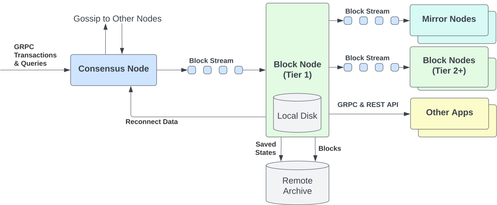
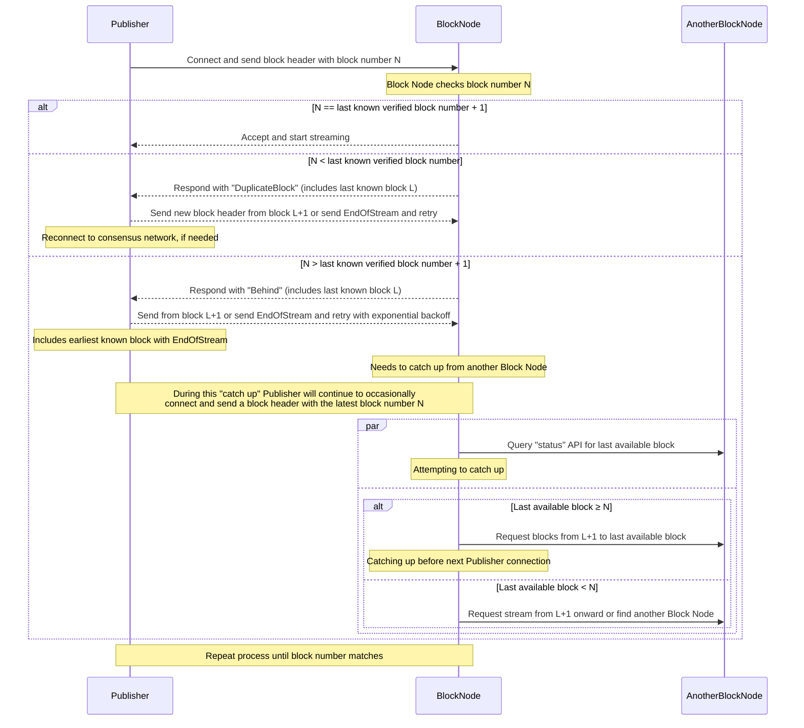
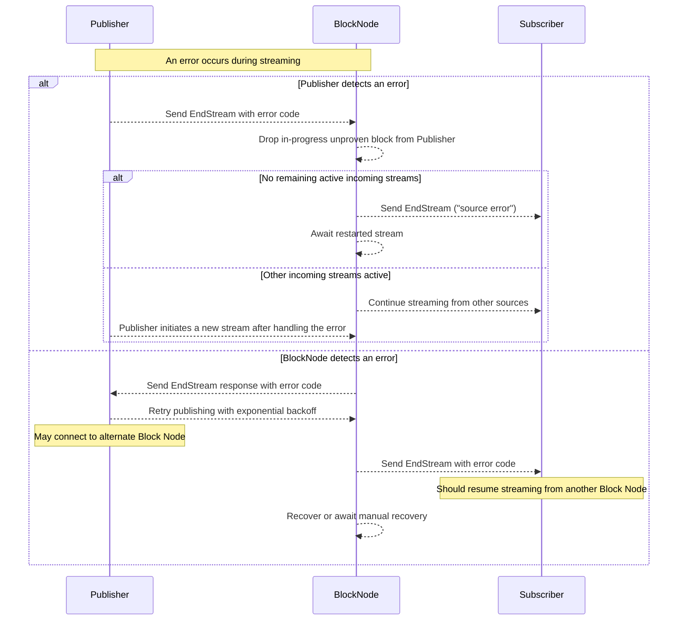

## Abstract

This HIP introduces Block Nodes. Block Nodes receive block streams from Consensus Nodes (or other block stream
publishers), verify the integrity of each block, store the block chain, distribute blocks to downstream clients
(including Mirror Nodes and other Block Nodes), maintain a copy of consensus network state, and enable critical
capabilities including state proofs, block item proofs, and provide new capabilities for Consensus Nodes such as
providing the current state when bootstrapping a new consensus node or catching up to the current consensus network
state when a Consensus Node is far behind its peers.

By assuming responsibility for long-term block and state storage, Block Nodes will replace the current use of cloud
storage buckets for distributing data to Mirror Nodes and other block stream parsing clients. Additionally, by
maintaining latest consensus network state, Block Nodes offload key data management functions from Consensus Nodes,
improving scalability and operational efficiency.
Block Nodes are the decentralized data lake for the ledger!

Block Nodes expose robust APIs to provide filtered or full block streams, enable random access to blocks, and offer
cryptographic proofs of data within blocks. This architecture fosters a decentralized data services layer,
where independent operators can deliver value-added services such as analytics, aggregation, and real-time data
pipelines&mdash;further decentralizing the ledger and enhancing data availability, security, and usability.

Block Nodes are free to innovate on payment for access to these features. They can be commercial and have connectivity
rules / rate limits / SLAs for customers with settlement in native cryptocurrency, web2 pay walls, or at no cost.



## Motivation

The current Hiero network architecture stores records files, event files, sidecars, state snapshots and signatures in
S3-compatible cloud storage. Access to this data may be expensive (such as with reader-pays public cloud storage
buckets). More importantly, the API used for storing and accessing this data is restricted to the standard S3 object
storage API.

While perfectly reasonable as an artifact storage solution, such a design precludes enhanced capabilities that
fit-for-purpose APIs would provide, such as: targeted data schema, business inspired performance optimizations and
streamlined developer experience that support end users of downstream services.
By managing the transport, parsing and storage logic a Block Node is able to support optimized streaming and filtering
of block data. Additionally, a Block Node is able to decouple the consensus network data stored from the API that it
serves, this allows it to provide consensus network supporting services like live state, proof generation and reconnect.

An additional motivation for Block Nodes is the ability to supporting a more open and inclusive ecosystem where
community members can run full-featured server with access to the complete consensus network history and state for
verification by downstream services.

As such Block Nodes are designed to decentralize data storage and access, enabling independent operators to serve
verified block and state data directly from the consensus network. This allows users and applications to consume the
data without relying on enterprise-operated infrastructure or cloud-specific implementations.

Block Nodes will provide a clean architectural separation of responsibilities: Consensus Nodes focus on consensus and
transaction execution, while Block Nodes focus on data availability, accessibility, and verifiability—paving the way
for a more decentralized and developer-friendly ledger.


## Rationale

The Block Node is introduced to address three strategic goals for the Hiero network: increased data availability,
greater decentralization, and improved client diversity. These goals reflect a broader effort to reduce reliance on
centralized infrastructure, improve access to consensus network data, and empower a wider range of developers and
operators to build on the ledger.

### Communication Protocol

To support these goals, Block Nodes will communicate using **gRPC over HTTP/2**, a protocol chosen for several key
reasons:
- **High-performance streaming**: Enables efficient, low-latency delivery of large volumes of block and state data.
- **Cross-platform compatibility**: Supported across most modern development environments, improving accessibility for
diverse client implementations.
- **Native support for protocol buffers**: Ensures strong typing, forward compatibility, and extensibility of APIs over
time.

This communication model aligns with the protocol stack already used by Hiero Consensus Nodes, reinforcing
architectural consistency across the ledger.
While gRPC is the initial focus, the design remains extensible. Future enhancements may include support for WebSocket,
REST, or GraphQL interfaces to meet evolving developer and community needs—striking a balance between performance,
flexibility, and ecosystem adoption.

### Upgradeability
A key design goal of the Block Node is upgradeability and ease of operation across diverse environments, including
different platforms and cloud hosting providers. Unlike Consensus Nodes—which must run identical versions of the node
software to maintain their network integrity—Block Nodes are intentionally decoupled from the consensus layer. This
enables independent deployment and upgrade cycles without requiring coordination with the core Consensus Node network.
Additionally, there could be many implementations of a Block Node across languages and platforms, they need only fit
at least the API  noted in this HIP. 
This independence increases the resilience and diversity of the ledger by allowing open-source developers and
operators to maintain Block Nodes on their own cadence and maintenance windows.

While protocol-level consistency must be maintained—particularly with regard to the block stream’s protobuf schema
Block Nodes are designed with forward compatibility in mind. Even when a node does not fully understand newly added
fields, it should still be able to parse, verify, store, and serve block data reliably. This ensures consensus network
continuity and user access to verifiable data, even during version transitions.
To support transparency and ecosystem interoperability, Block Nodes will expose semantic versioning via API. This
allows clients and developers to identify feature sets, manage compatibility, and ensure predictable integration
behavior across versions.


## User stories

### Personas

- **Hiero Consensus Node Operators**: Enterprise-aligned operators responsible for validating transactions, maintaining
    network consensus, and producing block streams.
- **Independent Block Node Operators**: Independent entities running Block Nodes to support decentralized data access,
    historical state services, or value-added APIs.
- **Mirror Node Operators**: Infrastructure providers consuming verified data from Block Nodes to serve RESTful
    endpoints for block explorers dApps and analytics tools.
- **Application Developers / dApp Builders**: Developers building decentralized applications that depend on reliable
    access to historical or real-time block and state data
- **Auditors / Analysts / Researchers**: Users performing independent validation of transactions, querying historical
    state, or analyzing consensus network behavior for compliance or insight


### User Stories

#### Consensus Node Operators

1. As a Consensus Node Operator, I want to publish block streams to one or more Block Nodes, so that I can offload long
    term data storage responsibilities and focus server resources on consensus operations.
2. As a consensus node I want to know that the block node(s) I send my blocks to are trustworthy so that I can trust
    acknowledgement truly represents secure persistence of a verified block.
3. As a Consensus Node Operator I want to know that I can access a reconnect API with high enough priority and performance to
    effectively recover synchronization with the consensus network.
4. As a Consensus Node Operator I want to implement a shared communication protocol with Block Nodes that defines how
    success or failure pathways during block stream publishing are communicated back to me in real time. This will allow
    me to implement optimal data distribution algorithms to ensure blocks are persisted amongst a diverse set of Block Nodes.

#### Block Node Operators

1. As a Block Node Operator, I want to provide a `publishBlockStream` API from which I can ingest block streams pushed from
    one or more Consensus Nodes (or other Block Stream producers), so that I can build a complete and reliable record of
    consensus network activity.
2. As a Block Node Operator, I want to verify block proofs as part of block stream ingestion, so that I can ensure the
    authenticity and integrity of the data I store and serve.
3. As a Block Node Operator, I want to persist block data and state snapshots, so that I can provide historical access
    and recovery capabilities to other nodes and clients.
4. As a Block Node Operator, I want to serve real-time block streams via a `subscribeBlockStream` API, so that clients
    can access up-to-date consensus network activity as it happens.
5. As a Block Node Operator, I want to provide historical block access via a `getBlock` API, so that users can retrieve
    and analyze past blocks on demand.
6. As a Block Node Operator, I want to offer APIs for querying current and historical state, so that clients can
    understand the evolution of Hiero entities (account, smart contracts, files, tokens, topics and schedules) over time.
7. As a Block Node Operator, I want to offer proof APIs for external validation of blocks and state, so that third
    parties can verify the correctness of consensus network data without relying on trust in my services.
8. As a Block Node Operator, I want to support Reconnect APIs for syncing new or lagging nodes (Consensus or Block), so
    they can catch up to the latest block and state information from the consensus network efficiently and securely.
9. As a Block Node Operator, I want to subscribe to verified block streams from other Block Nodes, so that I can
    increase redundancy, expand coverage, or fill data gaps.
10. As a Block Node Operator, I want to expose a `serverStatus` API to report my current capabilities, so that clients
    can discover my block range, and service availability.
11. As a Block Node Operator, I want to offer filtered block streams to external clients (including Block Nodes and
    Mirror Nodes), so that subscribers only receive the data relevant to their use cases, reducing bandwidth and
    processing overhead
12. As a Block Node Operator I want to maintain a block node that only stores the data within blocks that is important
    to me so that I do not incur the cost of maintaining data within blocks of no value to me.
13. As a Block Node Operator I want to maintain a block node that stores only the block ranges that are important to me
    so that I do not incur the cost of maintaining blocks that are of no value to me.
14. As a Block Node Operator I want to utilize a storage retention policy that allows me to prune data above a configurable
    threshold so that I can optimize my storage resources and costs.
15. As a Block Node Operator I want to implement a shared communication protocol with Consensus Nodes that defines how
    success or failure pathways during block stream ingestion are handle. This will allow me to inform Consensus Nodes
    of the nature of their blocks but also implement optimal data ingestion algorithms to ensure blocks are sourced from
    a diverse set of Consensus Nodes.
16. As a Block Node Operator I want to support the cost-effective backup of my data to external archive solutions so
    that I can optimize my local storage resources and costs.

#### Application Developers / dApp Builders

1. As a dApp Developer, I want to stream real-time transaction data filtered by my application's criteria, so that I
    can monitor and react to relevant on-chain events efficiently.
2. As a dApp Developer, I want to query historical state from a Block Node, so that I can understand application
    behavior over time and debug or audit contract interactions.
3. As a dApp Developer, I want to fetch state proofs for validation in a low-trust model from a Block Node,
    so that I can build applications that do not require trust in centralized infrastructure.

#### Mirror Node Operators
1. As a Mirror Node Operator, I want to consume verified block and state data from a Block Node, so that I can serve
    reliable RESTful APIs to applications and developers.
2. As a Mirror Node Operator, I want to bootstrap quickly and economically using snapshots and recent blocks, so that I
    can recover from downtime or deploy new infrastructure without full re-syncs from genesis.

#### Auditors / Analysts / Researchers
1. As an Auditor or Analyst, I want to retrieve historical block and state data, so that I can conduct investigations,
    perform compliance checks, or reconstruct on-chain activity.
2. As a Researcher, I want to analyze transaction and state trends using structured and verified data, so that I can
    gain insights into network usage, adoption patterns, and protocol behavior.


## Specification

Hiero Block Nodes will serve two primary category of services:
- **Consensus Network Support Services**  – Ingesting, verifying, and storing record streams generated by Hiero
    Consensus Nodes.
- **Data Access Services** – Providing value-added services that make consensus network data and insights easily accessible to
    users and applications.

This categorization allows for a clear delineation of protocol-level responsibilities from service-layer innovations.

> Note: The following Block Node Service protobuf API specifications are summaries. The full protobuf specifications
can be found under this HIPs original [protobuf assets](./../assets/hip-1081/protobuf).

### Terms and Definitions
| Term                              | Definition                                                                 |
| --------------------------------- | -------------------------------------------------------------------------- |
| **Block Node**                    | A software system intended to process a Block Stream and store blocks. The content of a Block Stream is defined in HIP 1056, among others.         |
| **Block Number**                  | A monotonically increasing number assigned by consensus to each block produced by the network.    |
| **Publisher**                     | An entity publishing blocks to a Block Node via the `publishBlockStream` API. This is typically a Consensus Node or another Block Node.                         |
| **Subscriber**                    | An entity that subscribes to a verified block stream from a Block Node.  |
| **Verified Block**                | A verified block is a block for which a Block Proof is received and for which the TSS signature of the network ledger ID is valid.  |
| **Full History Block Node**       | A Block Node that maintains block history from network streaming start.  |
| **Archive Block Node**            | A Block Node that maintains block history but does not expose consumer API services.  |
| **Rolling History Block Node**    | A Block Node that maintains blocks but prunes them after a configured period of time.  |
| **Tier 1 Block Node**             | A Block Node that receives block streams from a Consensus Node.  |
| **Tier 2+ Block Node**            | A Block Node that receives block streams from a Block Node or any non-Consensus Node block stream provider.  |


#### Tier 1 Block Nodes
Tier 1 Block Nodes provide high-availability, performance-critical services directly to Mainnet Consensus Nodes (CNs)
and other Tier 1 Block Nodes. They ingest block streams directly from Consensus Nodes and are typically operated by
trusted node operators. For optimal performance, Tier 1 Block Nodes are expected to be deployed in close proximity to
Consensus Nodes, minimizing latency in stream processing and delivery.

#### Tier 2 Block Nodes
Tier 2 Block Nodes extend the capabilities of Tier 1 by offering additional services to developers, applications, and 
the broader community. They receive block streams from Tier 1 nodes and may offer both free and monetized data services.
These nodes are designed to foster decentralization by allowing independent entities to operate Block Nodes under
flexible models, including subscription-based access, pay-per-query APIs, or open data access.
 

### Consensus Network Support Services

Block Nodes will support the following core consensus network functions:
- **Block Stream Ingestion** – Receiving and processing block streams from Consensus Nodes or upstream Block Nodes.
    Providing consensus node confirmation that their blocks have been verified and persisted.
- **State Management** – Verifying and maintaining consensus network state, and optionally persisting state backups.
- **Reconnect** – Providing bootstrapping and synchronization services to other nodes (Consensus and Block).

#### Block Stream Ingestion

Hiero ledgers are modular blockchain networks in which Consensus Nodes use the Hashgraph algorithm to order and timestamp
transactions. These Consensus Nodes emit block streams containing all relevant transaction, state, and metadata outputs.
For the Consensus Node network to remain operational and responsive, this output must be efficiently ingested and
processed by downstream infrastructure, namely Block Nodes. Block Nodes are therefore a critical component in ensuring
that consensus output is reliably processed, stored, and made available to users and downstream services.

##### Block Stream Publish Service
A protocol for communication between Consensus Nodes and Block Nodes is essential to ensure the reliable and efficient
processing of consensus output. To facilitate communication from Consensus Node(s), Block Nodes will expose a public
streaming endpoint to which a block stream producing client like a Consensus Node can publish block items to.

The `publishBlockStream` on the `BlockStreamPublishService` will provide publishers with an endpoint to push their
block stream

```protobuf
/**
 * Remote procedure calls (RPCs) for the Block-Node block stream publishing services.
 */
service BlockStreamPublishService {
    /**
     * Publish a stream of blocks.
     */
    rpc publishBlockStream(stream PublishStreamRequest) returns (stream PublishStreamResponse);
}
```

For multiple reasons including security and ease of data rate controls the consensus node will push block stream data
to a block node. As such a block node must be ready and available to accept connections that push the block stream to
the Block Node as blocks are agreed upon by the consensus network. In this mode the Consensus Node or other block
stream clients act as the Publisher feeding the block node data.

A summarized handshake of communication between a publisher and BN is as follows
- A publisher will send a batch of items starting with a BlockHeader on connection
- A block node will accept the stream if it is the next block or the Block Node has no cache of previous blocks. 
    - If the block is less than the last known block, the block node will respond with a `DuplicateBlock` response
    including details of the last known block. 
    - If the block is greater than the last known block, the block node will respond with a `Behind` response including
    details of the last known block. A publisher must send either an earlier block or an `EndOfStream` in response. If
    an an `EndOfStream` is sent by the publisher it must include its earliest known block to signal to the Block Node
    how large of a catch-up range it must resolve. In this case the Block Node may implement a backfill path from
    another block node to resolve gaps in blocks, where applicable.
- During streaming errors may occur from either side.
    - If a Publisher detects an error it must send an `EndStream` response instead of the next BlockItem. A Block Node will
    drop incomplete blocks from that Publisher.
    - If a Block Node detects an error it will send an `EndStream` response to all publishers specifying the latest
        verified and persisted block. A publisher may start a new stream and resume after the indicated block. In the
        case of repeated errors, the publishers may apply exponential back-off.





Publish block stream API response codes and their details are noted below

| Response code        | Description   |  
| -------------------- | ------------- |  
| `UNKNOWN`            | The server software failed to set a status, and SHALL be considered a software defect. |  
| `SUCCESS`            | The Block Node ended the stream in an orderly manner. |  
| `TIMEOUT`            | The delay between requests was too long. |  
| `DUPLICATE_BLOCK`    | A block was sent that is already verified and persisted. |  
| `BAD_BLOCK_PROOF`    | A block proof did not verify, the publisher should resend. |  
| `BEHIND`             | The block sent is newer than the block node can receive. |  
| `INTERNAL_ERROR`     | The block node encountered an error. |

> When the publisher is a consensus node it is important to expose error cases that suggest a block node is falling
behind or failing to store blocks when expected.

> Notably, a block node may consume a block stream from multiple sources e.g. multiple CNs.
This approach can be used to increase the reliability and availability of consensus network data.

> Note: If the publisher is not a Consensus Node a Block Node may receive a filtered block stream via the
`publishBlockStream` endpoint. Filtering support is expanded upon in the Block Stream HIP 1056 and is characterized by
the replacement of block items with hash values while maintaining the ability to carry out block and state proofs on
the block information.

##### Protobuf Schema Management

Block Nodes are responsible for streaming and parsing Block Stream messages encoded in Protocol Buffers (protobuf), as
defined in the [hiero-consensus-node](https://github.com/hiero-ledger/hiero-consensus-node) repository. While protobuf
offers a structured and extensible format for communication, there are specific scenarios that require careful handling
by the Block Node to ensure stream integrity and resilience:

1. Protobuf Version Upgrades:
Protocol Buffers are designed with built-in forward and backward compatibility. As a result, versioning the block
stream schema is generally unnecessary. Block Nodes must be capable of processing older and newer message formats
gracefully, ignoring unknown fields while continuing to verify and store the stream contents reliably.

2. Stream Pauses Due to Consensus Node (CN) Upgrades:
Consensus nodes periodically undergo coordinated software upgrades, during which data streams may temporarily pause.
Block Nodes should anticipate an end-of-stream signal during these events and handle the interruption gracefully
without impacting downstream services.

3. Missing Block Proofs:
Each block in the stream—excluding certain record file block items—is typically terminated with a block proof,
providing cryptographic assurance that the block was verified by the consensus network. If a block proof is absent for an
extended period, this may indicate that the CN has fallen behind, is unable to compute the proof, or is encountering
an ISS (Inconsistent State Signature). In such cases, the Block Node should maintain the connection and manage the
stream termination appropriately. Subscriber connections actively receiving block items may be closed after a
configurable timeout. Block Nodes may also persist partial data (e.g., current and previous block contents) to aid in
debugging stream disruptions.

4. Delayed Block Proofs and Cascade Proofs:
In some cases, a delayed block proof may arrive indirectly through a cascade proof, where the block proof signature is
from a later block that retroactively verifies the block through a chain of prior block hashes. Block Nodes must be
capable of recognizing and validating such proofs to maintain a complete and verifiable block history.
It is important to keep clear that no block header will be sent for block N+1 until the block proof for N is sent;
this is invariant. A delayed proof delays all subsequent blocks as well.
Further, the block proof for block N+1 does not prove block N; it is only the signatures gathered by consensus for
Block N+1 that are used to build the block proof for block N (and that block proof is still sent for block N, not N+1).

```mermaid
gantt  
    title "Cascade Proof" timing diagram  
    %% We just need order, not days, so (mis)use milliseconds for the times  
    dateFormat SSS  
    axisFormat %L  
    tickInterval 5millisecond  
    section Consensus Node  
      Block 9 Produced :active, 002, 012  
      Block 9 Send :active, 004, 028  
      Block 9 Gather Signatures (fail) :done, 012, 016  
      Block 10 Produced :active, 012, 022  
      Block 10 Gather Signatures :done, 022, 026  
      Block 9 Craft Cascade Proof :done, 026, 027  
      Block 9 Send Proof :active, 027, 028  
      Block 10 Craft Proof :done, 027, 029  
      Block 10 Send :active, 028, 032  
      Block 10 Send Proof :active, 032, 034  
     section BlockNode  
      Block 9 Receive :active, 002, 028  
      Block 9 Verify :active, 028, 029  
      Block 9 Acknowledge :milestone, 030, 030  
      Block 10 Receive :active, 028, 032  
      Block 10 Verify :active, 032, 033  
      Block 10 Acknowledge :milestone, 033, 033 
```



#### State Management

In today’s consensus network, consensus nodes periodically take state snapshots and store them in centralized cloud
buckets. These backups are primarily used for Consensus Node bootstrapping, disaster recovery, and long-term archival.
However, this data has not been made readily accessible to the broader community, limiting its utility for external
developers and applications.
By maintaining live state and capturing periodic state snapshots, Block Nodes can introduce new state-related services
that provide DApps and external tools with granular access to consensus network state at any block height. These
capabilities unlock use cases such as historical state queries, lightweight state verification, and state comparison
over time. Additionally, Block Node state snapshots can be used by other consensus or Block Nodes to efficiently
bootstrap or synchronize with the Hiero network, reducing recovery time and improving resilience.

The `stateSnapshot` on the `StateService` will allow clients to request a Hashgraph state snapshot.

```protobuf
/**
 * Remote procedure calls (RPCs) for the Block Node State snapshot
 * and query services.
 */
service StateService {
    /**
     * Read a state snapshot from the block node.
     */
    rpc stateSnapshot(StateSnapshotRequest) returns (StateSnapshotResponse);
}
```

##### Error Handling

| Response code             | Description   |
| ------------------------- | ------------- |
| `UNKNOWN`                 | The server software failed to set a status,and SHALL be considered a software defect. |
| `SUCCESS`                 | The request succeeded. |

> Note: In the future a block node could offer additional APIs such as on demand Live state, a stream of state changes
or single entity state requests.


#### Reconnect

It is possible for a consensus node to fall behind due to latency, load, or temporary outages.
Additionally, new Consensus Nodes joining the consensus network must be bootstrapped with the latest state and Hashgraph
information to synchronize and begin participating in consensus or data services.

Today, this is handled by other consensus nodes, which temporarily assume a “teacher” role, assisting peer nodes in
catching up by sharing recent Hashgraph data and state snapshots. While effective, this approach imposes additional
bandwidth and processing burdens on consensus node resources that are better dedicated to executing transactions and
maintaining consensus integrity.

To support consensus network scalability and improve role specialization, Block Nodes will assume this teacher function.
They will act as reliable sources for Consensus Nodes or Block Nodes that need to bootstrap or resynchronize with the 
consensus network, reducing load on consensus infrastructure and improving overall recovery and onboarding performance.


```protobuf
/**
 * Remote procedure calls (RPCs) for the Block Node reconnect services.
 */
service ReconnectService {
  /**
   * Request reconnect data comprised of state and block data from the block node.
   */
  rpc reconnect(ReconnectRequest) returns (stream ReconnectResponse);
}
```


### Data Access Services

In addition to ingesting and storing consensus output, Block Nodes play a pivotal role in exposing this data to
external consumers—including developers, applications, and infrastructure services—through accessible, verifiable,
and high-performance interfaces.

As part of Data Access Services Block Nodes transform raw consensus network output into meaningful, consumable
formats, cryptographic proofs, and streaming protocols. This functionality forms a vital bridge between the Hiero
protocol and its surrounding ecosystem, enabling use cases such as state lookups, historical data queries, filtered
block streams, and trust-minimized validation of transactions. By decoupling data access from the consensus layer, Block
Nodes increase consensus network scalability while fostering a more diverse and decentralized application landscape.

Block Node implementers are encouraged to architect services as loosely coupled, independently deployable components,
rather than as tightly integrated or monolithic systems. This modular design promotes lightweight, scalable
deployments—making Block Nodes more accessible to community operators and more flexible for developers seeking to
innovate on top of the data stream.

The following outlines the core data services provided by default, which developers and community members are  
encouraged to leverage, extend, substitute, and customize to support a wide range of applications and community needs.


#### Block Access Service

While the block stream provides a continuous flow of data in real time, many applications and services require
on-demand access to historical block data—either for validation, auditing, replay, or analysis. To support this, the
Block Access Service offers a `getBlock` endpoint that allows consumers to request a fully verified block from a Block
Node by block number or identifier.

Unlike live streaming APIs, which require continuous subscription, `getBlock` provides random access to a previously
ingested and stored block.  Each block returned by this service is verified, and includes the relevant
metadata and signatures necessary for cryptographic validation, ensuring consumers can trust the data without needing
direct access to consensus nodes.


```protobuf
/**
 * Remote procedure calls (RPCs) for the Block Node block services.
 */
service BlockAccessService {
    /**
     * Read a single verified block from the block node.
     */
    rpc getBlock(BlockRequest) returns (BlockResponse);
}
```

###### Error Handling

| Response code     | Description   |
| ----------------- | ------------- |
| `UNKNOWN`         | The server software failed to set a status,and SHALL be considered a software defect. |
| `SUCCESS`         | The request succeeded. |
| `INVALID_REQUEST` | The client sent a malformed or structurally incorrect request. |
| `NOT_FOUND`       | The requested block was not found as it does not exist. |
| `NOT_AVAILABLE`   | The requested block is not currently available on this block node server. |


#### Block Stream Subscribe Service

One of the core value-added APIs provided by a Block Node is the public streaming endpoint that delivers real-time,
verified block data to external consumers. This service enables applications, indexers, and data platforms to react to
consensus network activity as it occurs—without maintaining consensus node infrastructure.

The primary interface for this capability is the `subscribeBlockStream` method on the `BlockStreamSubscribeService`.
This endpoint allows clients to initiate a pull-based stream of block items directly from a Block Node.

Clients may optionally specify filters to limit streamed content to block items relevant to their use case—for example,
filtering by HCS topic. Filtering occurs at the block item level, allowing dApps to receive only the data they need.
Future enhancements may include more advanced filtering based on state deltas or multi-item patterns.


```protobuf
/**
 * Remote procedure calls (RPCs) for the Block Node Stream subscribing services.
 */
service BlockStreamSubscribeService {
    /**
     * Subscribe to a stream of blocks.
     */
    rpc subscribeBlockStream(SubscribeStreamRequest) returns (stream SubscribeStreamResponse);
}
```

An overview of communication between a Block Node and a subscriber is as follows:
1. A client initiates a subscription request, specifying:
    - A block start (required).
    - A block end (optional).
2. The Block Node validates the request:
    - If the requested start block is earlier than available data, it responds with `INVALID_START_BLOCK_NUMBER`.
    - If the end block is set to `uint64_max`, the stream is treated as open-ended, continuing until:
        - The client disconnects,
        - The Block Node enforces a streaming limit,
        - A network communication error occurs, or
        - The Block Node restarts.

> Note: A stream of state changes highlighting the changes in a given block may be obtained by utilizing block item
filtering on the block service.

###### Error Handling
If an error occurs during streaming, the Block Node will terminate the stream with an EndStream response in place of
the next BlockItem. Clients may choose to retry the stream from the last successfully received block or switch to a
different Block Node for continued access.

Subscribe block stream API response codes and their details are noted below

| Response code                 | Description   |
| ----------------------------- | ------------- |
| `UNKNOWN`                     | The server software failed to set a status and SHALL be considered a software defect. |
| `SUCCESS`                     | The request succeeded. |
| `INVALID_START_BLOCK_NUMBER`  | The requested start block number is not valid. |
| `INVALID_END_BLOCK_NUMBER`    | The requested end block number is not valid, such as when the end is less than the start block number |
| `NOT_AVAILABLE`               | The requested stream is not available. |


#### Node Service
The Node Service provides essential metadata about the operational state and configuration of a Block Node, enabling
clients to make informed decisions about connectivity, compatibility, and data availability.

The `serverStatus` endpoint exposes key information such as:
- Current and available block ranges
- Supported API version and protocol capabilities
- Availability of historical state snapshots

This service is especially useful for clients bootstrapping a connection, discovering available features, or selecting
between multiple Block Nodes based on capabilities or data retention. It also helps ecosystem tools—such as indexers,
dashboards, and health check systems—monitor and validate the status of deployed nodes.


```protobuf
/**
 * Remote procedure calls (RPCs) for the Block Node Ancillary services.
 */
service BlockNodeService {
    /**
     * Read the status of this block node server.
     */
    rpc serverStatus(ServerStatusRequest) returns (ServerStatusResponse);
}
```
> In the future a Block Node could expose which value-added services are enabled (e.g., filtering, proofs, streaming modes)

#### Proof Service

The ability to request cryptographic proofs of state has long been a desired feature for developers and auditors.
However, implementing such functionality directly on consensus nodes would introduce additional computational and
bandwidth overhead, detracting from their primary role of executing transactions and maintaining network consensus.
Moreover, consensus nodes only maintain live state and are not equipped to provide historical state proofs—limiting
their usefulness for applications that require verifiable, point-in-time data.
Block Nodes address this gap by maintaining live state, historical state snapshots, and the complete block stream.
With this expanded data scope, they are uniquely positioned to provide a robust set of proof services that verify the
correctness of consensus network data—both in real time and historically.

HIP-1056 defines the inclusion of cryptographic proofs in the block stream. 
The `ProofService` will offer endpoints to retrieve a subset of these:
- `getBlockContentsProof`:
    Returns a BlockContents proof to verify that a specific BlockItem (e.g., a transaction or event) was included in a
    given block.
- `getStateProof`:
    Returns a State proof confirming the value of a specific state key at a particular block height. This allows
    external systems to independently validate state without trusting any single node.


These proof endpoints empower developers, auditors, and applications to verify the integrity of block and state
data—strengthening trust and enabling decentralized verification without needing direct access to consensus
infrastructure.


```protobuf
/**
 * Remote procedure calls (RPCs) for the Block Node block contents proof
 * and state proof query services.
 */
service ProofService {
    /**
     * Request a block contents proof for a given block from the block node.
     */
    rpc getBlockContentsProof(BlockContentsProofRequest) returns (BlockContentsProofResponse);

    /**
     * Request a state proof for a given state item and block from the block node.
     */
    rpc getStateProof(StateProofRequest) returns (StateProofResponse);
}
```


### Monetization

Block nodes will perform significant work by consuming the block stream, verifying it, storing it and providing
multiple API services to further users. To block node operators it is thus important to offer capabilities to cover
the cost of work and encourage a vibrant economy.

To achieve this the Block Node will adopt a model similar to a pre-paid card, with crypto transfers of crypto currency
to the block node account required prior to the consumption of APIs. The block node will initially maintain a balance
ledger on the Block node to track the remaining balance that each AccountID holds with that block node. Only non-zero
balances would be tracked in this manner.

To achieve this it is required that a block node have its own `AccountId` that users can transfer to.

API costs will vary based on API but will include flat fees per request and variable fees based on size of data and
complexity.

Notably, monetization will be an optional and replaceable service that allows for free or reduced cost pathways per the
configuration of the operator.
For example a consensus node operator would likely run its own block node and would not charge for calls from that
consensus node to that block node.

> Note: This account could also be a smart contract to utilize more strict automated rules for how funds are managed.


## Backwards Compatibility

Block Nodes propose to completely replace the existing cloud storage buckets and replace the record file format with
the block stream format.
All consumers of record stream data from the existing cloud storage buckets will need to change the mechanism of
access, change the mechanism of payment, and adjust any processing logic to process block stream data.

With consideration for Hiero transaction protobuf type formats - the block node will support the new Block Stream
format, which incorporates the existing transactional API formats by reference.

## Security Implications

Block Nodes do not sign or co-sign transactions, nor do they participate in consensus. They do not hold custody of user
assets and therefore are not custodial in nature.

To support authentication and monetization, each Block Node must possess at least one account on the Hiero network. This
account enables identification by consensus nodes—particularly when block items are streamed directly—and facilitates
the receipt of payments for services. Operators may optionally use multiple accounts to separate concerns such as
authentication, metering, and billing.

In applicable configurations, Block Nodes will acknowledge receipt and verification of blocks back to the stream
publisher (whether a Consensus Node or another Block Node). This feedback mechanism allows the publisher to track
successful delivery and optionally implement back-pressure or rate control.

A Block Node may receive a block stream directly from a Consensus Node or indirectly from another Block Node. Because
each block in the stream includes verifiable cryptographic proofs, the source of the stream does not affect data
integrity—only latency, trust assumptions for availability, and potentially the service fees involved.

A publisher may also explore additional network protocols in their deployment architecture to increase trust and
reliability of the target of their stream. Examples of this include TLS to provide additional authentication,
encryption and data integrity checks for the block streams data being transmitted.

Block Nodes may also implement targeted metrics that observe the nature and latency of blocks received from Consensus
Nodes and provide actionable details to operators.

## How to Teach This

To effectively educate and inform users about block node operation, comprehensive technical documentation, blogs, and
webinars will be essential. Technical documentation will provide detailed and in-depth explanations of operation modes,
usage, and best practices, ensuring that developers and mirror node operators can fully understand and transition to
block stream consumption from a block node as well as block node hosting.

Blogs will offer more accessible and engaging content, highlighting use cases, real-world applications, and the benefits
of a block node, catering to a broader audience of Hiero stakeholders. Webinars will serve as interactive platforms
for live demonstrations, Q&A sessions, and expert insights, enabling participants to gain a deeper understanding through
direct engagement with subject matter experts.

## Reference Implementation


## Rejected Ideas

### BN to CN staking as a requirement for a CN before streaming to a BN.
It was suggested that to help incentivize long term block nodes that a BN would stake some minimum amount of HBAR to a
CN. In which upon reward of the full staking period a BN would recuperate staking rewards but also additional reward
for offering DA

### BN to CN staking as a mechanism to ensure long term Date Availability (DA)
It was suggested that to help incentivize long term block nodes that staked and consumed a stream for at least the
staking period would receive an additional reward for offering DA

### App to BN allowances to pay for API usage
It was suggested that one mechanism of paying in advance would be for a client such as a BN or MN or app to first offer
a BN an allowance of some amount of HBAR. The BN would then periodically debit from the allowance to pay itself after
responding to a clients calls. The issue was there was a fear that the client to rescind the allowance after time and a
BN would be 1 or 2 blocks in time off of the accurate allowances which could result in services offered for free if the
client was being malicious.
Additionally, there were possible write-amplification concerns where a poorly implemented debit process could create
significant additional transactions every block, resulting in a large number of unnecessary transfers.

### BlockItem Service
Returning a single request BlockItem seemed to not be a valuable service out of the gate. 
Especially without the ability to cleanly identify an item it doesn’t seem worthwhile for a BN to return a BlockItem vs
a Block.

### Periodic CN provided state snap shots
With record streams the CN creates a state snapshot every 15 mins. A question was asked if this should be exposed to
allow BNs to start up or compare state periodically. However, this would add additional low usage process on the CN.
It would also defeat the goal of removing the bandwidth, processing, and complexity of managing state snapshot
transfers from the CN.
Block Nodes that manage live state or produce state snapshots require a state snapshot to start up if not active since
genesis for that network. That snapshot should, however, be transferred manually (either from cloud storage or another
block node).
The consensus node will continue to maintain state snapshot for local backup only and will be short-lived ephemeral
data (if stored at all).
A running block node that requires a state snapshot for some reason should retrieve it from another block node.

### Gossiping Block Node
<aside>
🚨 **Open Task:** Summarize initial claims and initial reasons to not support
</aside>

## Open Issues/Ideas/Tasks
- [ ] Flesh out design decisions approach in `Rationale` section
- [ ] Add diagram showing BN system location in overall Hiero architecture in `Rationale` section
    - Highlight CN(s) -> BN -> MN + block stream clients
- [ ] Flesh out PRoof Service response components, Noting the 3 different proof types
    - Block Proof
    - Block Item Proof 
    - State Proof
- [ ] Expand Reconnect Service
    - Speak to the need and value of BN provided reconnect vs CN
    - Highlight BN -> BN reconnect
    - Note details of what reconnect will provide i.e. latest state + x
- [ ] Q: “As a block node operator I should be able to attach custom plugins to the block node, which can utilize its
    functionality.” How should this intent be highlighted in specification. Are the detail more implementation and future
    expansions that should be captured in separate HIPs and product EPICs?
    - Add a note in the Services section to encourage loosely coupled and deployable services.
- [ ] Q: Does the block node require or rely on a transmission of full state from a CN? If so what’s the contract between
nodes here? Previously the CN output state every 15 mins
- [ ] Improve `Block Stream Schema` section regarding streaming interruptions
    - Protobuf version upgrades - Expand section and confirm
    - Pause in stream due to CN upgrades - Confirm and improve explanation
    - Pauses in stream due to no Block Proof - Confirm and improve explanation
- [ ] Q: How can block nodes provide discovery details?
    Considerations
    - Are they self reported?
    - Are they onchain?
    - What requirements if any are there for a block node and operator?
    - One idea is "There should be a mechanism that is on chain and self reported (could just be an HCS topic with a
    custom fee), but that should not be the only mechanism. Community innovation in this area should be encouraged
    (perhaps someone will build a "Block Market" to find and obtain blocks according to a wide variety of criteria,
    similar to a wholesale electric power market)."
- [ ] Q: How will block nodes be discovered?
    - by a client so they can query data
    - by a CN so they can push data e.g. by address book
    - One idea that is optional and customizable by CN & BNs is "Client should have many options. Possibilities
    include address book entries, block nodes that offer listings of other block nodes (sort of like how some bit
    torrent services work), or even "block node rating" services that offer curated lists.
    Consensus Nodes should be encouraged to establish commercial contracts or other strong trust relationships with a
    small set of block nodes that can be relied upon to always accept blocks from those consensus nodes, and be 100%
    available, so that the CN is never forced to stop processing because it cannot be certain it's blocks are stored
    and verified."
- [ ] Flesh out Single entity state query e.g. return account `0.0.x` 
- [ ] Complete communication overview with potential diagrams
- [ ] Add a diagram to further illustrate Monetization considerations. Potentially a sequence diagram to highlight
    the onboarding flow to access paid APIs

## References

A collections of URLs used as references through the HIP.

## Copyright/license

This document is licensed under the Apache License, Version 2.0 -- see [LICENSE](../LICENSE) or
(https://www.apache.org/licenses/LICENSE-2.0)
