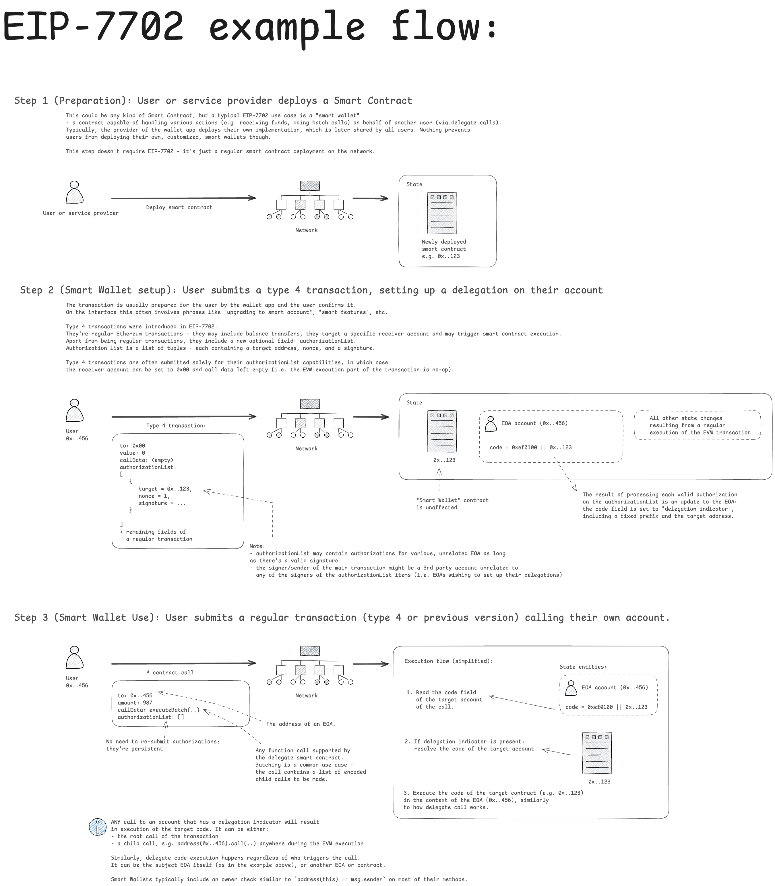
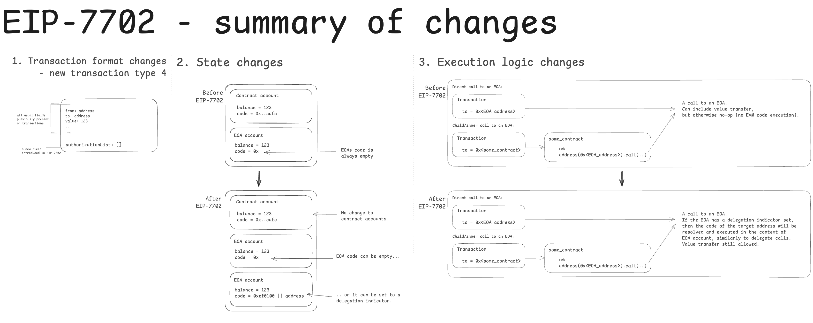
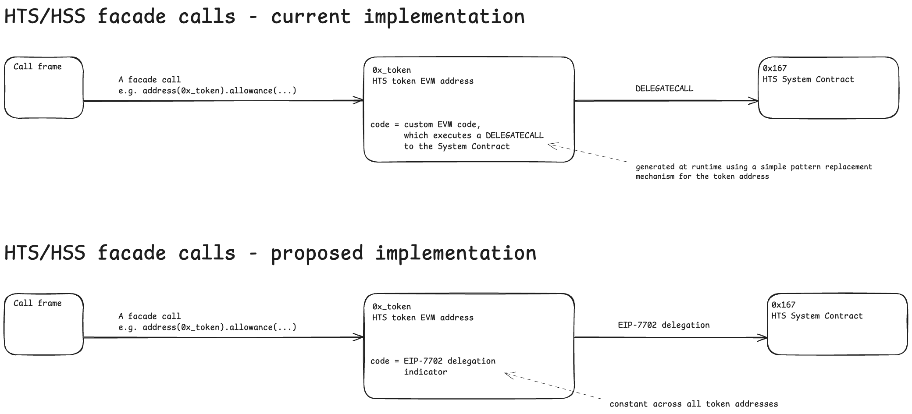

## Abstract

Ethereum's Pectra upgrade (activated May 7, 2025) introduced, among other things, EIP-7702. This HIP defines the adoption of EIP-7702 account delegation in Hedera and the related changes to the proxy/facade mechanism.

## Motivation

EIP-7702 is the core of Ethereum's Pectra upgrade and enables a wide range of use cases. Supporting it aligns with the goal of being Ethereum-compatible.

## Rationale

The core of this HIP is to implement EIP-7702 as originally specified. Apart from a few exceptions there's no need to introduce modifications.

To maintain a consistent account creation cost across the system, we will apply the same charges when a type 4 transaction (new EVM transaction type, as defined in EIP-2718 and EIP-7702) triggers account creation.

There are two main goals behind the proposed proxy/facade changes:
- ease the implementation of EIP-7702 by reducing the overall complexity of HSCS
- make the processing logic coherent with the state of the entities (i.e. their bytecode)

Proposed protobuf changes follow the modifications to the account entity.

## User stories

- As a HSCS user I want to be able to set code delegation for an EOA using authorization list on an EVM type 4 transaction, following EIP-7702 specification, so that EVM calls to my account can result in code execution.
- As a HSCS user I want to be able to call an EOA and execute a correct delegate smart contract if an EIP-7702 delegation has been set for that account.
- As a HSCS user I want to be able to use the existing HTS/HSS/HAS facade calls with no interface changes.

## Specification

### High-Level summary

EIP-7702 introduces the concept of code delgation when calling EOA accounts.
A few changes to the protocol have been introduced to make that possible.

1. An EOA can be configured to store a so called "delegation indicator". EOAs `code` field (previously always empty) has been repurposed to store it. The format consists of a fixed prefix (0xef0100) followed by a 20-byte target address of the delegation.

2. A new transaction type - 4 - has been introduced that allows EOAs to set their delegations by updating their `code` field to the aforementioned delegation indicator. The transaction in its payload includes a new optional field dedicated to updating delegation indicators.

In this HIP we propose to add full support for EIP-7702 - both the new transaction format (required for setting delegations) and the updated processing logic.
 
Typo 4 transactions and account delegation logic will be implemented as specified in EIP-7702.

Example user flow of EIP-7702 delegation has been presented on the diagram below, followed by a diagram that shows a summary of all related protocol changes.





### Delegation setup - type 4 transaction

- A new Ethereum transaction type - V4 - will be added, matching the specification of EIP-7702:
    ```
    payload = rlp([chain_id, nonce, max_priority_fee_per_gas, max_fee_per_gas, gas_limit,
                   destination, value, data, access_list, authorization_list, signature_y_parity,
                   signature_r, signature_s])

    authorization_list = [[chain_id, address, nonce, y_parity, r, s], ...]
    ```

- The code of an EOA account will become mutable:
    - It can be either empty or contain an EIP-7702 delegation indicator. No other code is allowed.
    - The delegation indicator can be modified or cleared by submitting an EVM type 4 transaction

### Delegation processing

- While processing an Ethereum transaction (either the new type 4 or previous types), any call made to an EOA that has a delegation indicator set will result in a delegatecall-like execution of the target code - following EIP-7702 specification
- The delegation to a precompile address is a no-op
- The delegation to a Hedera System Contract is a no-op, unless for Token Proxy Accounts or Schedule Proxy Account, which do successfully delegate to the target System Contract

### Impact on proxy/facade calls

HIP-218, followed by HIP-719 (later extended by HIP-755 and HIP-906) introduced the concept of proxy/facade calls, where a call can be made directly to an EVM address of a Hedera-native entity (e.g. an HTS token or an account).
The implementation of this facility currently relies on an intermediate, hardcoded and dynamic piece of EVM code that is being run when such a call is made.
While functional, this has two main downsides:

- It interferes with the implementation of EIP-7702 executable code resolution
- It will become an unnecessary complexity once EIP-7702 is implemented.

We propose to update the underlying implementation of the proxy/facade calls to leverage the EIP-7702 delegations:

- Custom piece of EVM code will be replaced with a delegation indicator to a corresponding System Contract

The comparison of the existing mechanism to the proposed one has been captured on the below diagram:



The above diagram only applies to HTS/HSS System Contracts.

HAS facade requires more care as it must harmonize with user-defined delegation indicators.
For compatibility reasons, we propose HAS facade calls to have precedence over any user-defined delegations, if the function selector of the call matches one of the HAS facade functions. The diagram below illustrates the proposed change:


Note, that HAS calls might shadow the functions in the delegate contract if there is a selector conflict. E.g. if user-defined delegate contract included a function of signature `setUnlimitedAutomaticAssociations(bool)` , or any other signature matching a HAS proxy method, they would be unreachable.

### Account creation when the delegation indicator is being set

When a type 4 transaction attempts to set up a code delegation for an account that didn’t previously exist, a Hedera-specific hollow account creation cost will be charged on top of the gas charge of 25000 units defined in EIP-7702.

### Code delegation persistence in case of reverted EVM execution

All valid authorizations of a type 4 transaction will be persisted, even if the subsequent execution of the EVM code of the transaction reverts.

### Hooks

No impact on hook execution is expected. A call to an EOA with a delegation set within a hook will work the same way as in non-hook environment.

### Protobuf changes

In order to support the setting of contract code delegation into a Hedera Account, the following additions to the CryptoCreateTransactionBody and CryptoUpdateTransactionBody will be required.

```
message CryptoCreateTransactionBody {
...
/**
 * The delegation indicator of authorized contract address for the account.
 * It will be encoded as defined in EIP-7702 as (0xef0100 || <contract address>).
 * If this field is set, a call the account's address within a smart contract will
 * result in the code of the authorized contract being executed.
 */
 bytes delegation_indicator=19
}

and 

message CryptoUpdateTransactionBody {
...
/**
 * The delegation indicator of authorized contract address for the account.
 * It will be encoded as defined in EIP-7702 as (0xef0100 || <contract address>).
 * If this field is set, a call the account's address within a smart contract will
 * result in the code of the authorized contract being executed.
 */
 bytes delegation_indicator=19
}
```

In addition to these protobuf updates, functionality will be added in the `TokenService` to call the 
`ContractService` to save the association between the `account` and the `authorized_contract_delegation_indicator` 
into `ContractStateStore`.  This will be accomplished via the creation of a new `ContractServiceApi` whose 
interface will be defined as follows:

```
/**
 * Defines mutations that can't be expressed as a {@link com.hedera.hapi.node.transaction.TransactionBody} dispatch.
 *
 * <p>Only exported to the token service at this time, as it is the only service that currently needs such a thing.
 */
public interface ContractServiceApi {
    /**
     * Sets the account identified by the accountID with the associated runtime bytecode in the ContractStateStore.
     *
     * @param accountID id of the account to set the bytecode for
     * @param bytecode  the runtime bytecode to set for the account
     */
    void setAccountBytecode(@NonNull AccountID accountID, @NonNull Bytes bytecode);
}
```

### Impact on Mirror Node and Block Node

Mirror Node will be impacted in the following ways:

- EOAs will store a mutable code
- The code (as returned by ContractGetBytecode) of HTS tokens and HSS schedule addresses will be updated (from custom EVM snippets to EIP-7702 delegation indicators)
- The code of EOA accounts (as returned by ContractGetBytecode) will be updated (from custom EVM snippets to either empty or delegation indicator)

### Impact on RPC Relay

- RPC Relay will need to support type 4 transactions
- RPC Relay will need to update its internal/hardcoded bytecode of HTS and HSS tokens

### Impact on SDK

All supported SDKs will need to support parsing, creating and submitting type 4 transactions.

## Backwards Compatibility

The change itself is backwards compatible, but it significantly modifies the behavior of calls to EOAs and invalidates some previous assumptions (e.g. the code of an EOA always being empty).

## Security Implications

The proposed way to implement EIP-7702 aligns with the V2 security model, but introduces the concept of EOA delegation,
which follows the security princpiles of a delegate call. We propose to extend the securtity model by changing:

"Smart contract A can change EOA’s state via delegate call"

to

"Smart contract A can change EOA’s state via delegate call or if EOA has set up an EIP-7702 delegation to A."

EIP-7702 delegation to System Contracts will only be permited for the following native entities: Token Proxy Account, Schedule Proxy Account. This is allowed to facilitate the proxy/facade mechanism described above.

EOA's can set their delegation to an arbitrary address. If however, when called, the address resolves to either a precompile address or a System Contract than the call is a no-op.

## How to Teach This

Hedera will support EIP-7702, with some modifications:
- delegations to functions matching the signautres of HAS will not work (HAS calls have precedence)
- Hedera's account creation cost will be charged when setting a delegation for new accounts
HTS/HSS proxy/facade calls remain unchanged from user’s perspective.

## Reference Implementation

The reference implementation must be complete before any HIP is given the status
of “Final.” The final implementation must include test code and documentation.

## Rejected Ideas

None at this time.

## Open Issues

Confirm no impact on hooks.

## References

https://eips.ethereum.org/EIPS/eip-2718

https://eips.ethereum.org/EIPS/eip-7702

https://hips.hedera.com/hip/hip-218

https://hips.hedera.com/hip/hip-719

https://hips.hedera.com/hip/hip-755

https://hips.hedera.com/hip/hip-906

https://docs.hedera.com/hedera/core-concepts/smart-contracts/security

## Copyright/license
This document is licensed under the Apache License, Version 2.0 —
see [LICENSE](../LICENSE) or <https://www.apache.org/licenses/LICENSE-2.0>.
