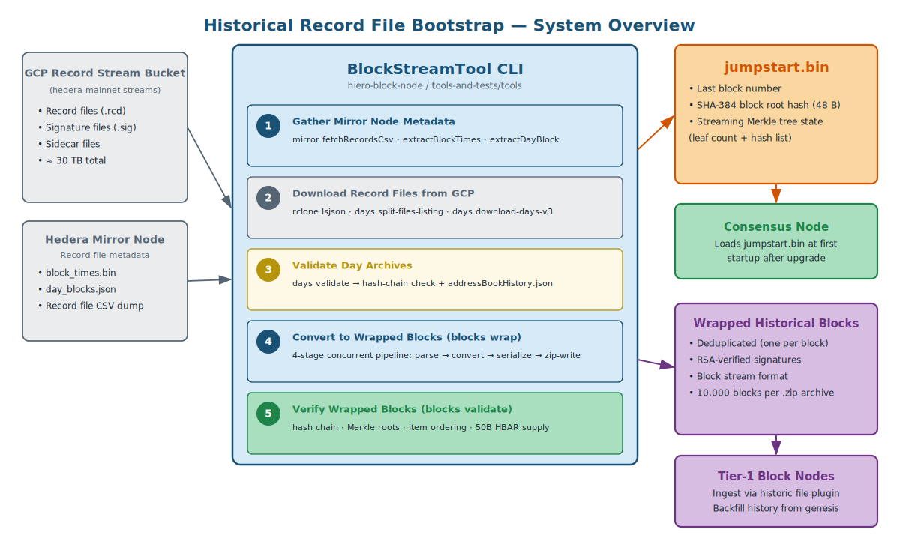
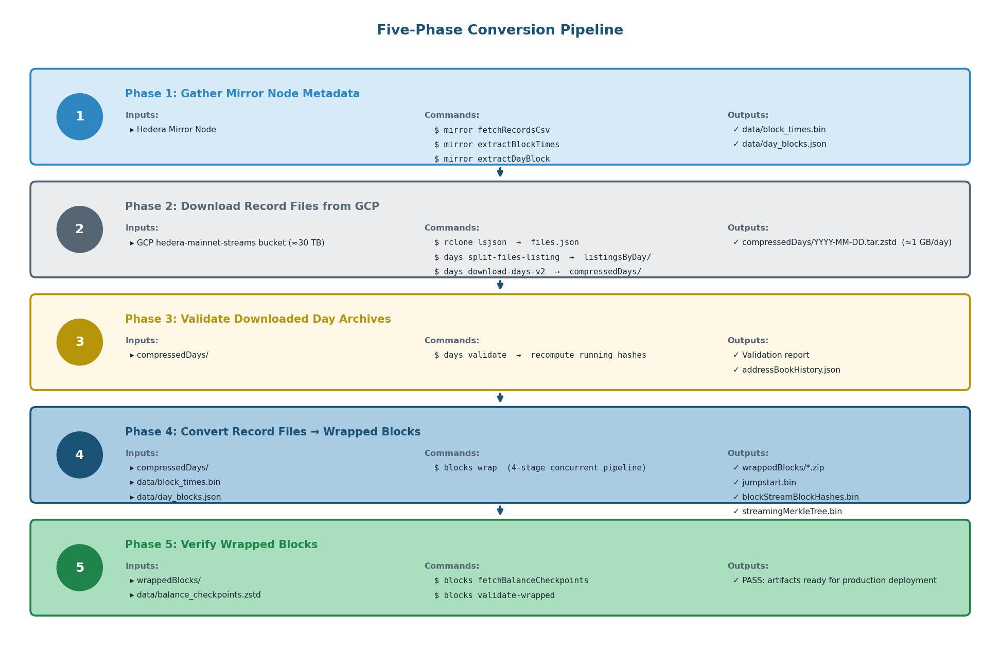
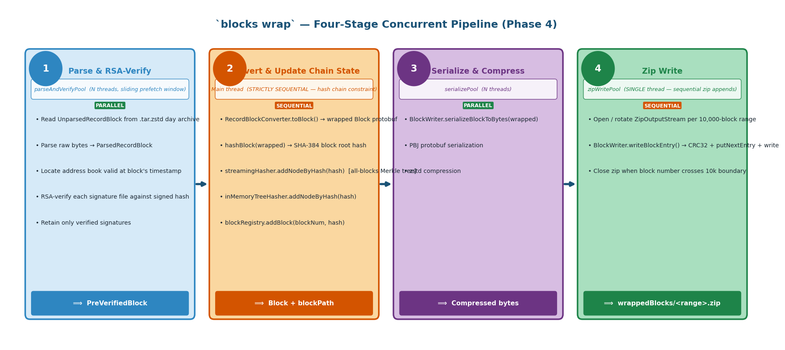
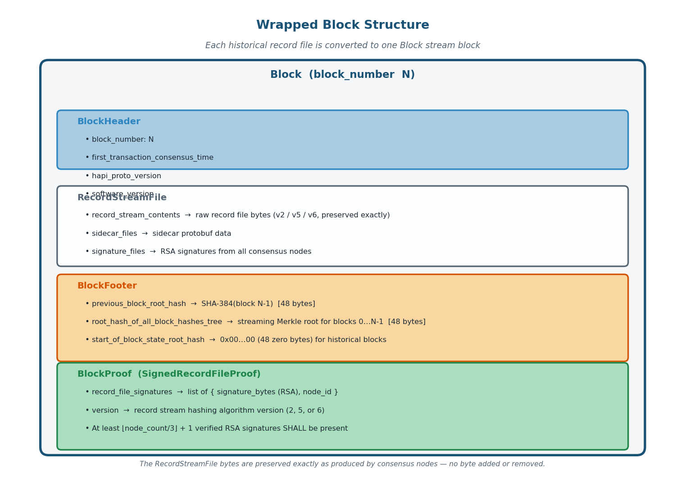
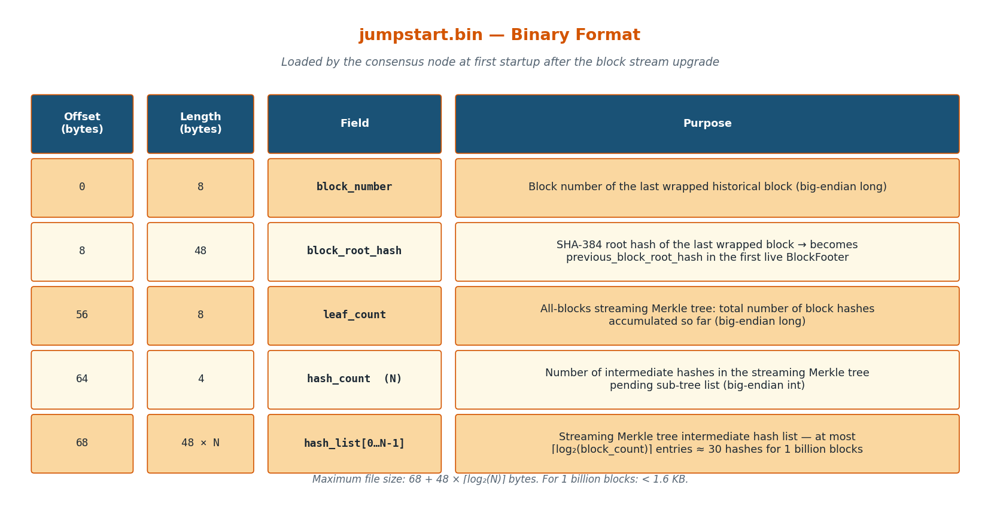

## Abstract

Before the Hedera network transitions from record streams to block streams (as defined by [HIP-1193](https://hips.hedera.com/hip/hip-1193)),
all historical record files produced from network genesis through the cutover point must be converted into the block
stream format defined by [HIP-1056](https://hips.hedera.com/hip/hip-1056).
This conversion is performed offline as a one-time operation using a purpose-built CLI tool.
The process produces two artifacts:
- **jumpstart file** that the consensus node loads at first startup after the upgrade to resume block hashing from
the correct cryptographic state
- **verified collection of wrapped record blocks** that Tier-1 block nodes use to backfill the complete Hedera
blockchain history from genesis.

This HIP specifies the conversion process, the format of both output artifacts, and the verification requirements that
the wrapped record blocks must satisfy before they are accepted into production.



## Motivation

[HIP-1056](https://hips.hedera.com/hip/hip-1056) introduced block streams as a replacement for the legacy record and
event streams that Hedera nodes have produced since genesis.
[HIP-1193](https://hips.hedera.com/hip/hip-1193) defines the mechanism by which consensus nodes stop producing record
streams and begin producing block streams at a specific upgrade boundary, ensuring forward continuity.
However, neither HIP addresses the backwards continuity problem: the full Hedera blockchain history exists only as
record stream files, not as block stream files.
This creates two gaps that must be closed before a complete block stream ecosystem can operate:

**Gap 1 — Consensus node initialization.**
The block stream hashing scheme defined in [HIP-1424](./hip-1424-block-stream-hashing.md) requires each block to
include the root hash of the immediately preceding block and the root hash of an incremental Merkle tree containing
all prior block root hashes in order. For the first block the consensus node produces after the cutover, the
"previous block" is the last wrapped record file block, and the Historical block hash Merkle tree must already incorporate all
prior block hashes. Without pre-computing these values across the full historical record file corpus, the consensus
node cannot produce a correctly-linked first block.

**Gap 2 — Block node historical data.**
Block nodes are the long-term authoritative store of the block stream. A block node that starts after the cutover has
no mechanism to serve historical blocks — blocks from genesis to the cutover point — to clients that request them.
The block node protocol expects blocks in block stream format. Record stream files cannot be served directly.

This HIP defines the one-time offline process that closes both gaps by converting the complete set of historical record
files into block stream format before the cutover is executed.

## Rationale

### Why offline pre-processing rather than on-demand conversion

The Hedera mainnet record file corpus spans from September 2019 to the cutover date. The total dataset is approximately
30 TB and comprises billions of individual record files, signature files, and sidecar files distributed across over 30
consensus nodes. Processing this volume online, during or immediately after the upgrade, is not feasible within the
narrow maintenance window of a network upgrade. The conversion is therefore performed offline, weeks or months in
advance, on purpose-built hardware with cloud bucket access. The resulting wrapped record blocks are staged for block node
ingestion before the upgrade begins.

### Why a separate jumpstart file rather than reading from the wrapped record blocks

The consensus node needs just three pieces of information at first startup: the block number of the last historical
block, the SHA-384 root hash of that block, and the intermediate state of the streaming Merkle tree that will be used
to build the all-blocks hash tree going forward. Deriving these values by re-reading all wrapped record blocks at
startup would require the consensus node to process terabytes of block data before it could produce its first block.
The jumpstart file encodes only the minimum state required for cryptographic continuity in a small binary file (fewer
than 500 bytes for the foreseeable future), allowing startup to proceed in milliseconds.

### Why record files are wrapped rather than discarded

The wrapping process is lossless: every byte of every record file, every RSA signature file, and every numbered sidecar
file is preserved inside the wrapped record block stream block. The wrapped record blocks can be cryptographically verified using the
same SHA-384 hashing and RSA signature algorithms used by the original record stream. This means the wrapped historical
blocks provide the same evidentiary guarantees as the original record files — independent parties can verify that the
wrapped record blocks faithfully represent the original consensus output — while also being accessible through the unified
block stream API.

### Why deduplication is performed during conversion

In normal network operation, every consensus node produces an identical copy of each record file. With 30+ nodes, this
means 30+ copies of every block exist in cloud storage. The conversion tool selects one canonical record file per block
number (the first valid file found), collects all available signature files (which together provide the RSA
multi-signature proof), and discards the redundant duplicate record files. The result is a deduplicated collection in
which each block is represented exactly once by its content, accompanied by all available signatures.

### Versions of record file format

The historical record files exist in three distinct format versions (v2, v5, and [v6](https://hips.hedera.com/hip/hip-435)),
each with its own internal structure and hashing algorithm. The wrapping tool handles all three versions transparently
during conversion, applying the appropriate hash computation for each version when building the block proof.

## User Stories

### Consensus Node Operator

1. **As a consensus node operator**, I need the jumpstart file to be generated and deployed to each consensus node before
   the upgrade so that the first block produced after the cutover carries the correct previous block root hash and
   Historical block hash Merkle tree root, maintaining unbroken cryptographic continuity with the historical record file chain.

2. **As a consensus node operator**, I want the jumpstart file format to be well-defined and small so that it can be
   validated, distributed, and loaded quickly during the upgrade process without adding meaningful delay to the
   maintenance window.

### Block Node Operator

3. **As a Tier-1 block node operator**, I need the complete collection of deduplicated wrapped record blocks to be
   available before the cutover so that I can backfill my node's block store from genesis and serve any historical
   block to clients without gaps.

4. **As a block node operator**, I want every wrapped record block to be independently verifiable so that I can
   confirm the integrity of the backfill data before accepting it into my authoritative block store.

### Network Participant

5. **As a network participant**, I want historical blocks to be available in block stream format so that I can use the
   unified block proof mechanism to verify any transaction in Hedera's history, including transactions that pre-date
   the block stream cutover.

### Conversion Process Operator

6. **As the operator running the conversion process**, I want clear, resumable, well-documented steps so that the
   multi-week or multi-month conversion can be monitored, interrupted, and resumed without losing work or introducing
   errors.

7. **As the operator running the conversion process**, I want the output to be independently verifiable, including hash
   chain continuity, correct Historical block hash Merkle tree roots, required item presence and ordering, and total HBAR supply
   integrity, so that errors introduced during conversion are caught before the artifacts are used in production.

## Specification



### Definitions

**Record file block**: A logical unit of blockchain history represented by one record file from one node, together with
all available signature files from all nodes and all sidecar files for that record file. In normal operation all nodes
produce byte-identical record files, so a single record file plus N signature files constitutes one record file block.

**Wrapped record block (WRB)**: A block stream `Block` protobuf containing a `BlockHeader`, a `RecordStreamFile` item
carrying the raw record file bytes and all RSA signature files, a `BlockFooter` carrying the three pre-computed hash
values, and a `BlockProof` of type `SignedRecordFileProof` carrying the RSA signatures.

**Jumpstart file**: A small binary file carrying the last block number, the SHA-384 root hash of the last wrapped
record block, and the intermediate state of the all-blocks streaming Merkle tree. This file is handed to each consensus
node for loading ahead of the cutover upgrade.

**Historical block hash Merkle tree**: The streaming binary Merkle tree defined in [HIP-1424](./hip-1424-block-stream-hashing.md)
that accumulates the root hash of every block, from block zero onward, as each block is produced. Its root appears at
leaf position 2 of the fixed block root sub-tree.

**Balance checkpoint**: A snapshot of all account balances at a specific block number, downloaded from the Hedera
mainnet cloud bucket, used to verify that the wrapped record blocks faithfully preserve the correct 50 billion HBAR
supply throughout history.

---

### Phase 1 — Gather Mirror Node Metadata

Before any record files are downloaded, auxiliary metadata must be assembled from the Mirror Node.
This metadata is used in later phases to map timestamps to block numbers, validate the record file hash chain, and
identify which record files belong to which day.

#### 1.1 Download Mirror Node record file CSV dump

```bash
java -jar tools.jar mirror fetchRecordsCsv
```

Downloads a CSV dump of the Mirror Node's record file table, which contains every record file timestamp, block number,
and running hash known to the Mirror Node. Output: a CSV file used as input for the next step.

#### 1.2 Generate block times file

```bash
java -jar tools.jar mirror extractBlockTimes
```

Processes the CSV dump and produces `data/block_times.bin`: a compact binary index mapping block numbers to record
file timestamps and back. This file is required by the conversion command (`blocks wrap`) to assign the correct block
number to each record file.

#### 1.3 Generate day blocks file

```bash
java -jar tools.jar mirror extractDayBlock
```

Produces `data/day_blocks.json`: a per-day summary containing the first and last block numbers and hashes for each
calendar day. Used by the conversion pipeline to determine which day archive contains a given block range and to
cross-check block number continuity across day boundaries.

---

### Phase 2 — Collect Record Files

All record files, signature files, and sidecar files must be downloaded from the Hedera mainnet bucket into local
per-day `.tar.zstd` archives.

> **Cost warning**: This phase downloads approximately 30 TB of data from requester-pays buckets. Egress fees can reach
> tens of thousands of dollars. Confirm billing arrangements before starting.

#### 2.1 Generate a bucket file listing

```bash
nohup rclone lsjson -R --hash --no-mimetype --no-modtime \
  --gcs-user-project <PROJECT> \
  "gcp:hedera-mainnet-streams/recordstreams" > files.json &
```

Produces `files.json`: a recursive listing of every file in the record stream bucket.

#### 2.2 Split the listing into per-day files

```bash
java -jar tools.jar days split-files-listing
```

Converts the large `files.json` into a hierarchy of compact binary per-day listing files under `listingsByDay/YYYY/MM/DD.bin`.
These per-day files are the inputs to the download step.

#### 2.3 Download record files for all days

```bash
nohup java --enable-native-access=ALL-UNNAMED \
  -jar tools.jar days download-days-v2 \
  <start-year> <start-month> <start-day> \
  <end-year> <end-month> <end-day> &
```

Downloads all record files, signature files, and sidecar files for the specified date range. Output: one `.tar.zstd`
file per calendar day, approximately 1 GB each, written to the `compressedDays/` directory.
Multiple invocations with different date ranges can run in parallel across machines.

---

### Phase 3 — Validate Downloaded Day Archives

Before conversion begins, the downloaded day archives must be validated to confirm that the record file hash chain is
intact and that the data is internally consistent.

```bash
java -jar tools.jar days validate <compressedDaysDir>
```

This command reads each day archive in order, recomputes the blockchain running hashes, and validates them against the
expected values from the Mirror Node. It writes `validateCmdStatus.json` into the `compressedDays/` directory so it can
resume if interrupted. Full validation is estimated to take several days on a fast machine.

**Side effect**: the validation step produces `addressBookHistory.json`, a chronological history of the consensus node
address books. This file is required in Phase 4 for RSA signature verification, and is bundled into the wrapped record
blocks output for use by block node verification code.

---

### Phase 4 — Convert Record Files to Wrapped record blocks

The conversion command reads each day archive in chronological order and converts every record file block into a wrapped
record block stream block.

```bash
java -jar tools.jar blocks wrap \
  -b data/block_times.bin \
  -d data/day_blocks.json \
  -i compressedDays/ \
  -o wrappedBlocks/ \
  -n mainnet
```

The command can resume from the last successfully converted block if interrupted.
It is estimated to take from a few days or more on fast hardware.

#### 4.1 Four-stage concurrent processing pipeline

The conversion uses a four-stage concurrent pipeline to maximize throughput while maintaining the strict sequential
ordering required by the hash chain:



**Stage 1 — Parse and RSA-verify** (parallel): For each `UnparsedRecordBlock` read from the day archive, the record
file is parsed into a `ParsedRecordBlock`, the address book valid at that block's timestamp is located, and each
signature file is RSA-verified against the record file's signed hash. Only signature files with a valid RSA signature
are retained. Multiple blocks can be in this stage simultaneously using a sliding prefetch window.

**Stage 2 — Convert and update chain state** (strictly sequential): Converts the pre-verified record block into a
wrapped `Block` protobuf. This stage must remain on a single thread because it updates three non-thread-safe data
structures: the streaming Merkle tree hasher (which builds the all-blocks hash tree), the in-memory complete balanced
binary tree hasher (an alternative representation of the same data), and the block hash registry. After conversion,
the wrapped block's SHA-384 root hash is computed and all three structures are updated.

**Stage 3 — Serialize and compress** (parallel): The wrapped record block is serialized to PBJ protobuf bytes and
compressed. Multiple blocks can be serialized concurrently on all available cores.

**Stage 4 — Zip write** (single-threaded): Compressed block bytes are appended to the current open `ZipOutputStream`.
One zip file contains 10,000 consecutive blocks. When the block number crosses a 10,000-block boundary the current zip
file is closed and a new one opened.

#### 4.2 Wrapped record block structure

Each wrapped record block SHALL contain the following items in the following order:



1. `BlockHeader` — identifies the block number and carries metadata.
2. `RecordStreamFile` — carries the raw bytes of the original record file and all RSA-verified signature files from
   consensus nodes. The record file bytes are preserved exactly as produced by the consensus nodes; no byte is added or removed.
3. `BlockFooter` — carries the three pre-computed hash values required to complete the block root Merkle tree: (a) the
   SHA-384 root hash of the immediately preceding block, (b) the root hash of the all-blocks streaming Merkle tree up
   to and including the previous block, and (c) the state root hash at the start of the block (zero for genesis and
   historical blocks where state hash is not available).
4. `BlockProof` (one or more) — contains a `SignedRecordFileProof` carrying the RSA signatures collected from consensus
   nodes and the record stream format version. At least one-third of the node count's RSA signatures SHALL be present.

#### 4.3 Output files

The `blocks wrap` command writes the following files to the output directory:

| File | Description |
|---|---|
| `wrappedBlocks/<range>.zip` | Zip archives of 10,000 wrapped record blocks each, in block-number order |
| `addressBookHistory.json` | Chronological address book history, used for signature verification |
| `blockStreamBlockHashes.bin` | Binary registry of all computed block root hashes, indexed by block number |
| `streamingMerkleTree.bin` | Checkpoint of the streaming Merkle tree state for resume |
| `completeMerkleTree.bin` | Checkpoint of the complete balanced binary tree state for resume |
| `jumpstart.bin` | The jumpstart file for the consensus node (see §4.4) |

#### 4.4 Jumpstart file format

The jumpstart file (`jumpstart.bin`) is a binary file written once at the end of a successful conversion run and
updated incrementally on graceful shutdown via a JVM shutdown hook. Its format is:



| Offset | Length | Field |
|:---:|:---:|---|
| 0 | 8 bytes | Block number of the last wrapped record block (big-endian `long`) |
| 8 | 48 bytes | SHA-384 root hash of the last wrapped record block |
| 56 | 8 bytes | All-blocks streaming Merkle tree leaf count (big-endian `long`) |
| 64 | 4 bytes | Number of intermediate hash entries in the streaming Merkle tree (big-endian `int`) |
| 68 | 48 × N bytes | Intermediate hash list of the streaming Merkle tree (N entries of 48 bytes each) |

The consensus node SHALL read this file at first startup after an upgrade (prior to cutover) and use its contents as follows:

- The block number is incremented by one to produce the block number of the next wrapped record block.
- The 48-byte root hash becomes the `previous_block_root_hash` field in the `BlockFooter` of the next wrapped record block.
- The leaf count and hash list are used to initialize the streaming Merkle tree so that the future first live block's
   `root_hash_of_all_block_hashes_tree` correctly incorporates all historical block root hashes.

The maximum possible size of the jumpstart file is `68 + 48 × ceil(log₂(N))` bytes, where `N` is the total number of
historical blocks. For one billion historical blocks this is approximately `68 + 48 × 30 = 1,508 bytes`.

---

### Phase 5 — Verify Wrapped record blocks

Before the wrapped record blocks are accepted for production use, they SHALL be verified using the `blocks validate-wrapped` command.

#### 5.1 Fetch balance checkpoints

```bash
java -jar tools.jar blocks fetchBalanceCheckpoints \
  --interval-days 30 \
  -o data/balance_checkpoints.zstd
```

Downloads signed account balance snapshots from the mainnet GCP bucket at monthly intervals.
These snapshots are used to verify that the 50 billion HBAR total supply is correctly preserved throughout all wrapped
record blocks.

#### 5.2 Run full validation

```bash
java -jar tools.jar blocks validate-wrapped \
  --balance-checkpoints data/balance_checkpoints.zstd \
  wrappedBlocks/
```

This command walks all wrapped record blocks in block-number order and verifies:

1. **Hash chain continuity**: each block's `previous_block_root_hash` in the `BlockFooter` equals the SHA-384 root hash
   computed from the preceding block. The first block (block 0) SHALL have 48 zero bytes as its previous hash.
2. **Historical block hash Merkle tree root**: the `root_hash_of_all_block_hashes_tree` in each block's `BlockFooter`
   equals the root hash that the streaming Merkle tree algorithm produces after incorporating all prior block hashes in
   order.
3. **Required item presence**: every wrapped record block SHALL contain at least one `BlockHeader`, one
   `RecordStreamFile`, one `BlockFooter`, and one `BlockProof`.
4. **Item ordering**: items SHALL appear in the order: `BlockHeader`, optional `StateChanges`, `RecordStreamFile`,
   `BlockFooter`, one or more `BlockProof` items, with no duplicates or misplaced items.
5. **50 billion HBAR supply**: account balances tracked through all `StateChanges` and `RecordFile` transfer lists
   SHALL sum to exactly 50,000,000,000 HBAR at each balance checkpoint block.

Validation MUST pass with zero errors before the wrapped record blocks are staged for block node ingestion or the
jumpstart file is distributed to consensus nodes.

---

### Consensus Node Integration

The consensus node SHALL implement a jumpstart file loader that:

1. Reads `jumpstart.bin` from a configurable path at startup.
2. Uses the stored block number as the predecessor block number for the first live block.
3. Initializes the streaming Merkle tree used for the all-blocks hash (`root_hash_of_all_block_hashes_tree`) with the
   stored leaf count and intermediate hash list.
4. Sets the `previous_block_root_hash` field of the first live block's `BlockFooter` after cutover to the stored 48-byte hash.

The consensus node SHOULD validate the jumpstart file's integrity on load (e.g., verify that the byte length matches
the encoded hash count field) and SHOULD refuse to start if the file is malformed.

---

### Block Node Integration

Tier-1 block nodes SHALL ingest the wrapped record blocks using the block node's historic file persistence plugin.
The wrapped record blocks are compatible with the block node's standard block ingestion path. Block nodes SHALL verify
each wrapped record block as it is ingested; if any block fails hash chain verification it SHALL be rejected and the
ingestion operator SHALL be notified.

The wrapped record blocks directory structure produced by `blocks wrap` is compatible with the block node's historic
plugin directory layout. Block nodes MAY ingest blocks directly from the zip archives without unpacking them.

---

## Backwards Compatibility

This HIP defines a process that runs entirely before and independently of the live network. It does not change any
on-chain transaction processing, any existing API, or any currently-running network component. All changes are
additive: a new binary artifact (the jumpstart file) and a new set of block stream files are produced.

Historical record files remain available in their original format and location in cloud storage after the conversion;
the wrapping process is read-only with respect to the source bucket.

The wrapped record blocks use the `SignedRecordFileProof` block proof variant defined in
[HIP-1424](./hip-1424-block-stream-hashing.md), which is specifically designed for this scenario and does not affect
the block proof mechanism used for live blocks.

## Security Implications

### RSA Signature Preservation

Every wrapped record block carries the original RSA signatures produced by the consensus nodes at the time each
record file was created. A verifier can independently confirm that a sufficient threshold of nodes signed the
underlying record file by retrieving the address book that was active at the time of the block and verifying each RSA
signature. The wrapping process does not re-sign or alter any signature; it only packages the existing signatures
alongside the record file content.

### Hash Chain Integrity

The jumpstart file's 48-byte hash and the block registry (`blockStreamBlockHashes.bin`) form a complete, verifiable 
record of the SHA-384 root hashes of all historical blocks. Any tampering with a wrapped record block would change its
hash, breaking the chain encoded in all subsequent blocks and producing a mismatch with the jumpstart file.
The `blocks validate-wrapped` command detects such tampering before any artifact is deployed.

### Supply Verification

The 50 billion HBAR supply check provides an additional layer of integrity assurance: it confirms that the wrapped
record blocks faithfully represent the transfer lists and state changes recorded in the original record files, not an
altered view. Any block that deletes or fabricates HBAR balances would be detected at the next balance checkpoint.

### Jumpstart File Distribution

The jumpstart file is a critical input to the first live block. Its 48-byte hash and Merkle tree state MUST be
distributed to all consensus nodes with the same integrity guarantees as the node software itself (e.g., via signed
release packages). A tampered jumpstart file would cause consensus nodes to diverge on the Historical block hash Merkle
tree root in the first live block, preventing threshold signature aggregation.

### Requester-Pays Access Control

The record stream bucket uses requester-pays access. Only parties with configured GCP access can download the source
data. This provides a natural barrier against unsanctioned bulk downloads but is not a substitute for verifying the
integrity of downloaded data against the Mirror Node's known record file hashes.

## How to Teach This

### For consensus node engineers

The jumpstart file is the handshake between the historical wrapping process and the live block producer. The consensus
node needs three things from history: the last block number, the hash of the last block, and the Merkle tree state that
accumulates all block hashes. These three items are pre-computed by the wrapping process for the exact same reason the
`BlockFooter` exists in the live block stream — they cannot be computed from data that hasn't been produced yet. Load
the file at startup, initialize the three state variables from it, and the first live block will be correctly linked to
the full historical chain.

### For block node engineers

Wrapped historical blocks are ordinary block stream blocks whose `BlockProof` uses the `SignedRecordFileProof` variant.
The block node's verification path should already handle this variant (as defined in HIP-1424). Ingestion of wrapped
record blocks via the historic file plugin follows the same path as any other block ingestion.

### For conversion process operators

The conversion is a five-phase pipeline. Phases 1 and 2 are I/O-bound and dominated by network egress from GCP. Phase 3
is CPU-bound but embarrassingly parallelizable per day archive. Phase 4 (the wrap command) is CPU-bound with a
sequential bottleneck at the hash chain update step; all other sub-stages run in parallel. Phase 5 (validation)
re-reads all wrapped record blocks and is primarily I/O-bound. Plan for the full pipeline to take weeks to months on a
single high-memory machine with fast GCS access; Phases 2 and 4 can be parallelized across machines by partitioning
the date range.

## Reference Implementation

The reference implementation is the `blocks wrap` command in the `hiero-block-node/tools-and-tests/tools` subproject of
the `hiero-block-node` repository, built on the Java `picocli` framework with PBJ protobuf serialization. The tool is
runnable as a shadow JAR:

```bash
./gradlew :tools:shadowJar
java -jar tools-and-tests/tools/build/libs/tools-<version>-all.jar blocks wrap --help
```

The reference implementation SHALL be considered complete when the following have been delivered:

- The `blocks wrap` command produces wrapped record blocks that pass all `blocks validate-wrapped` checks across the
   full Hedera mainnet history from genesis to the block stream cutover block.
- The `jumpstart.bin` produced from a full mainnet conversion is loaded and used by the consensus node in integration
   tests to produce a correctly-linked first live block.
- The wrapped record blocks are accepted and stored by the Tier-1 block node historic file plugin in integration tests.
- The wrapped record blocks are independently verifiable by at least one third-party implementation.

## Rejected Ideas

### Live conversion during the upgrade window

Converting record files to wrapped record blocks during the network upgrade maintenance window was considered. It was
rejected because the ~30 TB record file corpus and the per-block RSA signature verification make real-time conversion
infeasible within a maintenance window of a few hours.
Pre-computing the wrapped record blocks offline eliminates this constraint entirely.

### Deriving jumpstart state from the wrapped record blocks at consensus node startup

Rather than a separate jumpstart file, the consensus node could derive its starting state by reading all wrapped record
blocks and recomputing the streaming Merkle tree. This was rejected because it would require the consensus node to
process billions of blocks before producing its first live block, delaying the network restart by potentially days or
weeks. The jumpstart file reduces this to a single file read of under 2 KB.

### Including the state root hash in historical BlockFooters

The `BlockFooter.start_of_block_state_root_hash` field is defined in HIP-1056 as the root hash of the consensus node
state Merkle tree at the beginning of each block. Computing this value for historical blocks would require replaying
all transactions from genesis through each block, which is even more expensive than the conversion itself. Historical
wrapped record blocks therefore set this field to the zero hash (48 zero bytes). Live blocks will carry the correct
state root hash once the consensus node begins producing them.

### Storing wrapped record blocks in the existing record stream bucket paths

Wrapped record blocks could be uploaded to paths alongside the existing record stream files. This was rejected because
the wrapped record block format and the block node path convention (defined in HIP-1193) use a different directory
structure from the record stream paths, mixing them would cause confusion, and record stream consumers should not
encounter block stream files unexpectedly. Wrapped record blocks are stored under the block stream bucket path structure.

## Open Issues

1. **State root hash for historical blocks**: As noted in Rejected Ideas, historical wrapped blocks set
   `start_of_block_state_root_hash` to zero. If a future need arises for state proofs referencing historical blocks, a
   mechanism to compute and embed accurate state root hashes for historical blocks would be required. This is out of
   scope for this HIP.

2. **Wrapped record block storage and CDN distribution**: The operational details of where the wrapped blocks are
   hosted for block node operators to download (e.g., a public GCP bucket, a CDN, or a peer-to-peer distribution
   mechanism) are not specified here. This will be determined as part of the block node launch operations plan.

3. **State Changes in wrapped record block structure**: The Wrapped record block structure currently omits State-Changes
   In most cases this is correct but likely block 0 and possible amendment captures map require state changes for visibility.
   Need to confirm this.

4. **wrappedBlocks/<range>.zip format**: Need to confirm what format the range value takes.

## References

- [HIP-1056: Block Streams](https://hips.hedera.com/hip/hip-1056) — defines the block stream format, block structure,
   and the block proof mechanism.
- [HIP-1193: Record Stream to Block Stream Cutover](https://hips.hedera.com/hip/hip-1193) — defines the upgrade
   boundary at which consensus nodes stop producing record streams and begin producing block streams.
- [HIP-1424: Block and State Merkle Tree Hashing Scheme](./hip-1424-block-stream-hashing.md) — defines the SHA-384
   hashing scheme, the streaming Merkle tree algorithm, and the `BlockFooter` and `SignedRecordFileProof` protobuf
   messages used by wrapped record blocks.
- [`hiero-block-node` CLI Tools](https://github.com/hiero-ledger/hiero-block-node/tree/main/tools-and-tests/tools) —
  reference implementation of the conversion and validation pipeline.
- [Record Stream File Format](https://github.com/hiero-ledger/hiero-block-node/blob/main/tools-and-tests/tools/docs/record-file-format.md) —
  detailed specification of the v2, v5, and v6 record file formats consumed by the wrapping tool.

## Copyright/license

This document is licensed under the Apache License, Version 2.0 — see [LICENSE](../LICENSE) or <https://www.apache.org/licenses/LICENSE-2.0>.
